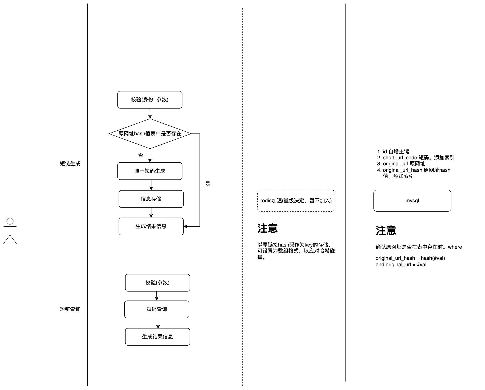
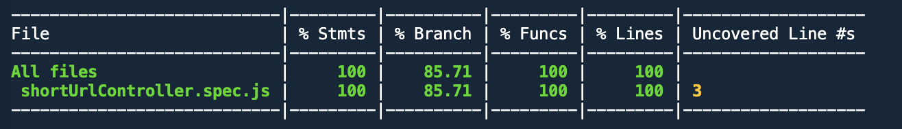

# 整体结构

# 表
- id 自增主键
- short_url_code 短码。建立索引 length = 8
- original_url 原链接 length = 2083。可适当增大长度，使用短链的大部分都是移动端，无需过多考虑IE
- original_url_hash 原链接哈希值。主要为加速以原链接为条件的查询。并在where中添加original_url限制，应对哈希碰撞。where original_url_hash = hash(#val) AND original_url=#val
- create_time 创建时间，default = now()
- create_user_id 保留字段，创建短链时记录操作人id

# 单元测试

# 集成测试
逻辑比较简单，写在单元测试中。主要考虑两点
- 调用短码生成接口后,使用短码查询接口，可以查询到相应的原链接
- 同一原链接反复调用短码生成接口，返回的短码一致，且反复调用用短码生成接口对短码查询接口没有影响

# TODO
- 添加日志模块，并规范请求日志与业务日志的记录
- 错误码统一管理
- 8位字符的唯一码使用雪花算法替换
- mocha的ts支持
- pm2进程守护+环境配置