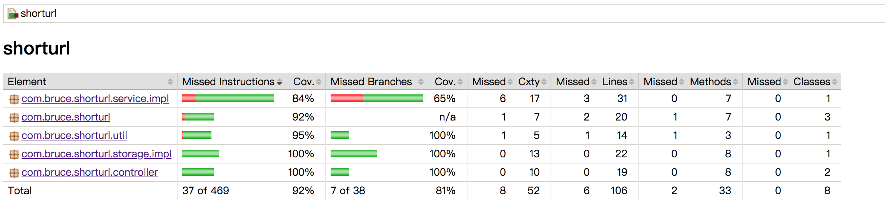

# 短域名服务

短域名服务基于springboot构建。

## 程序设计

### API接口

功能：`将长链接生成短链接`

API: http://`${host}`/api/generateShortUrl?fullUrl=${fullUrl}

Method：`GET/POST`

参数：`fullUrl`字符串


### 短链接跳转

功能：`访问短链接时，自动跳转到长链接地址`

URL: http://`${host}`/${hash}

Method：GET

异常处理：短链接无法转换时，将自动展示错误页面进行提示。


### 数据库设计

db使用了`redis`，使用`value`数据结构来存储短链接到长链接的关系。

key为短链接的hash值，value为长链接url，短链接过期时间可在yml中进行配置，目前设定为500天。


### 程序设计图


## 配置

```yml

#spring配置
spring:
  redis:
    host: 127.0.0.1 #redis的连接ip
    port: 6379
    pool:
      max-active: 8
      max-wait: 1
      max-idle: 8
      min-idle: 0
    timeout: 10000
    password: xxxxxxx	 #redis连接密码

# 短域名配置
shorturl:
  #生成短域名的scheme，支持[http|https]，不写默认http
  scheme: http
  #生成短域名的域名，必填
  host: t.cn
  #短域名hash冲突时的重试次数
  maxTryTimes: 5
  #短域名的过期天数
  expireDays: 500
```

## api测试




+ 生成短链接
```shell
#get
curl http://localhost:8080/api/generateShortUrl?fullUrl=http://www.baidu.com

#post
curl -d 'fullUrl=http://www.baidu.com' http://localhost:8080/api/generateShortUrl
```

+ 短链接跳转长链接
[http://localhost:8080/1MUChJ](http://localhost:8080/1MUChJ)

