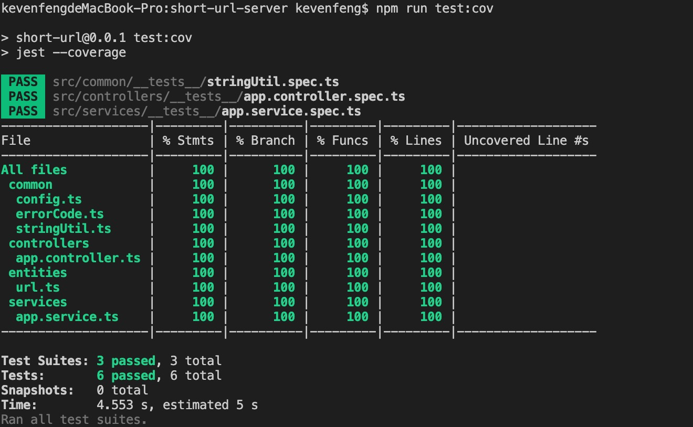
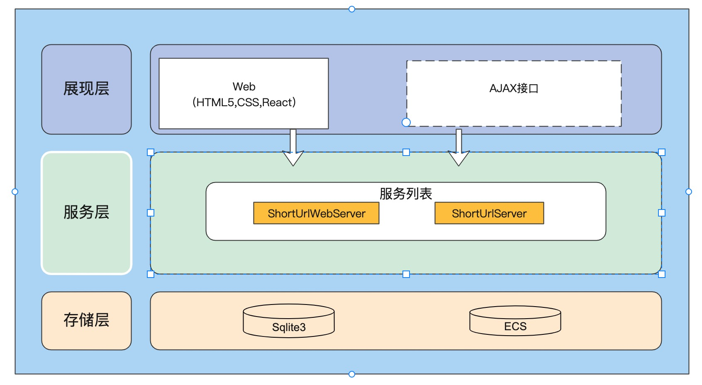

# 短连接生成系统

## 技术栈
NestJS + React

## Run it
```
npm i
npm start
```
will run server in open http://localhost:8080/

# 后端 short-url-server

## 技术栈
NestJs + TypeScript + TypeORM + Sqlite

## Run it
```
npm i
npm start
```
will run server in open http://localhost:3000/
安装sqlite3的时候请使用nodejs版本v14
## Test
```
npm run test
npm run test:cov
```

# 测试覆盖率


# 短连接生成机制
使用Nano ID生成唯一的 JavaScript 字符串ID

# 数据库
```
export class Url {
	@PrimaryColumn('varchar', { nullable: false })
	public shortUrl: string;

	@Column("text", { nullable: false})
	public longUrl: string;
}
```

# 结构框架
```
── src
│   ├── app.module.ts
│   ├── common 通用模块
│   │   ├── __tests__
│   │   │   └── stringUtil.spec.ts
│   │   ├── config.ts
│   │   ├── errorCode.ts
│   │   └── stringUtil.ts
│   ├── controllers 路由
│   │   ├── __tests__
│   │   │   └── app.controller.spec.ts
│   │   └── app.controller.ts
│   ├── entities ORM实例
│   │   └── url.ts
│   ├── index.ts
│   ├── main.ts
│   ├── middlewares
│   ├── migration
│   └── services 服务层，负责entity和controller的通信
│       ├── __tests__
│       │   └── app.service.spec.ts
│       └── app.service.ts
```

# 前端 short-url-web


## 技术栈
React + TypeScript + Axios + AntD

## Run it
```
npm i
npm start
```
open http://localhost:8080/

# 框架设计图


# 测试用例

