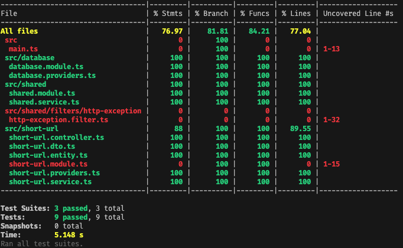

## 方案选型

短链系统在实现时，大致会有两种方案选型，**哈希** 和 **自增id** 。
下面就两种方案具体实现的原理及优缺点进行分析。

### 哈希

哈希算法是一种简单的方法，可以对原始长链接进行哈希算法，得到具体的哈希值当短链code。

这里可以选择非加密哈希算法，比如 `MurmurHash` 。

下面是采用 `MurmurHash` 算法的一个例子：

|长链接|哈希值|短链接|
|-|-|-|
|http://murmurhash.shorelabs.com/|498573365|erf81l|

将长链接 `http://murmurhash.shorelabs.com/` 使用 `MurmurHash` 算法计算后，得到哈希值 498573365 ，然后将其转换为32进制得到一个短字符串，便是长链接的短链表示。

由于哈希算法存在碰撞，因此如果遇到哈希碰撞时，可以在原长链接的基础上加新的随机数生成新的哈希值。

### 优缺点分析
- 优点： 
    - 实现简单，只需要计算长链的哈希值即可。
- 缺点： 
    - 任何哈希算法都会存在碰撞的可能，而且由于生成的短链有长度限制，因此在选择哈希算法时只能采用`MurmurHash`的32位实现，因此可表达的数据量比较小，在业务数据量大的时候碰撞的概率会增加。
    - 由于碰撞的问题，后续数据量大了不易拓展


### 自增id
实现短链系统，还可以使用自增id的方式。
每当一个新的长链接进来后，直接插入数据库，并获取到其自增id，将其id转换为62进制即可。

对于短链长度为6位的短链来说，可以生成 `62*62*62*62*62*62=568亿` ，对于一般的业务来说足够了。

### 优缺点分析
- 优点：
    - 1. 实现简单。
    - 2. 体量够用。
    - 3. 易于拓展.
体量小时，可以直接用单机数据库的自增id。当业务规模上来时，可以使用分布式发号器进行发号即可。
- 缺点：
    - 1. 长度不一致。系统初始时，由于id值比较小，生成的短链码较短。由此可能引发第二个缺点。
    - 2. 短链码可能会被猜测。

## 采用方案：自增id
基于哈希算法数据量大时，不可控因素太多，因此这里采用第二种方式：基于自增id的方式生成短链码。

针对以上两个缺点，可做如下针对优化：
1. 为避免被人猜测，可加入一位随机位。
2. 初始自增id为5000，生成短链码长度为4位

得到最终方案如下：
1. 采用数据库自增id方式生成短链，自增id初始为5000。转换为62进制表示
2. 最后一位加入一位随机位，避免被人猜测
3. 生成的短链码与原URL一同存入数据库（由于最后一位随机位，必须要保存短链码和原URL的映射关系）

> 比如，id=5000，转换为最终的短链码为 `1iED`，其中 `1iE` 为5000转换为62进制的表示。最后一位`D`为随机生成的位，用于防止被人猜测。

### 数据表结构：

```sql
-- 短链关系表
CREATE TABLE IF NOT EXISTS `short_url` (
	`id` INT UNSIGNED AUTO_INCREMENT,
	`url` TEXT NOT NULL,
	`hash` BIGINT UNSIGNED NOT NULL,
    `code` VARCHAR(10) NOT NULL DEFAULT '',
	`created_at` TIMESTAMP NOT NULL DEFAULT NOW(),
	PRIMARY KEY (`id`),
    INDEX (hash)
) ENGINE = InnoDB CHARSET = utf8;

-- 设置自增id从5000开始，以使生成短链码最低4位
ALTER TABLE `short_url` AUTO_INCREMENT=5000;

```

字段说明：
|字段|说明|
|----|----|
|id|自增主键|
|url|原始url|
|hash|对原始url做crc32哈希算法的哈希值，用于建立url列索引，加速url列的查询|
|code|生成的短链码|
|created_at|创建时间|


### 接口说明

1. 原始url生成短链
    请求地址： post /
    参数：
    body.url string 原始url

2. 解析短链码为原始url
    请求地址： get /:code
    参数：
        code string 短链码


### 单元测试结果

        


