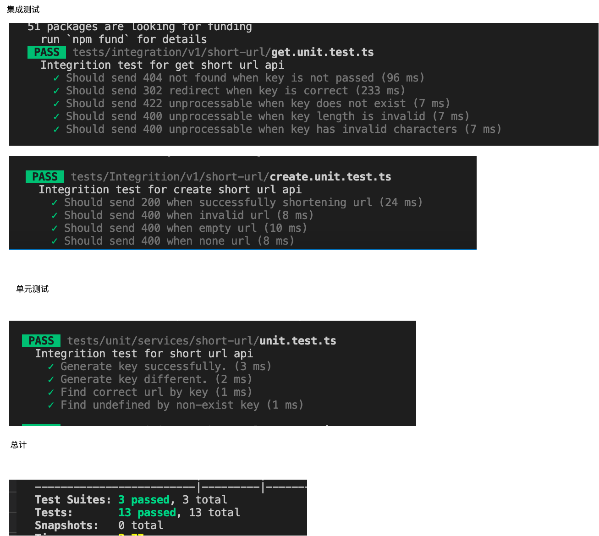

  

# 短域名服务

## 基本实现原则

  

本作业服务有以下基本实现原则：

  

1. Typescript 实现

2. 短域名长度最大为 8 个字符（不含域名）

  

3.  **不要过度设计，每一个依赖以及每一行代码都有足够充分的理由。**

  

4.  **使用尽量简洁的实现方式，尽量少使用第三方库。**

  

5. 提交内容：

  

- 源代码

  

- 单元测试代码以及单元测试覆盖率

  

- API 集成测试案例以及测试结果

  

- 简单的框架设计图，以及所有做的假设

  

- 涉及的 SQL 或者 NoSQL 的 Schema，注意标注出 Primary key 和 Index 如果有。

  

  

## 需求假设和分析

  

### 服务场景假设

  

根据对现有市场产品（(https://tinyurl.com/) 的使用和基于实现原则的筛选，假设短链接服务有以下基本场景：

  

  

1. 长链接转短链接， 用户输入长链接

  

- 如果长链接合法，返回唯一短链接

  

- 无论长链接是否相同，短链接不相同

  

- 如果长链接非法，返回错误提示

  

2. 短链接重定向， 用户调用短链接

  

- 如果短链接合法， 重定向到对应长链接

  

- 如果短链接非法或不存在， 返回错误提示

  

### 非功能场景假设

  

基于实现原则， 假设以下非功能场景限制：

  
  

1. 请求数量较低（小于1000/天）且分布平均无峰值。总数据量估算三年小于200GB。

2. 不用考虑高并发，全球化，高可用，安全等商业服务需求。

  

## 实现方案简要介绍

  

### 选型简要介绍

1. 短链接生成算法， 经过调查，当前比较常用的有以下

- 自增ID+字符串转换（62 进制）

- 维护自增ID， 每一个创建请求都匹配一个新的ID，然后转换成字符串

- 优点： 逻辑简单，实现复杂度不高，不会重复或碰撞

- 缺点： 并发风险明显，必须维护线程安全或者分布式系统安全的自增ID， 一般需要数据库ID或者使用分布式计数器来实现。位数不固定， 需要补齐

- 随机字符串

- 为每一个请求随机生成八位字符串，查重成功以后返回， 失败则往复重新生成+查重直到成功。

- 优点：逻辑简单， 实现复杂度低，因为每次都是随机字符串所以并发风险很低。位数固定。

- 缺点： 需要查重， 高并发场景需要维护线程或者分布式系统并发安全。

- Hash算法

- 对每一个请求的长链接进行hash算法

- 优点：位数固定，并发问题概率极小，且碰撞概率极小。

- 缺点： 逻辑相对复杂，相同的长链接短链接相同，需要查重。

- 分布式服务

- 使用单独的短链接产生服务，周期生成短链接并查重存储与专门的数据库与缓存中， 短链接生成服务只需要向产生服务获取即可。

- 优点： 不用担心线程安全， 效率高

- 缺点： 实现复杂

  

基于需求与原则，**随机字符串**应该是最适合的方案，逻辑与开发难度简单，且在低并发场景并发风险极低可接受。

  

2. sql vs nosql

这个服务中存储的数据简单， 没有关联和事务。 当前需求下，sql 和 nosql 都是合适的解决方案。 考虑到无关联数据nosql 相对更快，且未来可能会扩展数据结构， 并且数据量增加，故选择nosql 中的document db（dynamodb， firestore， mongodb等）作为数据库更为合适。

  

### 方案简要介绍

1. 总体实现

总体实现如图

2. 服务实现

服务实现流程如图：

- 生成短链接

- 调用短链接

3. 数据实现

基于当前需求与假设， 只需要存储长链接和生成的短链接键， 同时短链接键作为**文档主键**：

{

key : string , //短链接键， 文档主键（objectId）

url: string //初始长链接

}

未来可以基于需求添加创建时间，过期时间等数据

**基于实现原则和开发效率， 在本作业里用系统的内存map 模拟实现。**

4. 测试结果

覆盖率

