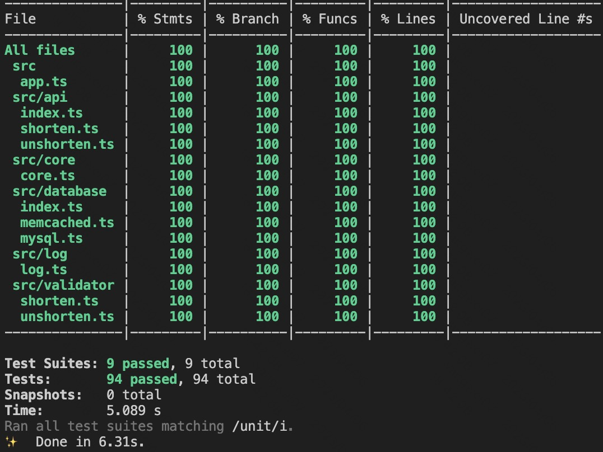
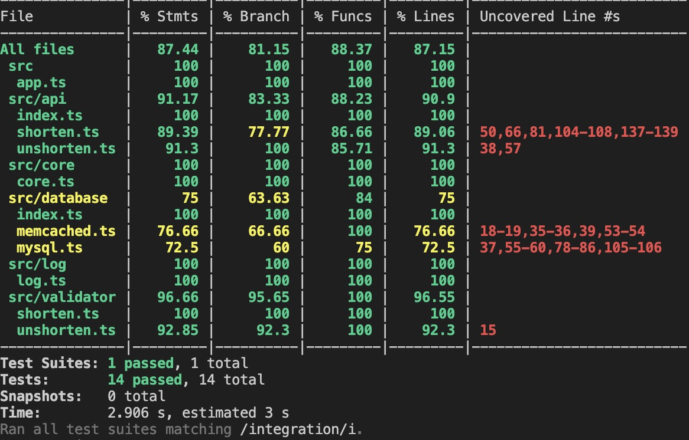

# 短域名服务设计

### API 接口
- [/shorten](swagger/api.yaml#L6): 短域名存储接口，接受长域名信息，返回短域名信息。
- [/{code}](swagger/api.yaml#L28): 短域名读取接口，接受短域名信息，返回长域名信息。

### 测试
- 单元测试

- 集成测试

### 假设
- 短链长度不会修改
- 域名映射永不过期
- 用户无法自定义短域名
- 用户不能删除已有短域名
- 用户是匿名的
- 日读请求量1,000,000
- 日写请求量100,000
- 读写比例10:1

### 思路
- MySQL作为DB，主库写，从库读，业务发展后可做sharding
- hash字符串作为主键，优点: 读快， 缺点: 写相对慢。不过不管怎样都要在short_url上创建索引，还不如直接用short_url当主键。
- Redis作为写DB前的分布式锁预防写冲突，并发量太高也可以sharding
- Memcached作为读缓存，读多，写少
- 处于安全考虑，不用自增id作为短链，再hash一样需要考虑冲突，还不如直接hash
- 用md5对url进行hash，转化为64进制字符串(数字、大小写字母和_-)
- md5转化为64进制为22个字符(不够前面补0)，视其为环，可转化为22个8字符候选词
- 第一候选冲突检测用DB检索，可优化为bloomfilter
- 第一候选被占用时，取不在DB中的候选词
- 没有不在DB中的候选词，则选取最老的候选词

### 系统架构

### 流程图
