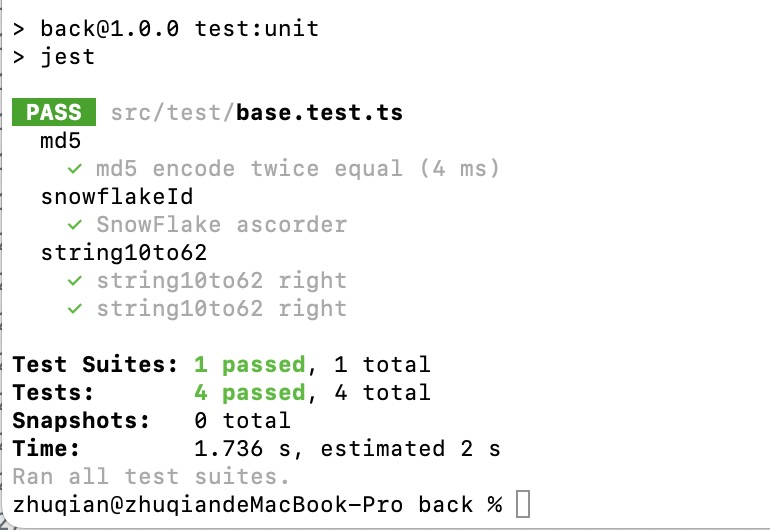
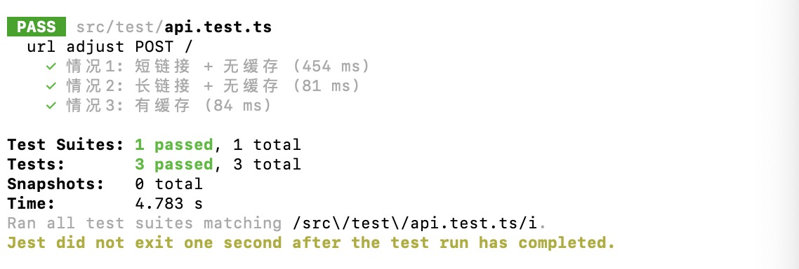
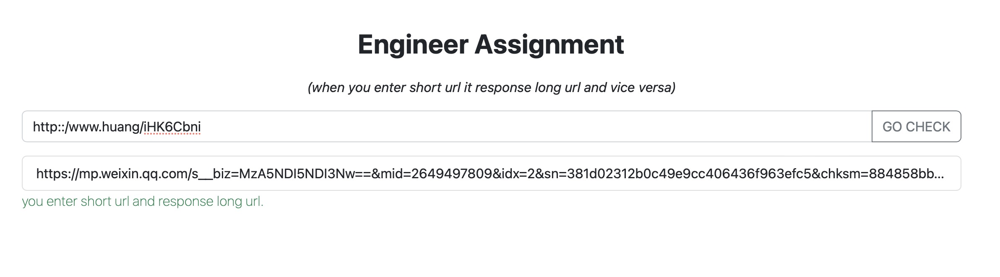

## 个人信息
- 姓名: 黄捷
- 邮箱: 2281346514@qq.com

## 代码清单
- 前端: front
- 后台: back
- 数据库文: short-url.sql
- 具体功能每个文件下下的README.md 有详细描述
> 注: mongo 数据库 部署在我自己的服务器上,可以直接连接

## 启动步骤
- 分别在  front back 文件夹下安装依赖 npm i
- 后台: cd back && npm run start
- 前端: cd front && npm run start
- 浏览器访问 http://localhost:3000
- 输入短码 eg: http::/www.huang/iHK6Cbni

## 测试相关
### 单元测试
- 单元测试 测试了 md5、雪花算法、十进制转62进制结果如下

### API集成测试
- api 接口测试

## 流程图

## 程序截图

## 程序可优化点
- 缓存方面: 加入LRU缓存机制,超时实现,提高内存使用率;
- 运维方面: 采用Docker等容器化手段直接打包前后端;