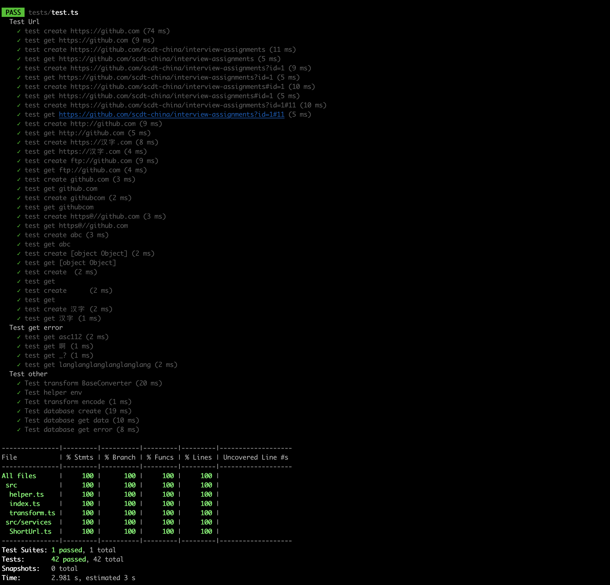

# 说明

## 开发

```
pnpm run dev
pnpm run build
pnpm run test
```

## 短链接标示生成

常见有以下几种方法:

1. 自增`id` 极端情况下会溢出, 但是可以保证唯一性, 同时并发高时, 会有性能问题
2. 原始 `url` 哈希, 不适合标示长度较短的情况, 容易碰撞重复, 不太适合允许重复生成的场景(虽然有解决方案)
3. `uuid` 哈希, 同上,不过适合重复生成场景
4. 随机生成 不适合标示长度较短的情况, 容易碰撞重复
5. 发号器 比较完美的方案 就是部署成本较高

源代码中使用 `mysql` 自增id, 进行简单加密处理

1. 基于乱序字母表(基于[a-zA-Z0-9])转换 以免生成有规律的(类似纯数字)链接
2. 简单字符串加解密
    1. 字符串添加校验码 提高对错误输入的校验效率
    2. 按照校验码重新计算字符串 增加不可预测性
3. 生成的链接过短, 可以将`id`字段的 `AUTO_INCREMENT`设置大些

> `fullstack/src/transform.ts`

## 文件

### sql

[table.sql](table.sql)

### 测试



## api

### 创建短链接

``` 
curl --location --request POST 'http://*****/api/shorturl' \
--header 'Content-Type: application/json' \
--data-raw '{"url":"https://github.com/"}'
```

#### 响应

```json
{
    "status": true,
    "info": "success",
    "data": {
        "url": "https://domain.com/UzOs",
        "short": "UzOs"
    }
}
```

### 获取长链接

``` 
curl --location --request GET 'http://*****/api/shorturl/UzOs'
```

#### 响应

```json
{
    "status": true,
    "info": "success",
    "data": {
        "url": "https://github.com/"
    }
}
```

### 数据缓存

1. 读取时, 读取缓存,存在更新缓存时间,缓存不存在时, 读取数据库, 并写入缓存(正确数据和不存数据均会写)
2. 写入时, 写入数据库, 并写入缓存
3. 正确数据和不存数据的缓存过期时间不同
4. 是否会错误请求太多找造成缓存数据过多, 由于短链接标示有简单加密限制, 应该可以过滤大部分错误请求
5. 因为读取缓存时会更新缓存时间,确实可能会放大缓存与数据库不一致的影响, 可以考虑定时同步数据库全量数据到缓存中

### 其他

1. 读取出现性能问题时, 视情况采用 `分布式部署` `热数据缓存`等方案
2. 生成出现性能问题时, 视情况采用 `分布式部署`  `异步化`等方案
3. 自增`id`注意溢出, 和 `Number.MAX_SAFE_INTEGER` 问题
4. 允许`url`重复生成对后续业务功能扩展较为有力, 但是会增加数据库存储压力
5. 生成的短链接长度可以根据实际情况调整, 但是过短会增加碰撞概率, 过长会增加用户输入成本
6. 对于生成频次较高的场景, 可以考虑使用`发号器`方案, 但是部署成本较高
7. 对于恶意请求(特别是生成), 应采取限流措施


