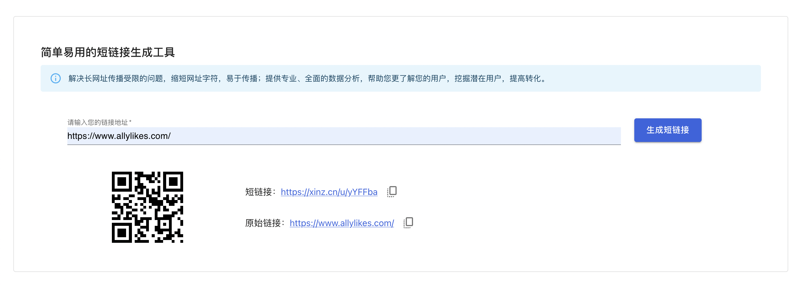

## 短链[shortlink]服务
[](https://coveralls.io/github/imxinz/shortlink)

### 前台界面展示


### 项目主要技术选型：
* Midway2.x & Midway Hooks & Express  构建全栈一体化应用
* mysql 数据库
* vite  构建工具
* Jest  单元测试工具

### 单测报告
```
------------------------|---------|----------|---------|---------|-------------------
All files               |   95.91 |    52.94 |      80 |   95.55 |
 apis                   |     100 |      100 |     100 |     100 |
  configuration.ts      |     100 |      100 |     100 |     100 |
 apis/config            |     100 |      100 |     100 |     100 |
  config.default.ts     |     100 |      100 |     100 |     100 |
 apis/entity            |     100 |      100 |     100 |     100 |
  tb_shortlink_url.ts   |     100 |      100 |     100 |     100 |
 apis/hooks             |     100 |       50 |     100 |     100 |
  shortCode.ts          |     100 |       50 |     100 |     100 | 39
 apis/lambda            |   96.55 |    54.54 |     100 |   96.29 |
  shortlink.ts          |   96.55 |    54.54 |     100 |   96.29 | 32
 apis/service/shortlink |   82.35 |       50 |      50 |      80 |
  url.ts                |   82.35 |       50 |      50 |      80 | 23-24,29
 utils                  |     100 |       50 |     100 |     100 |
  helper.ts             |     100 |       50 |     100 |     100 | 8
------------------------|---------|----------|---------|---------|-------------------
```

### 介绍
短链服务：将长的URL网址，转换为简短的网址字符串的服务，用户访问短链接即可重定向到原始的URL。以达到节省字符、更便于传播分享引用、生成二维码更小更简洁等目的。

### 短链特点
* 1、短、内容少，节约空间，如微博会有字数限制；
* 2、可收集站点访问数据，用作数据分析等用途；
* 3、做了一层中转，可以做各种个性化定制，如设置链接开放日期等访问控制的逻辑判断；
* 4、和app结合，实现唤端等；

###  关键问题
* 1、如何将任意长的字符串转化为较短长或者固定长的字符串；
* 2、如何将短链接还原成之前的长链接，使之能够访问；
* 3、如何保障短链服务的稳定性和安全性；

### 系统设计
#### 系统架构图

ps:实际系统架构设计时要结合业务场景，要面向未来不要过度设计。

#### 系统时序图


#### 访问重定向
当用户访问短链时，应以302的方式重定向到原始URL。302为临时重定向，当用户访问时每次请求都会先到短链服务，以便处理短链时效及业务归因分析等。

#### 安全性设计
短链服务大多在业务内使用，为避免被业务外使用，需要考虑安全性问题。一般可采用准入式：在生产端增加限制，在访问端增加访问限制。
1、生产端限制：通过接入审核，增加原始URL的限制。仅允许授权过的原始URL的域名或地址，才能使用短链服务生成短链。
2、访问端限制：根据不同的业务场景，可采用不同的访问端限制方法或不限制。常见的包括短链有效期限制、身份校验限制、单IP访问频次限制、访问来源限制等。

#### 缓存设计
1、缓存策略：若短链服务对高并发要求比较高时，可针对短链访问、短链查询增加缓存。短链数据以K-V（短链Code为key，原始URL为value）的形式存储，存储可采用OSS、Redis等高性能高并发的存储服务。针对短链访问，可将短链域名+根路径托管至CDN，增加短链服务并发请求，减小源站服务压力，降低网络阻塞，提高用户访问响应速度和命中率。
2、缓存更新：缓存更新模式使用主动推送，在数据新增的时候直接推送到缓存；同时提供数据全量更新的接口，以供手动推送缓存数据或者定时任务自动更新。

#### 短链生成算法
##### 固定长度：算法一
1、将长网址md5生成32位签名串,分为4段, 每段1个字节（即8位）;
2、对这四段循环处理, 取4个字节(32位), 将他看成16进制串与0x3fffffff(30位1)与操作, 即超过30位的忽略处理;
3、这30位分成6段, 每5位的数字作为字母表的索引取得特定字符, 依次进行获得6位字符串;
4、总的md5串可以获得4个6位串; 取里面的任意一个就可作为这个长url的短url地址;
##### 固定长度：算法二（自增序列算法）
1、把数字和字符组合做一定的映射,就可以产生唯一的字符串,如第62个组合就是aaaaa9,第63个组合就是aaaaba,再把原字符串打乱后保存，那么对应位置的组合字符串就会是无序的组合。
2、把长网址存入数据库,取返回的id,找出对应的字符串,例如返回ID为1，那么对应上面的字符串组合就是bbb,同理 ID为2时，字符串组合为bba,依次类推,直至到达62种组合后才会出现重复的可能，所以如果用上面的62个字符，任意取6个字符组合成字符串的话，你的数据存量达到500多亿后才会出现重复的可能，几乎是永不重复。
##### 固定长度：算法三
准备一个被打乱的数组，存放A-Za-Z0-9这62个字符，预先产生一个网址ID，将这个ID通过 _10_to_62 解析转换成62进制的短网址符。存储ID,短网址code，页面URL。简单，时间效率也比较高，有了存储的ID可以不存储短链接。（本质上是算法二）
##### 不固定长度：方法四
基于TDDL sequence获得全局唯一ID，然后对ID做n进制转换映射，判断结果是否有重复，若有重复则增加位数（随机取A-Za-Z0-9字符集拼接）

#### 数据库表
```
+-------------+--------------+----------------------------+
|                  tb_shortlink_url                       |
+-------------+--------------+----------------------------+
| id          | int(11)      | PRIMARY KEY AUTO_INCREMENT |
| url         | varchar(255) |                            |
| short_url   | varchar(255) |                            |
| status      | varchar(255) |                            |
| gmt_update  | timestamp    |                            |
| gmt_create  | timestamp    |                            |
+-------------+--------------+----------------------------+
```
#### 接口说明
##### 保存接口
```
{
    // 请求说明
    "request": {
        "url": "/api/shortlink/set",
        "method": "POST",
        "header": [
            {
                "key": "Content-Type",
                "value": "application/json"
            }
        ],
        "body": {
            "url": "https://news.sina.com.cn/c/xl/2022-05-08/doc-imcwiwst6290215.shtml"
        }
    },
    // 返回格式说明(data节点)
    "response": {
        "data": {
            "message": "",
            "data": {...},
            "code": 0
        }
    }
}
```

##### 读取接口
```
{
    // 请求说明
    "request": {
        "url": "/api/shortlink/get",
        "method": "GET",
        "query": {
            "url": "https://xinz.cn/u/abc"
        }
    },
    // 返回格式说明(data节点)
    "response": {
        "data": {
            "message": "",
            "data": {...},
            "code": 0
        }
    }
}
```

### 目录结构

```
.
├── bootstrap.js //
├── jest.config.js // unit test file
├── midway.config.ts // config file for setup directory and middleware
├── src
│   ├── apis // Backend directory
│   │   ├── config // app configuration directory
│   │   ├── entity // database table entities directory
│   │   ├── hooks    // custom hooks directory
│   │   ├── service  // app model directory
│   │   ├── configuration.ts // Midway Hooks configuration
│   │   └── lambda // api directory(Can be modified in midway.config.ts)
│   ├── utils // utility functions directory
│   ├── test  // unit test directory
│   └── main.tsx // Frontend framework file
├── tsconfig.json
└── vite.config.ts
```

#### 启动

```bash
$ npm run dev
```

#### 构建

```bash
$ npm run build
```

#### 部署

```bash
$ node bootstrap.js
```

### 相关资料
* [Midway & Midway Hooks](https://midwayjs.org/docs/2.0.0/hooks/intro)
* [Express 4.x](https://www.expressjs.com.cn/4x/api.html)
* [Vite](https://cn.vitejs.dev/config/)
* [Jest](https://www.jestjs.cn/docs/using-matchers#strings)
* [big-integer](https://www.npmjs.com/package/big-integer)
* [query-string](https://www.npmjs.com/package/query-string)
* [TypeORM](https://typeorm.biunav.com/zh/#%E5%AE%89%E8%A3%85)
* [TypeScript](https://typescript.bootcss.com/tutorials/typescript-in-5-minutes.html)
