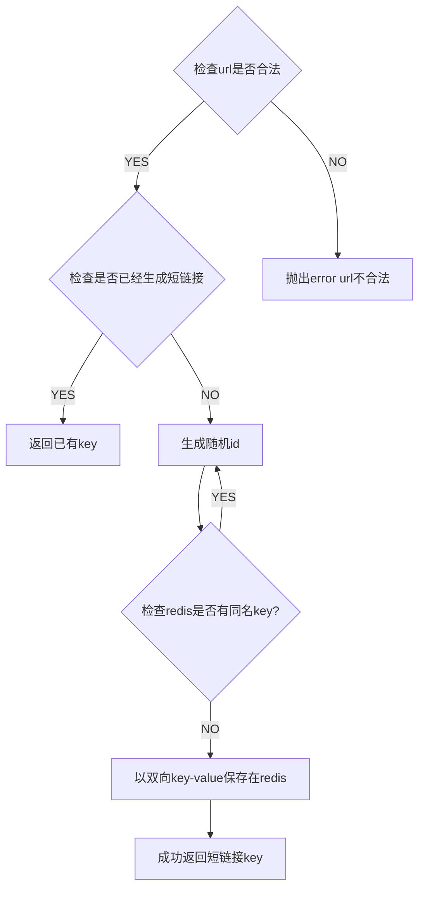

## 假设只需要简单快速的短域名重定向
### 实现方式
    
#### 框架选择 
- 因为需求包括单元测试及覆盖率那么自己搭建简单的express架构难以满足需求，遂选择成品egg.js


##### 短链存储选择

- redis（简单，高性能）不需要额外考虑缓存优化查询等细节

#### 可能会新增的需求（访问量统计，短链时效，删除长期不使用短链等）

> 为了避免过度设计，以下功能等到需求时在补充即可

- 访问量统计在网关处理（无侵入） 或者 在重定向处（无需修改原有逻辑，仅新增统计即可）
- 短链时效 redis 可以完全满足（仅需要修改新增短链接口即可）
- 删除长期不使用短链就需要至少统计最后一次访问时间（无需修改原有逻辑，仅新增统计即可）    


### 流程

#### 生成流程


#### 重定向流程
```mermaid
flowchart TD

    A{检查key在redis是否存在} ;
    A -- YES --> B[重定向到源地址];
    A -- NO --> ERROR[404];
    B[重定向到源地址] --> D[通知最后访问时间访问次数等数据收集操作];
````