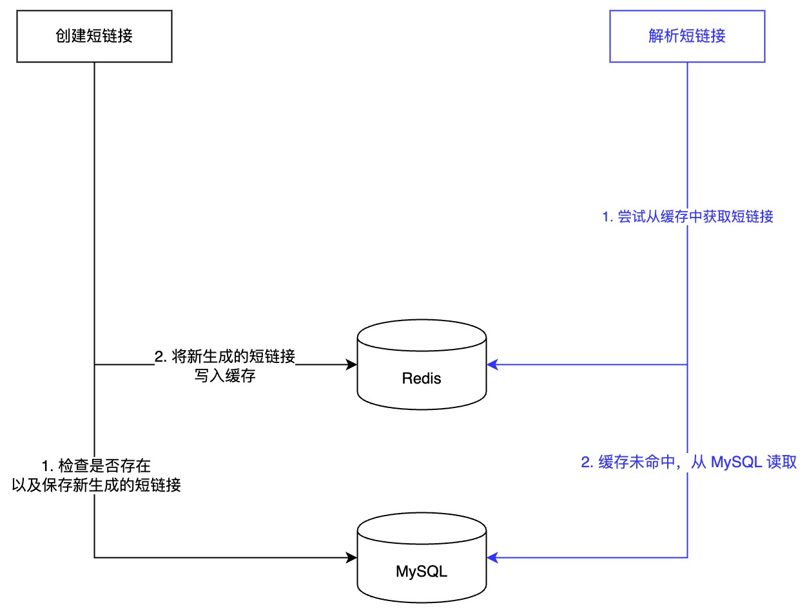
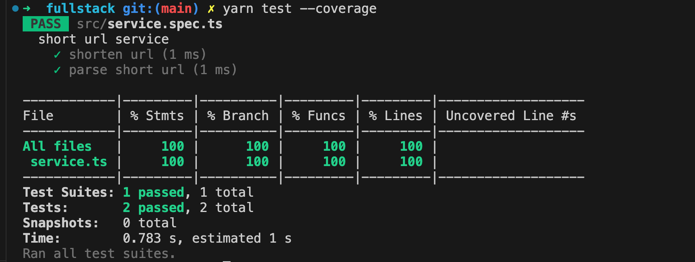

# 数据库 (short_url_service)

表名：`short_urls`

| 字段名        | 类型         | 索引   | 其他 | 注释           |
| ------------- | ------------ | ------ | ---- | -------------- |
| id            | bigint       | PK     | AI   | ID             |
| short_url_key | varchar(8)   | INDEX  |      | 短链接         |
| full_url_key  | varchar(40)  | UNIQUE |      | URL SHA-1 hash |
| url           | varchar(512) |        |      | 原始 URL       |

```sql
CREATE TABLE IF NOT EXISTS `short_url_service`.`short_urls` (
  `id` BIGINT(11) NOT NULL AUTO_INCREMENT,
  `full_url_key` VARCHAR(40) NOT NULL COMMENT 'URL Hash',
  `short_url_key` VARCHAR(40) NOT NULL COMMENT '短链接',
  `url` VARCHAR(512) NOT NULL COMMENT '原始 URL',
  PRIMARY KEY (`id`),
  UNIQUE INDEX `full_url_key_UNIQUE` (`full_url_key` ASC) VISIBLE,
  INDEX `short_url_key_idx` (`short_url_key` ASC) VISIBLE)
ENGINE = InnoDB;
```

# 业务流程



一些假设：

- 依据短链接服务的业务场景，短链接的解析请求比创建请求要多。
- 短链接通常在某一段时间内频繁访问，过了这段时间后访问量会急剧下降。所以仅对短链接解析添加了缓存，并且设置了超时时间，这里也可以换成一个 LRU 缓存。

## 生成短链接

1. 使用长链接计算 SHA-1 哈希值
2. 使用全 HASH 查询数据库，如果记录已经存在，返回对应的短链接
3. 获取前 8 位作为短链接，检查数据库是否存在冲突，冲突的话使用全 HASH 作为短链接
   1. 冲突的概率比较小，如果严格限制 8 个字符的话，冲突的情况下可以拼接随机字符串或者时间戳重新 HASH。
4. 创建新的记录，并写入缓存，设置缓存超时时间
5. 返回新的短链接

## 解析短链接

1. 查询 Redis 缓存，判断是否存在，存在的话直接返回原始的 URL
2. 查询 MySQL 数据库，判断是否存在，如果存在的话，写入缓存并返回原始 URL
3. 如果不存在，404

# 单元测试



# API 测试

## 创建短链接

```bash
curl 'http://localhost:3000/api/short-url' \
--header 'Content-Type: application/json' \
--data '{
    "url": "https://www.baidu.com"
}'

# {"shortUrlKey": "354abe0f"}
```

## 创建短链接(不合法的 URL)

```bash
curl 'http://localhost:3000/api/short-url' \
--header 'Content-Type: application/json' \
--data '{
    "url": "xxx"
}'

# {"error": "invalid url"}
```

## 解析短链接

```bash
curl 'http://localhost:3000/api/short-url/parse' \
--header 'Content-Type: application/json' \
--data '{
    "shortUrlKey": "354abe0f"
}'

# {"url":"https://www.baidu.com"}
```

## 解析短链接(不存在)

```bash
curl 'http://localhost:3000/api/short-url/parse' \
--header 'Content-Type: application/json' \
--data '{
    "shortUrlKey": "xxx"
}'

# {"error":"not found"}
```

# 其他

如果是正式的服务，还需要考虑优化的点：

- 数据库密码不应该放在代码里
- express 需要添加错误处理、日志等 middleware
- 通过单独文件来管理路由
- 当过单独的模块来访问数据库访问的代码逻辑（目前跟业务逻辑放到了一起）
- 通过单独的 Controller 模块来管理路由的 Action，来处理请求/响应的数据格式，数据验证，编排业务逻辑等
