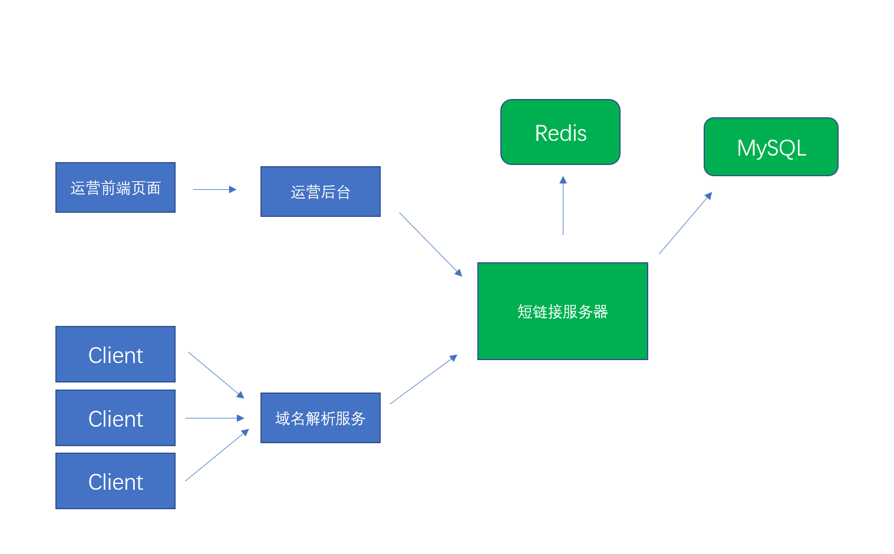
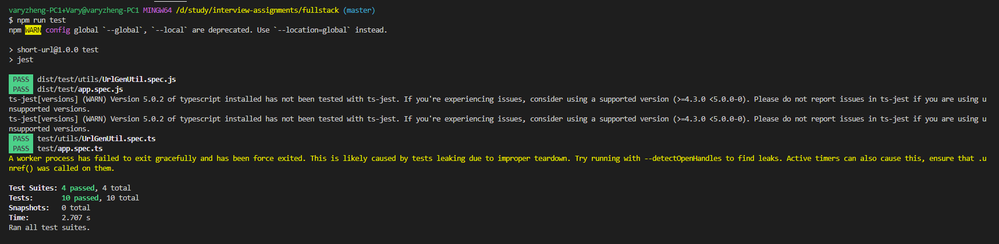
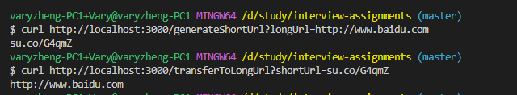
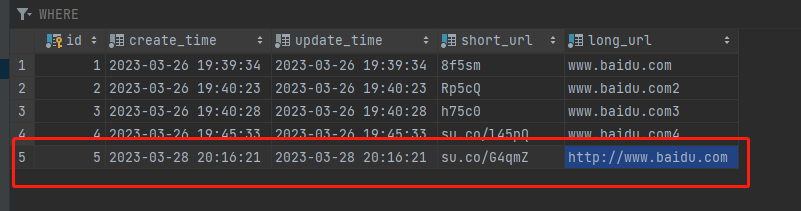
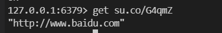

# 系统说明

## 假设

假设系统的使用场景为：网站的运营人员将已有的长链接生成短链接，然后在运营的文案中使用短链接作为推广链接进行推广。  
在此前提下，可以进一步假设：  
1. 我们假设该网站已申请的短域名为 `su.co`
2. 长链接生成短连接的请求量较小，短连接查询对应长链接的请求量较大

## 系统架构



如图中所示，绿色部分即为本系统实现的部分  
这里同时使用了MySQL和Redis，是为了既能持久保存长短链接的对应关系，又能应对在短链接推广初期，涌入的巨大流量。

## 系统设计

#### 生成短链接

1. 接收参数 longUrl
2. 校验longUrl是否已生成短链接
3. 已生成则返回，未生成则生成短链接后返回结果
4. 将结果存入MySQL及Redis


#### 解析为长链接

1. 接收参数 shortUrl
2. 看是否在Redis中命中，命中直接返回结果
3. 未命中Redis，则在MySQL中查询
4. 查到结果存入Redis并返回，未查到则返回404

___Tips: 具体实现细节参见代码注释___

## 数据库设计

#### MySQL

```sql
/* id自增主键，create_time，update_time 数据库设计规范推荐使用。short_url 和 long_url 均为唯一索引。 */
create table url_mapping
(
    id          int auto_increment
        primary key,
    create_time datetime default CURRENT_TIMESTAMP not null,
    update_time datetime default CURRENT_TIMESTAMP not null,
    short_url   varchar(20)                        not null,
    long_url    varchar(300)                       not null,
    constraint url_mapping_pk2
        unique (short_url),
    constraint url_mapping_pk3
        unique (long_url)
);
```

#### Redis

```js
// 短链接为Key，长链接为Value，过期时间1天
redisClient.set(shortUrl, longUrl, { EX: 3600 * 24 });
```

## 单元测试



## 系统运行

#### 接口运行结果


#### 数据库记录


#### Redis记录

