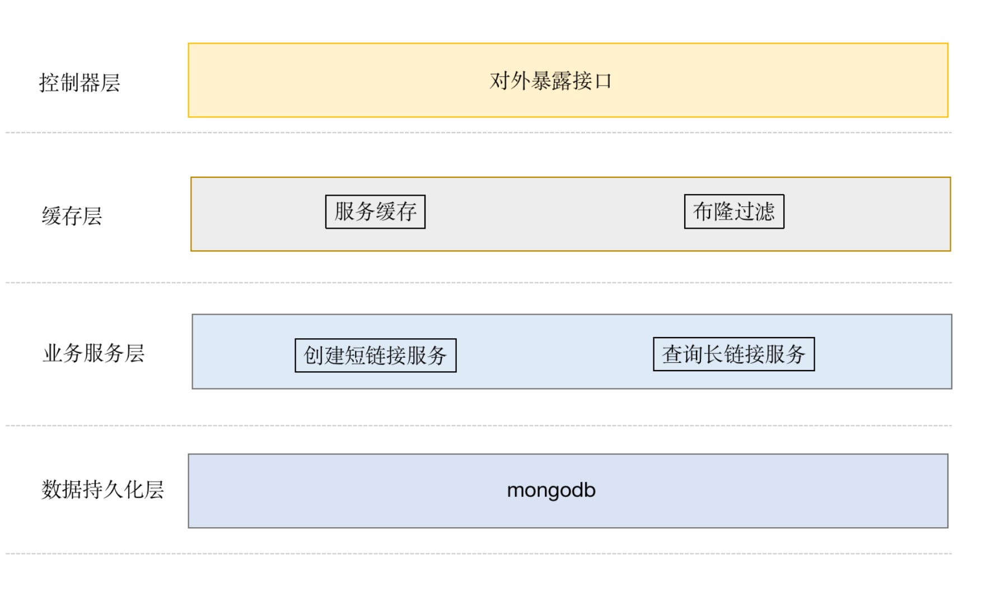

## 短域名服务

### 问题分析

短链是通过某种算法，将比较长的源链接映射成较短的链接.生成的短链接算法下面两种

1. **哈希算法**

   将长地址通过哈希算法生成唯一散列字符串。或者使用 id 生成器，如[nanoid](https://zelark.github.io/nano-id-cc/)直接生成，再建立映射关系。

   好处: 短链接分布均匀，更安全

   缺点: 短链接地址一般较短，哈希算法存在着冲突概率的，要做额外的工作去保证唯一性

2. **自增 id**

   通过递增的 ID 生成器（下文均使用发号器来描述），将数字 id 映射到 url 友好的字符串。

   好处: 设计简单

   缺点: 序号连续可预测。需要请求发号器下发 id

本项目对这两种算法分别做了实现

[**哈希算法实现设计**](./hash-design.md)

[**自增 id 实现设计**](./id-design.md)

## 环境依赖

[nodejs](https://nodejs.org/en/)

[mongodb](https://docs.mongodb.com/manual/installation/)

[RedisBloom](https://github.com/RedisBloom/RedisBloom)

## 技术栈

nodejs+express+typescript

## 系统架构



[创建短链接流程图](./images/create-short-url.png)

[查询长链接流程图](./images/get-long-url.png)

## 接口定义

- 创建短链接

```
POST /api/shortUrl/create
Content-Type:application/json; charset=UTF-8

{longUrl}
```

参数说明:
|参数名|类型|是否必填|说明|
|--|--|--|--|
|longUrl|string|是｜长链接|

返回结果:

{shortUrl:string}

- 查询长链接

```
GET http://localhost:3000/api/shortUrl/getLongUrl?shortUrl={shortUrl}
```

参数说明:
|参数名|类型|是否必填|说明|
|--|--|--|--|
|shortUrl|string|是｜短链接|

返回结果:

{longUrl:string}

##### 表设计

- **Signal** id 发号器

  使用 id 算法时使用
  | 字段 | 类型 | 说明 | 索引 |
  | ----- | -------- | ---------- | ------------ |
  | \_id | objectid | 主键 id | Primary key |
  | name | string | 发号器名称 | Unique Index |
  | value | number | 发号器值 | |

- **UrlMapping** 长短链接映射

  | 字段    | 类型   | 说明       | 索引        |
  | ------- | ------ | ---------- | ----------- |
  | \_id    | string | 短链接 key | Primary key |
  | longUrl | string | 长链接     | Index       |

  ##### 环境变量

  | 名称              | 类型                                | 说明                                     | 默认值 | 是否必填 |
  | ----------------- | ----------------------------------- | ---------------------------------------- | ------ | -------- |
  | NODE_ENV          | 'development ｜ production ｜ test' | 当前环境                                 |        | 是       |
  | MONGODB_URL       | string                              | mongdb 链接字符串                        |        | 是       |
  | MONGODB_NAME      | string                              | mongdb 数据库名                          |        | 是       |
  | REDIS_URL         | string                              | redis 链接字符串                         |        | 是       |
  | BASE_DOMAIN       | string                              | 短链接域名                               |        | 是       |
  | PORT              | number                              | 站点监听端口                             | 3000   |          |
  | CACHE_EXPIRE_TIME | number                              | 缓存失效时间（秒）                       | 3600   |          |
  | KEY_LENGTH        | string                              | 最大短链接 path 长度                     | 8      |          |
  | USE_HASH          | string                              | 是否使用 hash 算法，不设置默认为 id 算法 |        |          |
  | STEP_SIZE         | number                              | 子序列长度,自增 id 算法时生效            | 1000   |          |

### 单元测试覆盖率


