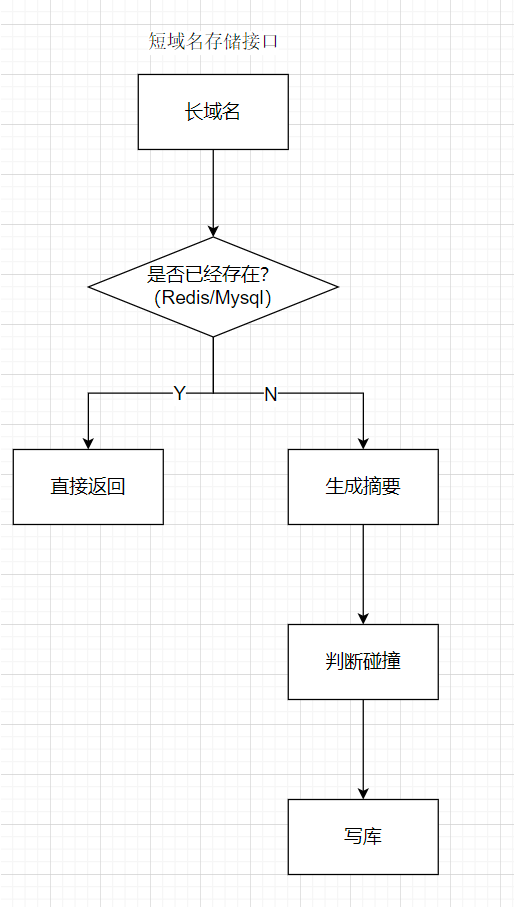
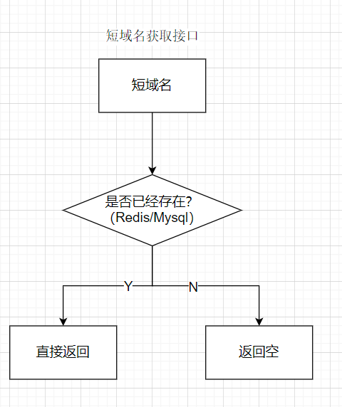

# Typescript 实现短域名服务（细节可以百度/谷歌）

撰写两个 API 接口

- 短域名存储接口：接受长域名信息，返回短域名信息
- 短域名读取接口：接受短域名信息，返回长域名信息。

## 概要设计

使用哈希算法（MurmurHash）生成短摘要，如果重复，则使用当前时间戳加盐（有分布式锁保证不会有同一时间、同一URL进来）。

## 详细设计

### 库表设计

Redis：

- 缓存长短链关系：longURL <-> shortURL, 分别缓存两次
- 分布式锁：给longURL加锁，防止同一个URL并发获取多次，得到多个不同的短链（冲突的时候有可能会加盐）

Mysql：

一张表，对长短链分别加唯一索引

```
DROP TABLE IF EXISTS `t_short_url`;
CREATE TABLE `t_short_url` (
  `id` int(11) NOT NULL AUTO_INCREMENT,
  `short_url` varchar(100),
  `long_url` text,
  `create_time` timestamp DEFAULT CURRENT_TIMESTAMP
  PRIMARY KEY (`id`),
  UNIQUE uq(short_url),
  UNIQUE uq_long(long_url),
  KEY `long_url` (`long_url`(64))
) ENGINE=InnoDB DEFAULT CHARSET=utf8mb4;
```

### 流程设计



