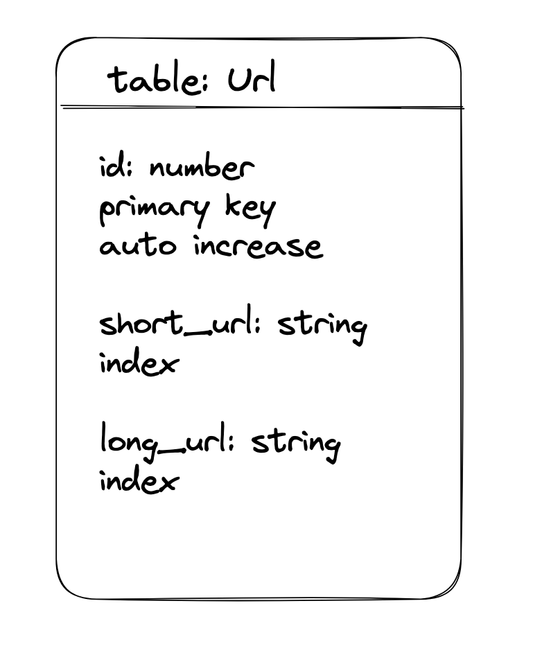
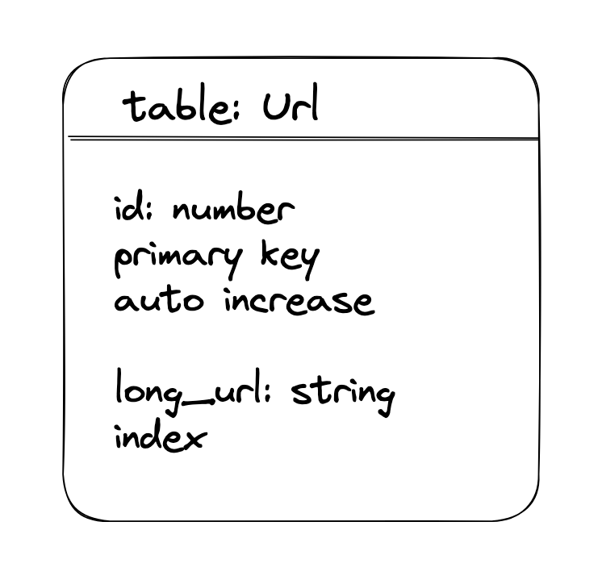
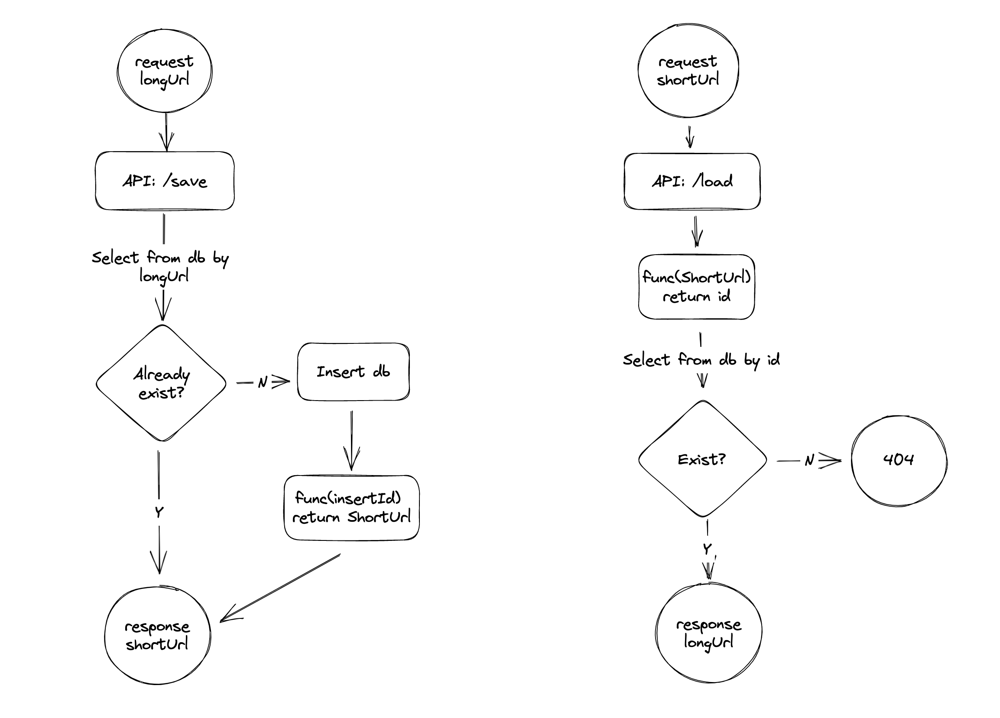
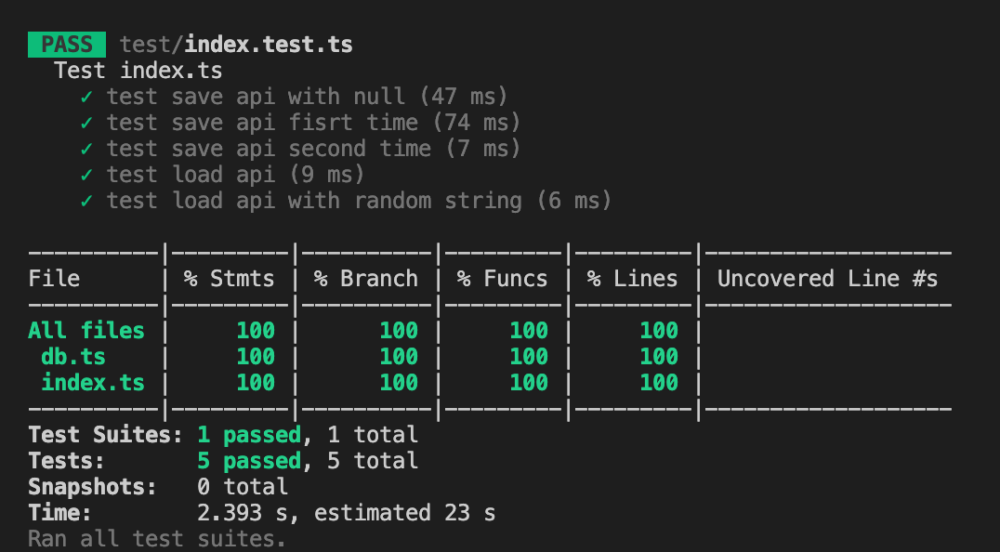

# 短域名服务

## 方案选型

几个可以选择的方案：

1，哈希。通过对长域名做哈希计算，得到一个足够短的摘要值。长到短的过程可以单纯由计算得到，但短到长不行，需要存储短到长的对应关系。此外，需要考虑碰撞的可能，解决方案：如果发生碰撞，则以链表的形式存储，但需要额外字段用于标记当前值在链表中的位置。

2，随机。通过某种算法生成一个足够短的随机值，并存储短到长的对应关系。同样存在碰撞的可能，但相对方案 1 更好解决：可以再次进行随机，直到产生不重复的随机数。若有容量/性能扩展需求，瓶颈在于存储。

3，顺序。使用一个递增的发号器，基于该号码计算出短域名，并存储短到长的对应关系。不存在碰撞问题。瓶颈在于发号器的并发性能，解决方案：可以设置 10 个发号器同时工作，并对每个发号器产生的值赋予尾号 0 - 9，则并发量提高十倍；同理，需要提高百倍、千倍亦可如此。

综上，综合考虑对需求的满足情况、实现成本以及可扩展性等方面，这里选择方案 3。在规模较小的情况下，发号器可以选用 mysql 的自增主键实现。

## 技术设计

一个最简单的数据库表结构大概有以下字段：

根据我们前面的假设，shortUrl 由 id 计算而来，那么二者应该是等价的关系，因此可以不存储 shortUrl，而是用一对函数来进行转换。

每次请求都使用函数会增加计算资源的开销，但可以节省存储资源。当前估计计算成本低于存储成本，因此选择不存 shortUrl 降低冗余的方案。将来若成本形势发生变化，也可以考虑增加字段以降低计算量。

优化后的表结构：

程序处理流程：

## 代码实现

[数据库读写代码](./src/db.ts)

[API 及转换函数](./src/index.ts)

[SQL Schema](./src/schema.sql)

## 测试

[测试代码](./test/index.test.ts)

覆盖率

## 细节说明

### 转换函数

`function idToShortUrl(id: number): string`

`function shortUrlToId(shortUrl: string)`

这一组为 id 到 shortUrl 的转换函数，转换逻辑采用了 base62 编码，这里采用 base62 而非 base64 的考虑在于，剔除了特殊符号，更适用于 url 的场景。

### 容量估算

根据题目要求，短域名长度最大为 8 个字符，那么当前系统能支持存储的数目为 62 ^ 8，约等于 2 * 10 ^ 14。

假设系统每天新增加一百万长域名，余量还能用 2 * 10 ^ 8 天，约等于几十万年 hhh

### 数据库初始化

如果我们就这样开始运行，最初的短域名会是 1、2、3、a、b、c 这样的单个字符，不太好看，我希望至少是 4 个字符，62 ^ 3 约等于 23w，因此我选择让数据库的自增主键从 30w 开始：[schema](./src/schema.sql)

### API

两个接口

`/save` 短域名存储接口：接受长域名信息，返回短域名信息

`/load` 短域名读取接口：接受短域名信息，返回长域名信息

代码逻辑比较单纯了，值得注意的地方在于，存储长域名时，为了区分同一个长域名的正常存储还是已经存在了，分别返回了 http 状态码 201 Created 和 208 Already Reported，测试代码中也利用到了这一点。

## 扩展

当数据量上升时，怎么办？

### 关于并发量

这里的 express 应用本身是无状态的，可以使用负载均衡扩展。那么瓶颈可能在更前面的网关，或更后面的数据库。

对于网关，可以增加基于 DNS 的负载平衡，来提高入口带宽。

对于数据库，读方面可以增加缓存、增加从库；写方面可以像前面提到的，拆分成多个表，每个表独立发自己的 id，拼上自己的尾号即可。

### 关于累积数据

项目运行一段时间后，数据库会变得更大，但存储的大部分 url 可能已经不会再用了。可以考虑给 url 表增加 last_access_time 字段等，采用逐步归档、冷热分离的方案，以减轻压力。

### 进一步延伸

到这里还有一些问题

因为我们方案中，因为不希望给同一个长域名多次分发不同的短域名，在插入前做了一个 already exist 的判断，来保证给它返回一个已有的短域名。但当数据量增大时，这个判断占用资源的问题会愈发显著。那么有以下几种策略：

1，放弃 already exist 判断，认可重复的长域名存在。

2，使用布隆过滤器，降低 already exist 判断的时间复杂度。这个方案的缺点在于，因为我们会对长期未访问的域名归档，而在布隆过滤器中移除一个元素是困难的。

3，缩短过期时间，在「热」表中只保留最近访问过的域名，降低 already exist 要检索的数量。

目前想到这些，有新想到的可以在 comment 补充。

## 复盘

TypeScript 本身不难，对熟悉 JavaScript 的工程师来说很好上手，尤其是工作中见识过动态类型满天飞、各种隐式类型转换踩坑之后，增加了静态类型检查简直是福音 hhh 

但整个作业做下来还是花了不少时间，其中大部分用于解决依赖版本的不匹配、ES 和 Commonjs 各个版本的差异、数据库读写组件回调和 async/await 等等。

此外，能搜到的关于 TypeScript + Express 的资料着实不多，看 Github 和 Stack Overflow 的帖子数量就知道了 hhh。整体上收获还是挺多的！

本来还想把 TypeScript + React 的前端作业也一并写了（不写前端算什么 fullstack！）轮播图本身好做，但想把每个细节都做好，还是有不少工作量的。精力有限，先弄到这里，后面有空再续！