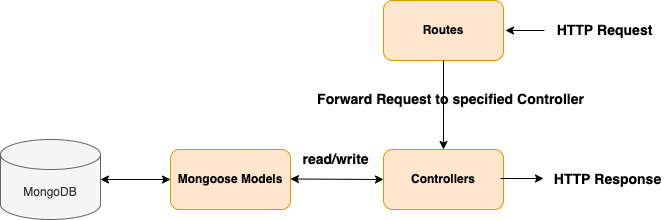
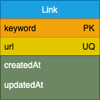

# Dynamic Links

This project is the solution of [TypeScript Fullstack Engineer Assignment](../README.md)

The solution may not be the best as I have described as follows, so please find me via [my resume](./documentation/Lv_Chao_Resume_20220525.pdf)

It comes bundled with Docker and is CI/CD optimized. The development environment uses `docker-compose` to start dependent services like mongo.

A few things to note in the project:
* **[Github Actions Workflows](./.github/workflows)** - Pre-configured Github Actions to run automated builds and publish image to Github Packages
* **[Dockerfile](./Dockerfile)** - Dockerfile to generate docker builds.
* **[docker-compose](./docker-compose.yml)** - Docker compose script to start service in production mode.
* **[Containerized Mongo for development](#development)** - Starts a local mongo container with data persistence across runs.
* **[Safe Mongooose Connection Helper](./src/lib/safe-mongoose-connection.ts)** - A helper class to connect with Mongoose reliably.
* **Joi** - For declarative payload validation
* **[Middleware for easier async/await](./src/middleware/request-middleware.ts)** - Catches errors from routes and throws them to express error handler to prevent app crash due to uncaught errors.
* **[OpenAPI 3.0 Spec](./openapi.json)** - A starter template to get started with API documentation using OpenAPI 3.0. This API spec is also available when running the development server at `http://localhost:3000/api/dev/api-docs`
* **[.env file for configuration](#environment)** - Change server config like app port, mongo url etc
* **[Winston Logger](#logging)** - Uses winston as the logger for the application.
* **ESLINT** - ESLINT is configured for linting.
* **Jest** - Using Jest for running test cases

I choose [MongoDB](https://www.mongodb.com/) to finish the project, for the dynamic links storage requires high scalability but low transactionality, especially under the real service provider circumstance which would be much more like Internet service. The architecture diagram is as follows:



Despite I choose NoSQL to develop the system, I also design the schema as follows to confirm the data:



Since the assignment is only supposed to resolve url shortener problems, the main consideration is store the url and keyword(short code for the url) to database for future retrieval.
If the project is required to deploy to product, we need further development on multiple threads synchronization as noted in [shorten.ts](./src/controllers/link/shorten.ts), for which one of the solutions are built up by [Redis](https://redis.io/)

## I. Installation

### Manual Method

#### Install dependencies

```
$ yarn install
```

## II. Configuration

#### Update Docker repository for actions
```
$ yarn setup-actions
```

## III. Development

### Start dev server
Starting the dev server also starts MongoDB as a service in a docker container using the compose script at `docker-compose.dev.yml`.

```
$ yarn dev
```
Running the above commands results in 
* 🌏**API Server** running at `http://localhost:3000`
* ⚙️**Swagger UI** at `http://localhost:3000/api/dev/api-docs`
* 🛢️**MongoDB** running at `mongodb://localhost:27017`

### Test

Run [unit tests](./__tests/unit/shorten.test.ts) and [integration tests](./__tests/integration/link.test.ts) as follows:

```
$ yarn test
```

Except the normal test reports, it would also output the coverage test reports as follows:

```
$ jest
 PASS  __tests/errors/ApplicationError.test.ts
 PASS  __tests/app.test.ts
 PASS  __tests/unit/shorten.test.ts
 PASS  __tests/integration/link.test.ts (6.071 s)
-------------------------------|---------|----------|---------|---------|-------------------
File                           | % Stmts | % Branch | % Funcs | % Lines | Uncovered Line #s 
-------------------------------|---------|----------|---------|---------|-------------------
All files                      |   52.72 |    25.58 |   32.43 |   51.64 |                   
 src                           |   46.42 |        5 |   15.38 |   46.98 |                   
  app.ts                       |      88 |        0 |   66.66 |      88 | 39-43             
  logger.ts                    |    62.5 |    33.33 |       0 |    62.5 | 14-20             
  routes.ts                    |   83.33 |        0 |     100 |   83.33 | 18-19             
  server.ts                    |       0 |        0 |       0 |       0 | 2-74              
  settings.ts                  |     100 |      100 |     100 |     100 |                   
 src/controllers/link          |   93.75 |    66.66 |     100 |   93.18 |                   
  index.ts                     |     100 |      100 |     100 |     100 |                   
  resume.ts                    |   93.33 |       75 |     100 |   92.85 | 11                
  shorten.ts                   |    93.1 |       50 |     100 |    92.3 | 31-32             
 src/errors                    |    90.9 |       50 |      50 |    90.9 |                   
  application-error.ts         |     100 |      100 |     100 |     100 |                   
  bad-request.ts               |   66.66 |        0 |       0 |   66.66 | 5                 
 src/lib                       |       6 |        0 |       0 |       6 |                   
  safe-mongoose-connection.ts  |       0 |        0 |       0 |       0 | 1-125             
  winston-console-transport.ts |    37.5 |        0 |       0 |    37.5 | 19-24             
 src/middleware                |    61.9 |    55.55 |      75 |   57.89 |                   
  request-middleware.ts        |    61.9 |    55.55 |      75 |   57.89 | 14-17,40-41,48-55 
 src/models                    |     100 |      100 |     100 |     100 |                   
  Link.ts                      |     100 |      100 |     100 |     100 |                   
-------------------------------|---------|----------|---------|---------|-------------------

Test Suites: 4 passed, 4 total
Tests:       8 passed, 8 total
Snapshots:   0 total
Time:        8.793 s
Ran all test suites.
✨  Done in 9.95s.
```

## IV. Packaging and Deployment

The mongo container is only available in dev environment. When you build and deploy the docker image, be sure to provide the correct **[environment variables](#environment)**.

#### 1. Build and run without Docker

```
$ yarn build && yarn start
```

#### 2. Run with docker

```
$ docker build -t api-server .
$ docker run -t -i \
      --env NODE_ENV=production \
      --env MONGO_URL=mongodb://host.docker.internal:27017/links \
      -p 3000:3000 \
      api-server
```

#### 3. Run with docker-compose

```
$ docker-compose up
```


---

## Environment
To edit environment variables, create a file with name `.env` and copy the contents from `.env.default` to start with.

| Var Name  | Type  | Default | Description  |
|---|---|---|---|
| NODE_ENV  | string  | `development` |API runtime environment. eg: `staging`  |
|  PORT | number  | `3000` | Port to run the API server on |
|  MONGO_URL | string  | `mongodb://localhost:27017/links` | URL for MongoDB |

## Logging
The application uses [winston](https://github.com/winstonjs/winston) as the default logger. The configuration file is at `src/logger.ts`.
* All logs are saved in `./logs` directory and at `/logs` in the docker container.
* The `docker-compose` file has a volume attached to container to expose host directory to the container for writing logs.
* Console messages are prettified
* Each line in error log file is a stringified JSON.


### Directory Structure

```
+-- scripts
|   +-- dev.sh
|   +-- setup-github-actions.sh
+-- src
|   +-- controllers
|   |   +-- link
|   |   |   +-- index.ts
|   |   |   +-- resume.ts
|   |   |   +-- shorten.ts
|   +-- errors
|   |   +-- application-error.ts
|   |   +-- bad-request.ts
|   +-- lib
|   |   +-- safe-mongo-connection.ts
|   |   +-- winston-console-transport.ts
|   +-- middleware
|   |   +-- request-middleware.ts
|   +-- models
|   |   +-- Link.ts
|   +-- public
|   |   +-- index.html
|   +-- app.ts
|   +-- logger.ts
|   +-- routes.ts
|   +-- server.ts
+-- .env.default
+-- .eslintrc.json
+-- .gitignore
+-- .gitpod.yml
+-- docker-compose.dev.yml
+-- docker-compose.yml
+-- Dockerfile
+-- jest.config.js
+-- LICENSE
+-- nodemon.json
+-- openapi.json
+-- package.json
+-- README.md
+-- renovate.json
+-- tsconfig.json
+-- yarn.lock
```
