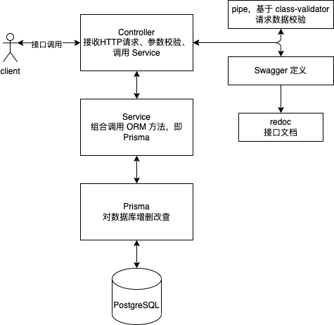
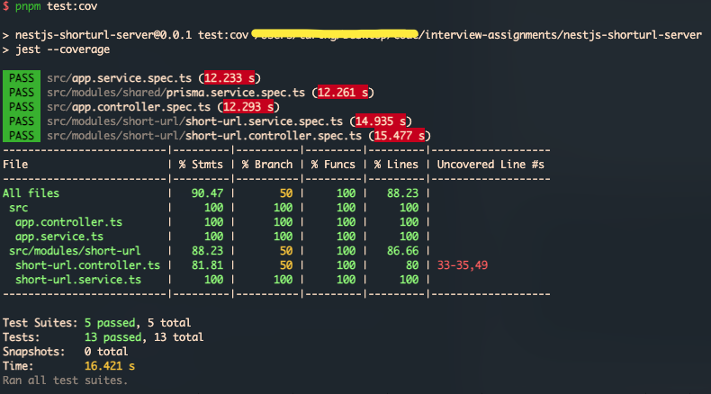
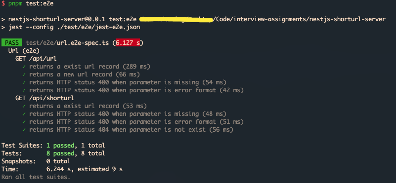

# 说明

## 开发启动

```bash
# 安装依赖
pnpm i

# 环境变量配置
copy .env.example .env

# 在本地安装 PostgreSQL 数据库，默认读取 docker-compose.yaml 和 .env 中的配置
docker-compose up -d
# 根据 prisma 模型定义生成数据表操作类型定义文件至 node_modules 中
npx prisma generate
# 将模型定义同步到真实数据库中
npx prisma db push
```

### 本地开发

```bash
pnpm start:dev
```

### 生产启动

```bash
pnpm start:pm2
```

### 测试

```bash
# 单元测试
pnpm test
# 生成测试覆盖率
pnpm test:cov
# 接口集成测试
pnpm test:e2e
```

## 系统设计
### 系统流程


### 主要技术栈
- [NestJS]()
- [Express]()
- [nanoid]()
- [class-validator]()
- [Prisma]()
- [PostgreSQL]()
- [Docker]()
- [Jest]()
- [TypeScript]()
- [@faker-js/faker]()

### 基于 Prisma 的表模型定义
详见 [`prisma/schema.prisma`](./prisma/schema.prisma)

```
model Url {
  id        String   @id @default(cuid())
  /// 原始链接
  url       String   @unique @map("url")
  /// 短链接
  shortUrl  String   @unique @map("short_url")
  /// 创建时间
  createdAt DateTime @default(now()) @map("created_at")
  // 更新时间
  // updatedAt DateTime  @updatedAt @map("updated_at")
  // 删除时间
  // deletedAt DateTime? @map("deleted_at")

  @@map("url")
}
```

### 创建表结构的 SQL

```SQL
CREATE TABLE "public"."url" (
  "id" text COLLATE "pg_catalog"."default" NOT NULL,
  "url" text COLLATE "pg_catalog"."default" NOT NULL,
  "short_url" text COLLATE "pg_catalog"."default" NOT NULL,
  "created_at" timestamp(3) NOT NULL DEFAULT CURRENT_TIMESTAMP,
  CONSTRAINT "url_pkey" PRIMARY KEY ("id")
)
;

ALTER TABLE "public"."url" 
  OWNER TO "postgres";

CREATE UNIQUE INDEX "url_short_url_key" ON "public"."url" USING btree (
  "short_url" COLLATE "pg_catalog"."default" "pg_catalog"."text_ops" ASC NULLS LAST
);

CREATE UNIQUE INDEX "url_url_key" ON "public"."url" USING btree (
  "url" COLLATE "pg_catalog"."default" "pg_catalog"."text_ops" ASC NULLS LAST
);
```

## 单元测试
单元测试，主要测试分层架构下的 controller 和 service


## 接口测试
接口集成测试


### 根据链接获取短链
**缺少 url 参数**

> curl http://localhost:3000/api/url

**Response**
```json
{
  "statusCode": 400,
  "message": [
    "url must be an URL address",
    "url should not be empty"
  ],
  "error": "Bad Request"
}
```

**正确请求**
> curl http://localhost:3000/api/url?url=https://github.com

**Response**
```json
{
  "id": "cl4yvya9w0002kcjd0sgetvok",
  "url": "https://github.com",
  "shortUrl": "https://hs.cn/tlhes",
  "createdAt": "2022-06-29T00:54:53.060Z"
}
```

** url 格式错误**
> curl http://localhost:3000/api/url?url=https://github

**Response**
```json
{
  "statusCode": 400,
  "message": [
  "url must be an URL address"
  ],
  "error": "Bad Request"
}
```

### 根据短链获取链接
**缺少 shortUrl 参数**

> curl http://localhost:3000/api/shorturl

**Response**
```json
{
  "statusCode": 400,
  "message": [
    "shortUrl must be an URL address",
    "shortUrl should not be empty"
  ],
  "error": "Bad Request"
}
```

**正确请求**
> curl http://localhost:3000/api/shorturl?shortUrl=https://hs.cn/tlhes

**Response**
```json
{
  "id": "cl4yvya9w0002kcjd0sgetvok",
  "url": "https://github.com",
  "shortUrl": "https://hs.cn/tlhes",
  "createdAt": "2022-06-29T00:54:53.060Z"
}
```

** url 格式错误**
> curl http://localhost:3000/api/shorturl?shortUrl=https://github

**Response**
```json
{
  "statusCode": 400,
  "message": [
    "shortUrl must be an URL address"
  ],
  "error": "Bad Request"
}
```
** 短链不存在 **
> curl http://localhost:3000/api/shorturl?shortUrl=https://hs.cn/notexits

**Response**
```json
{
  "statusCode": 404,
  "message": "url 不存在",
  "error": "Not Found"
}
```
