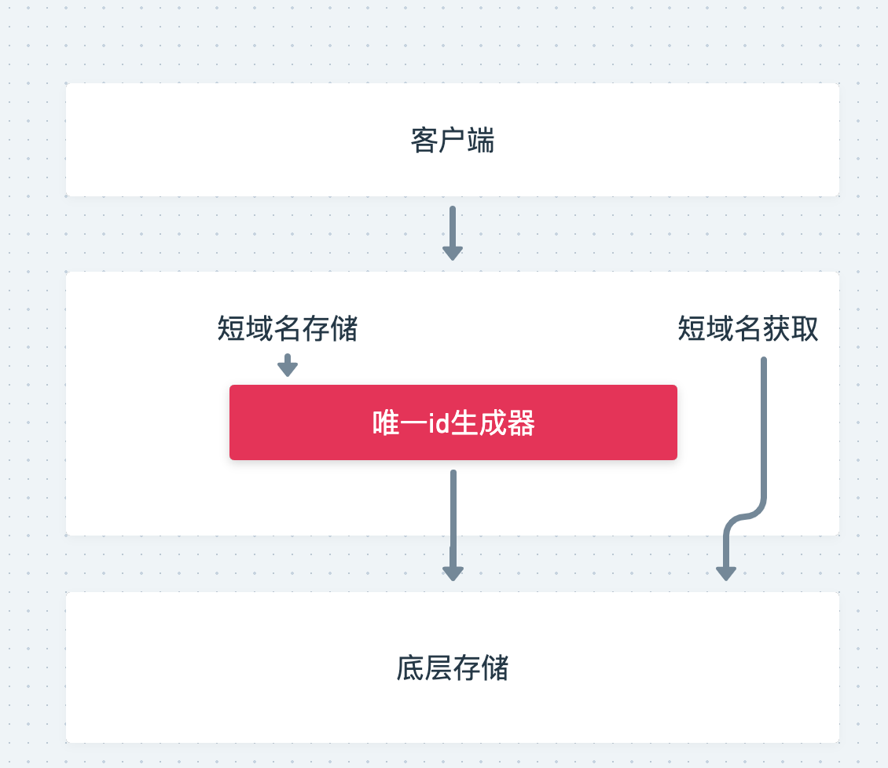

# 长域名转短域名服务
后续简称 SDServer

## 项目基础结构

## 功能分析 

### 短域名存储

接受一个长域名，例如 https://github.com/scdt-china/interview-assignments/tree/master/fullstack
转换成一个短域名，如 https://shortdomian.com/dsadaf12

其中 dsadaf12 这串字符串，可以理解微是长域名的代号，通过SDServer转换生成。

这个功能的核心就是长域名对应的 `代号` 的生成：

##### 方案1：通过base64 对url进行编码处理

base64作为可解码的算法，好像很适合这个场景。但是base64生成的编码长度和域名长度强相关。所以这个方案直接就排除了

##### 方案2：通过数据库的自增ID

比较简单

在分布式场景下需要考虑锁，数据多的时候还需要考虑分库分表等

##### 方案3：雪花ID

前两种方案其实都是和要存储的长域名item本身有相关性的。不过我们这个功能其实是可以把长域名和对应的`代号`来分开考虑的

思路就是基于一个可以生成分布式全局唯一id的工具，每次有存储操作时，都去这里去获取一个id即可。

##### 雪花ID补充
由于雪花Id生成的是64位。如果转为16进制（字符串）进行存储，那么长度为 16，超出限制，所以需要将雪花Id转为62进制再进行存储

为什么是62进制？ 英文字母26个，大小写英文字母 和 0-9 刚好为62个

### 短域名获取

存储时将短域名作为 PrimaryKey。获取时通过短域名获取到对应的记录，并获取到对应的长域名URL，返回HttpStatus为301，重定向URL为长域名URL即可
