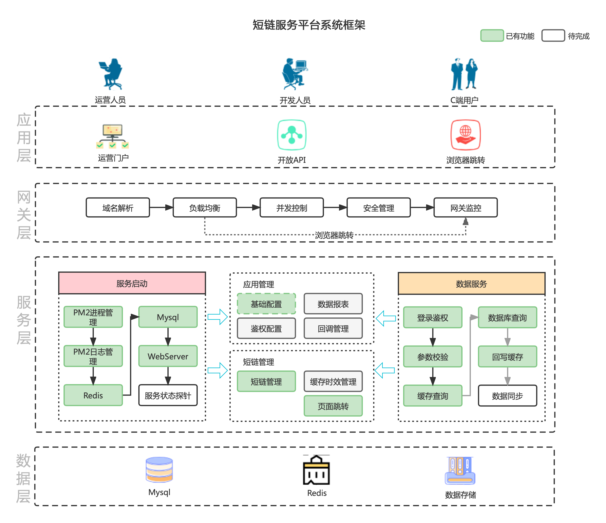
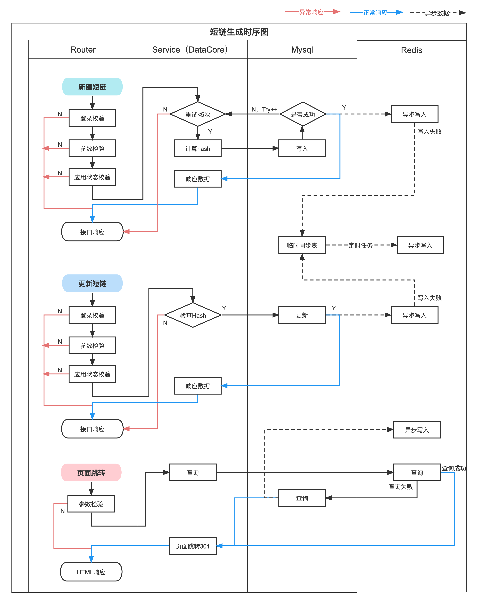

### 3.1 设计文档

#### 3.1.1. 技术背景

TODO

#### 3.1.2. 预期目标

TODO

#### 3.1.3. 技术方案

- 整体技术架构图
  

- 接口数据时序图
  

- hash（短链）生成器
  短链字符集：
  ```
  [0-9],[a-z],[A-Z],-,_
  ```
> 整体思路是：将数据库返回的id转换成64进制后，按需增加分库、分表的标识，最后作为短链的hash值。
> 
  1. hash长度对应短链个数估算：
```
长度为5: 64^5 大约 10亿
长度为6: 64^6 大约 687亿
长度为7: 64^7 大约 4.4万亿
```
2. 结合mysql数据库表查询和写入的性能，选择长度为5作为id映射后的hash长度。
- Hash控制在8位以内，拆解后为：
 
- 从图中可知：
```
1、长度为2-8位；
2、前两位分别为数据库分库、数据表分表的标识位；
3、最后一位是校验位，按位记录，可以区分短链中是否有分库标识、分表标识、以及id映射后的hash长度。
4、最大有效位数是7（最后一位是校验），短链最大有效个数4.4万亿
```
4. 计算短链（Hash）的时序图：
 


- 应用表
```
CREATE TABLE `sl_app` (
  `id` bigint(20) unsigned NOT NULL AUTO_INCREMENT COMMENT '自增id',
  `appid` varchar(32) COLLATE utf8_bin NOT NULL COMMENT 'appid',
  `app_name` varchar(64) COLLATE utf8_bin DEFAULT NULL COMMENT '应用名',
  `auth_token` varchar(32) COLLATE utf8_bin DEFAULT NULL COMMENT '认证token',
  `create_time` timestamp NULL DEFAULT CURRENT_TIMESTAMP COMMENT '创建时间',
  `update_time` timestamp NULL DEFAULT CURRENT_TIMESTAMP ON UPDATE CURRENT_TIMESTAMP COMMENT '修改时间',
  PRIMARY KEY (`id`),
  KEY `idx_appid` (`appid`) USING HASH
) ENGINE=InnoDB DEFAULT CHARSET=utf8 COLLATE=utf8_bin COMMENT='应用表'
```
- 链接映射表
```
CREATE TABLE `sl_slink` (
  `id` bigint(20) unsigned NOT NULL AUTO_INCREMENT,
  `appid` varchar(32) COLLATE utf8_bin NOT NULL COMMENT 'Appid\n',
  `ori_url` varchar(255) COLLATE utf8_bin NOT NULL COMMENT '长连接地址',
  `slink` varchar(32) COLLATE utf8_bin NOT NULL COMMENT '短链hash',
  `is_delete` tinyint(4) NOT NULL DEFAULT '0' COMMENT '是否已经删除。0 不删除，其他删除',
  `create_time` timestamp NULL DEFAULT CURRENT_TIMESTAMP COMMENT '创建时间',
  `update_time` timestamp NULL DEFAULT CURRENT_TIMESTAMP ON UPDATE CURRENT_TIMESTAMP COMMENT '最后一次更新时间',
  PRIMARY KEY (`id`),
  UNIQUE KEY `idx_slink` (`slink`) USING HASH,
  KEY `idx_appid` (`appid`) USING HASH
) ENGINE=InnoDB AUTO_INCREMENT=56 DEFAULT CHARSET=utf8 COLLATE=utf8_bin COMMENT='短链接映射表'
```
- 链接影子表

```
CREATE TABLE `sl_link_shadow` (
  `id` int(10) unsigned NOT NULL AUTO_INCREMENT,
  PRIMARY KEY (`id`)
) ENGINE=InnoDB AUTO_INCREMENT=1 DEFAULT CHARSET=utf8 COMMENT='sl_link影子表，自增id'
```