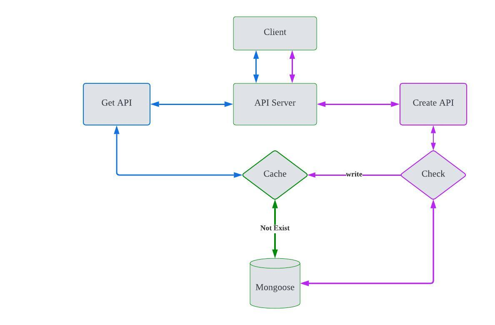

# API

## 设计

为了简化设计，我们不考虑负载均衡和集群等，仅考虑单节点从客户端到服务器的访问处理流程，设计图如下：


## 说明

响应结果实例，如果data为null, 客户端可以通过检查code和error来处理未返回或出错的原因。

```javascript
{
    "data": {
        "_id": "63f05260bc11abdeaa4a172b",
        "shortUrl": "wd0bsyjt",
        "longUrl": "https://medium.com",
        "createdAt": "2023-02-17T04:21:52.061Z",
        "updatedAt": "2023-02-17T04:21:52.061Z",
        "__v": 0
    }，
       "code"?: number,
       "error"?: string | object
}
```

| Path | Method | Data/Query | Response | Description |
|-----|----|----|----|-----|
| /api/shortUrl | POST | { longUrl: string }   | 如上所示 | 创建短链接，长链接必须指定 |
| /api/shortUrl | GET   | { shortUrl: string }  | 如上所示 |根据短链接获取保存的信息 |

## API集成测试

* ***保存长链接API***

 | data | 返回数据 | 测试结果 | 描述 |
 |---------|----|------|--------|-----|
| 未传参数 | {"shortUrl": null,code:4000} | 通过 | 未传参数，返回code 4000 |
| {"longUrl": ""} | {"shortUrl": null,code:4000} | 通过 | 未传参数，返回code 4000 |
| {"longUrl": "httpss://www.invald.cn"} | {"shortUrl": null,code:4000} | 通过 | 参数不是有效的域名地址，返回code 4000 |
| {"longUrl": "https://www.google.com"} | {_id: "abx", "shortUrl": "NrOCpX8M", ...} | 通过 | 正常返回，默认长度为8个字符 |
| {"longUrl": "https://www.google.com", "length": 10} | {_id: "abx", "shortUrl": "NrOCpXwZ8M", ...} | 通过 | 指定生成短链接的长度 |
| {"longUrl": "https://www.google.com"} | {_id: "abx", "shortUrl": "NrOCpX8M", ...} | 通过 | 唯一性：同一个长URL只会保存一次 |

* 获取长链接

 | data | 返回数据 | 测试结果 | 描述 |
 |---------|----|------|--------|-----|
| {"url":"NrOCpX8M"} | {_id: "abx", "shortUrl": "NrOCpX8M", ...} | 通过 | 根据创建的短链接参数获取数据 |
| {"url":"NrOCpX8M"} | {_id: "abx", "shortUrl": "NrOCpX8M", ...} | 通过 | 多次同一请求将会从缓存中读取 |
