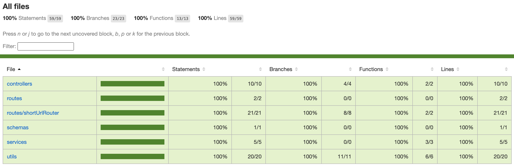

# 快速开始

## 安装

您首先需要连接mongoose数据库并创建“short-url-api”数据库。我们推荐使用yarn来管理依赖项和运行我们的命令。

```bash
$ yarn
```

## 运行API服务

```bash
# development
$ yarn dev

# production mode
$ yarn build
$ yarn start
```

## 运行测试用例

查看测试用例请访问文件夹命名为__test__下的文件, 比如：src/routes/shortUrlRouter/__test__ 该目录包含所有关于短链接的测试用例。

```bash
$ yarn test

# watch changes and re-run tests
$ yarn test:watch

```

## 代码覆盖率

```
$ yarn test:coverage
```

用浏览器打开项目目录：./coverage/lcov-report/index.html 以查看代码测试结果. 一般工程不会将代码测试率提交到git进行管理，所以我们做了以下截图：


