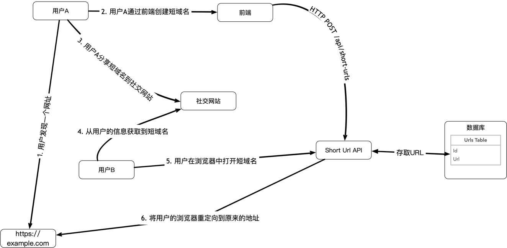
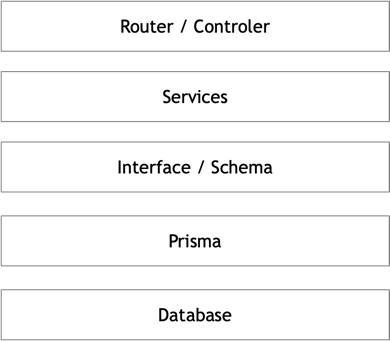

# Short URL

Another short url service, based on TypeScript, Node.js and Express.js

短域名服务, 基于TypeScirpt, Node.js 和 Express.js

## 系统假设

- 系统提供8位长度的短域名服务
- 提供快速的创建和访问
- 服务部署可能是在已有公司基础设施上部署

## 系统设计

### 用户流程



该系统使用典型的用户旅程如下：

1. 用户A发现一个网站
2. 用户通过Short-URL的前端创建短域名
   > 前端调用后台服务为该域名生成8位短域名，并记录在数据库中
3. 用户A在社交网站分享该短域名
4. 用户B从社交网站看到用户A的信息
5. 用户B在浏览器中点击该短域名
6. 浏览器被重定向到用户A发现的网站
   > 后台根据短域名解析后，反查到域名返回重定向到目的域名

### 短域名生成算法

短域名服务一般会使用看似乱序的固定位数的字符，考虑到资源效率和速度优先，采用了使用数字ID编码8为字符的方式：


1. 编码字符采用base58，而不是常见的base64，可以更方便识别和手动输入
2. 编码有salt的参与，可以通过跟换salt，变换生成的ID方便多站点部署
3. 相比使用hash生成算法，该算法计算非常快, 即使大量创建也可以毫秒级别响应，因为不会产生碰撞，可以避免不必要的数据库查重
4. 可以预期生成长度，，当前采用的算法支持最大ID
   194754273880 [参考 short-id-convert 的测试](src/utils/__test__/short-id-convert.spec.ts)
5. 在安全存储salt的情况下，数据库中并不需要存储生成的短域名，可以在API实时转换短域名和ID，可以减轻数据库的存储和索引的负担

### 框架设计



设计按接近MVC的方式，从上往下分为

- 路由
    - 配置API的入口和处理方式
    - 中间件处理日志和错误处理
    - 有基本的单元测试，但主要由集成测试覆盖
- 服务
    - 提供具体资源的上操作接口
    - 主要由集成测试覆盖
- 数据接口/Schema/ORM
    - 提供传输的DTO类型接口
    - 基于Prisma的schema及其生成的类型定义接口
    - 使用Prisma来编写和管理数据迁移
- 数据库
    - 数据库采用Postgres
    - 在开发时可以本地安装
    - 在集成测试时由docker-compose提供

## Prerequisites

- node version >= 18.12.1
- pnpm version >= 7.20.0
- PostgresSQL 11.15
- docker
- docker-compose

## Getting Started

### Prepare

Install dependencies

```shell
pnpm install
```

Generate prisma client

```shell
pnpm run prisma 
```

### Initial Database

Create `.env` file and config DATABASE_URL,

```.dotenv
DATABASE_URL=postgresql://<USER>:<PASSWORD>@<HOST>:<PORT>/<DATABASE>?schema=<SCHEMA>
```

Then run migration

```shell
# init production database
npx prisma migration deploy 
```

or

```shell
# initial a development db
npx prisma db push
```

> Check https://www.prisma.io/docs for more usage.

### Run the app

Start in dev mode:

```shell
pnpm run dev
```

Start in dev mode with watch:

```shell
pnpm run dev:watch
```

Start in prodaction mode:

```shell
pnpm start
```

### Run Test

```shell
# only unit test
pnpm run test:unit
# only integration test
pnpm run test:int
# run all test
pnpm run test
# run on CI
pnpm run test:ci
```

Current Test coverage

```shell
------------------------|---------|----------|---------|---------|-------------------
File                    | % Stmts | % Branch | % Funcs | % Lines | Uncovered Line #s
------------------------|---------|----------|---------|---------|-------------------
All files               |   92.89 |    85.71 |   88.37 |   92.25 |
 src                    |     100 |      100 |     100 |     100 |
  app.ts                |     100 |      100 |     100 |     100 |
  start.ts              |     100 |      100 |     100 |     100 |
 src/common             |   72.72 |    76.92 |   61.53 |   72.72 |
  app-error.ts          |   93.75 |       80 |     100 |   93.75 | 31
  error-handler.ts      |      50 |    66.66 |      50 |      50 | 11,24-46,53
  logging.ts            |     100 |      100 |     100 |     100 |
 src/short-urls         |     100 |      100 |     100 |     100 |
  short-urls.router.ts  |     100 |      100 |     100 |     100 |
  short-urls.service.ts |     100 |      100 |     100 |     100 |
 src/utils              |     100 |      100 |     100 |     100 |
  context.ts            |     100 |      100 |     100 |     100 |
  server.ts             |     100 |      100 |     100 |     100 |
  short-id-converter.ts |     100 |      100 |     100 |     100 |
------------------------|---------|----------|---------|---------|-------------------

```

> Except the error helper function, all is 100%.

## Configuration

Create a `.env` or setup environment variables.

| Name           | Description                               | Default |
|----------------|-------------------------------------------|---------|
| `PORT`         | Desired host port used for http requests. | 3000    |
| `DATABASE_URL` | database connection config                |         |
| `LOG_LEVEL`    |                                           | INFO    | 
