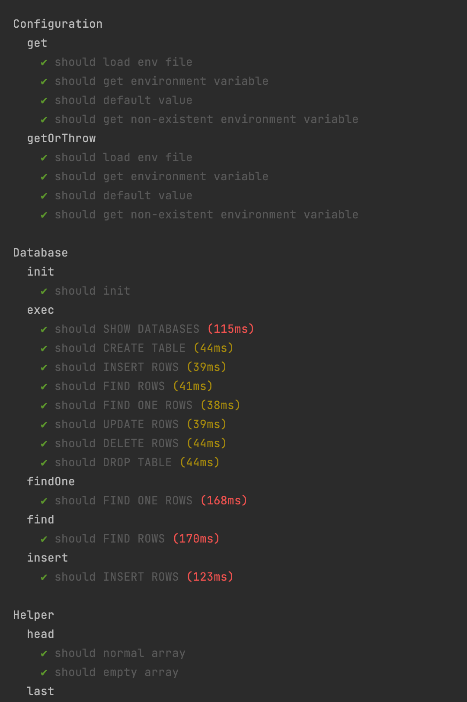

# Shorturl

> express 版本

[博客](https://www.g086.com)

[简历](https://www.aa8i.com/resume/1)

[简历图片](./docs/cv.png)

> 由于某些情况并没有写 node 相关经历。
> 之前在火花思维前端团队参与过活字平台(no-code)、包管理平台的前后端开发工作。
> 平时使用的 node 框架为 Nest.JS。

## 业务流程

```text
  Client  
    | 
    |  --- 访问 A  ------->  +-----------------+
    |                        + ShortService    +
    |  <- 301 Redirect ---   +-----------------+
    |     Location: B 网站
    |
    |
    |  --- 访问 B -------->   +-----------------+
    |                        + B WebServer     +
    |                        +-----------------+
```

## 生成逻辑设计

1. 生成一个随机字符串，拿到该字符串到数据库中查询，如果不存在，插入到表中。
2. 如果存在循环上面步骤。
3. 如果循环 20 次后，没有得到唯一随机字符串，字符串长度增加 +1，继续执行步骤一。

## 表结构设计

```mysql
CREATE TABLE IF NOT EXISTS `std_url` (
  `id`    INT(20)     NOT NULL  AUTO_INCREMENT  PRIMARY KEY  COMMENT 'ID',
  `url`   TEXT        NULL                                   COMMENT '链接',
  `alias` VARCHAR(50) NULL                                   COMMENT '别名',
  KEY `alias` (`alias`)
) COMMENT 'Shorturl' ENGINE=InnoDB CHARSET=utf8mb4 AUTO_INCREMENT=0;
```

## 接口测试

[使用 Rest Client 测试接口](./docs/Request.http)

### 跳转

```shell
curl -X GET --location "http://localhost:8000/ywJCE" -I
```

```text
HTTP/1.1 301 Moved Permanently
X-Powered-By: Express
Location: https://www.baidu.com
Vary: Accept
Content-Type: text/plain; charset=utf-8
Content-Length: 55
Date: Wed, 15 Jun 2022 18:55:55 GMT
Connection: keep-alive
Keep-Alive: timeout=5
```

### 生成短域名

```shell
curl -X POST --location "http://localhost:8000/api/v1/short" \
    -H "Content-Type: application/json" \
    -d "{\"url\": \"https://www.aa8i.com\"}"
```

```text
http://localhost:8000/api/v1/short

HTTP/1.1 201 Created
X-Powered-By: Express
Content-Type: application/json; charset=utf-8
Content-Length: 67
ETag: W/"43-A1BoDNTtSw+YZ4uOcRXp4eAgQeY"
Date: Wed, 15 Jun 2022 19:08:21 GMT
Connection: keep-alive
Keep-Alive: timeout=5

{
  "data": "http://localhost:8000/YfTch",
  "code": 0,
  "message": "success"
}
```

### 查询长域名

```shell
curl -X GET --location "http://localhost:8000/api/v1/short/YfTch"
```

```text
http://localhost:8000/api/v1/short/YfTch

HTTP/1.1 200 OK
X-Powered-By: Express
Content-Type: application/json; charset=utf-8
Content-Length: 60
ETag: W/"3c-xsVRmiACPV2qVZHeCzcCO8Xk8YY"
Date: Wed, 15 Jun 2022 19:08:34 GMT
Connection: keep-alive
Keep-Alive: timeout=5

{
  "data": "https://www.aa8i.com",
  "code": 0,
  "message": "success"
}
```

## 用例测试

```shell
pnpm test
```

### 测试结果




