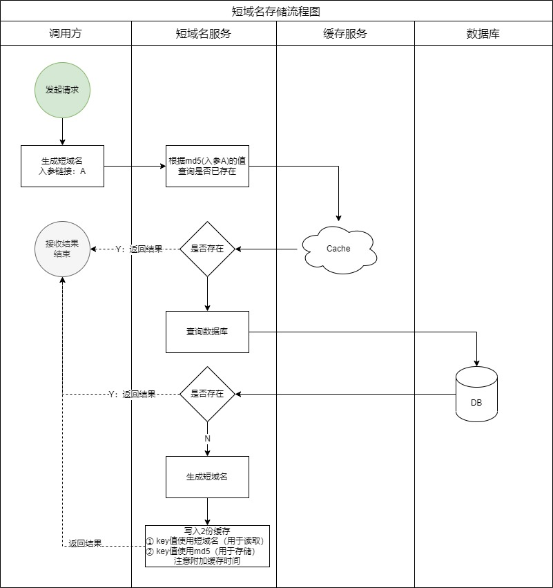
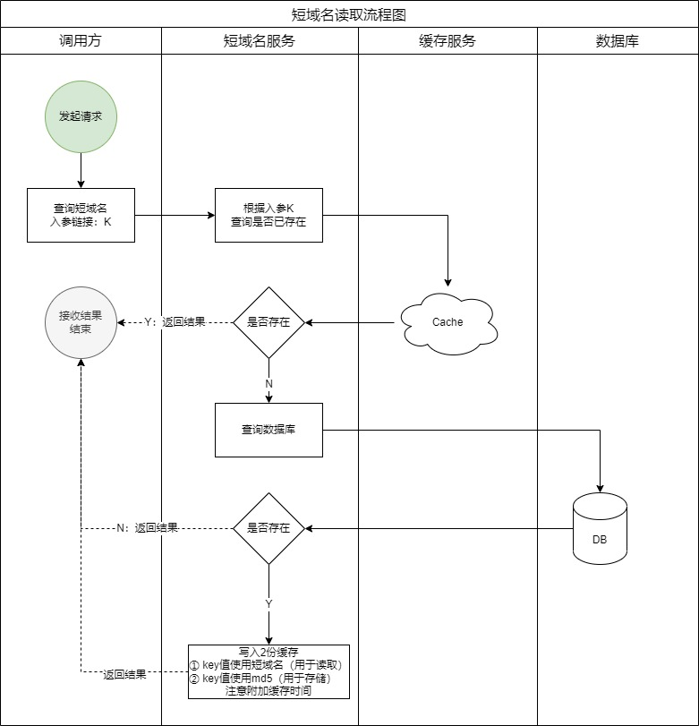
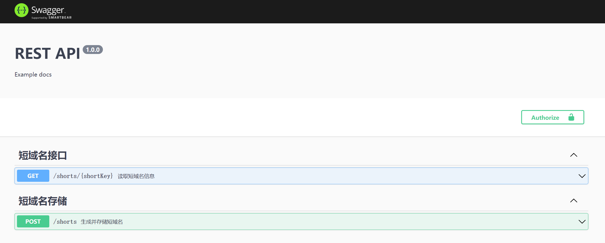
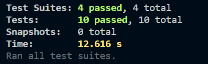

# 一、需求
Typescript 实现短域名服务  
撰写两个 API 接口  
短域名存储接口：接受长域名信息，返回短域名信息。  
短域名读取接口：接受短域名信息，返回长域名信息。  
- 限制  
  短域名长度最大为 8 个字符（不含域名）

# 二、需求预研
## 1、参考竞品
https://sina.lt/

# 三、开发方案
## 1、流程图
### 1、短域名存储流程图


### 2、短域名读取流程图



## 2、短域名计算方式  
1. 选择MurmurHash中32bits的生成方式，结果得到：一串十进制的整型值。  
- 文档：https://github.com/mikolalysenko/murmurhash-js  
2. 为了最后生成长度够8位62进制字符，62 ** 8=218340105584896，所以需要将MurmurHash的结果值取绝对值后，乘以一个随机数，将结果中的小数点移除，取前15位长度即可。
将结果转换为62进制，62进制常用的合法字符有0～9、a～z、A～Z 这样 62 个字符。因为第2步中生成的结果可能大于62 ** 8，转换成62位后可能会生成9位，所以生成的字符串再截取前8位。
```js
// 10进制字符串转62机制字符串
function string10to62(number) {
    const chars = '0123456789abcdefghigklmnopqrstuvwxyzABCDEFGHIGKLMNOPQRSTUVWXYZ';
    const charsArr = chars.split('');
    const radix = chars.length;
    let qutient = +number;
    let arr = [];
    do{
        let mod = qutient % radix;
        qutient = (qutient - mod) / radix;
        arr.unshift(charsArr[mod]);
    }while(qutient);
    return arr.join('');
}
```

## 3、扩展思考
如果MurmurHash的Seed缓存自增序号，在自增序号无法满足高并发时，方案上可以考虑：  
- 分布式发号器(Distributed ID Generator)
- 利用Redis的单线程自增函数

# 四、源码说明

## 1、框架架选型  
考量：社区近期活跃较高；可灵活集成；  
选用：https://github.com/ljlm0402/typescript-express-starter

## 2、数据库文件
- 路径：shorturldemo\src\databases\shorturl.sql

## 3、环境变量配置文件
- .env.development.local  // 开发  
- .env.production.local // 生产  
- .env.test.local // 测试  

## 4、路由说明
- 文件路径：shorturldemo\src\routes\shorts.route.ts
- 短域名路由path：/shorts

## 5、接口说明
接口文档地址：http://localhost:3000/api-docs/


<table>
<tr>
<th>接口</th>
<th>请求方式</th>
<th>入参</th>
<th>出参</th>
</tr>
<tr>
<td>/shorts</td>
<td>POST</td>
<td>```body: { origin: 'url'} ```</td>
<td>
<pre>
{
    "data": {
        "id": 1,
        "origin": "url",
        "md5": "",
        "shortKey": "",
        "updatedAt": "",
        "createdAt": ""
    },
    "message": "created"
}
</pre>
</td>
</tr>
<tr>
<td>/shorts/:shortKey</td>
<td>GET</td>
<td>---</td>
<td>
<pre>
{  
   "data": {
        "origin": "",
        "shortKey": ""
    },
    "message": "findOne"
}
</pre>
</td>
</tr>
</table>

## 6、单元测试
测试完成，正常。
  

