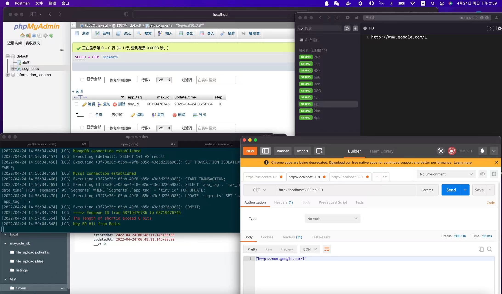

# Tiny URL  Api Overview

We build a  MMEN stack (Node.js + Express + MongoDB+Mysql) a application with Typescript. The back-end server uses Node.js + Express for TinyUrl REST APIs.

## Overview
The Algorithm in that:  

*    When building a tinyurl, we’ve got one dimensions to optimize on: shortened hash. We have 62 alpha numeric chars i.e. [a-z 0–9 A-Z], though hyphen(-) and underscore(\_) are allowed in a url still we want to avoid them as it would be a bad looking url like http://abc.com/c0--rw_ or http://abc.com/______-.
Following is the simple implementation of base2 to base62 converter, that’s all we need to shorten a url.

* #### 62⁸ = 218,340,105,584,896(~218 trillion)
Since the short url length is limited to a maximum of 8,the base62 value of length 8 corresponds to a binary length of 48. For information security, 11 low bits use interference bits: 3 bits of workid + 8 bits of random, the high-order 1bit is flag.
The remaining 36 bits in binary correspond to the maximum decimal number, that number come from the queue (segmentid) 

* #### 2³⁶-1=68719476735(~687✖️100million)
 
   

## The App Architecture

The application with following architecture:  

  

SnowflakeIdinstance: generate a maximum 8-bit shortid, get segmentid from  Mysqlinstance. 
 
MongdbInstance: get & store the generated shortid. 
 
Mysqlinstance: get segment range through mysql transaction from mysql, and put the numbers(segmentid) in the segment range into the queue, provide segmentid for SnowflakeIdinstance.    

RedisInstance: cache shortid-url.    


  

* shortid features: Global non-repeating, non-guessing and increasing trend

##  1.Back-end  

### Overview  

The following table shows overview of the Rest APIs that will be exported:

| Methods | Urls | Actions |
| :-----:| :----: | :----: |
| GET | /api/:shortid| get original url by shortid|
| POST | /api/ | generate shortid |
 

### Mongoose Schema

The following table shows database data structures of the api:

| Field | Type | Description |
| :-----:| :----: | :----: |
| url | String(unique) | original url |
| shortId | String(unique,index) | tinyurl |
| createdAt | Date |  created time |
| updatedAt | Date | updated time |

### Mysql Schema

The following table(InnoDB) shows database data structures of the api:

| Field | Type | Description |
| :-----:| :----: | :----: |
| app_tag |varchar(32)(Primary Key)| Biz tag |
| max_id | bigint | Max id |
| step | bigint |  Step|
| update_time | datetime | updated time |

###  Project structrue  
├── config  
│  ├── development.yaml  
│  ├── production.yaml  
│  └── test.yaml  
├── coverage  
├── http-test.sh  
├── jest-preload.js  
├── jest.config.js  
├── node_modules  
├── nodemon.json  
├── package-lock.json  
├── package.json  
├── src  
│  ├── api  
│  │  ├── ApiApp.ts  
│  │  ├── controllers  
│  │  │  ├── TinyControll.spec.ts  
│  │  │  └── TinyControll.ts  
│  │  ├── models  
│  │  │  ├── SegmentsModel.ts  
│  │  │  └── UrlModel.ts  
│  │  ├── routers  
│  │  │  ├── TinyRouter.spec.ts   
│  │  │  └── TinyRouter.ts  
│  │  ├── services  
│  │  │  ├── db  
│  │  │  │  ├── Mongoose.ts  
│  │  │  │  ├── RedisCache.ts  
│  │  │  │  ├── Sequelize.spec.ts  
│  │  │  │  └── Sequelize.ts  
│  │  │  ├── SnowflakeId.spec.ts  
│  │  │  └── SnowflakeId.ts  
│  │  └── utils  
│  │     ├── Singleton.ts  
│  │     └── utils.ts  
│  ├── debug.ts  
│  ├── index.ts  
│  └── schema  
│     └── mysql.sql  
├── tests  
└── tsconfig.json  
#### special note
* /config folder:configuring parameters for MongoDB & Mysql & Redis in different environment. 
* /coverage folder:Jest & supertest coverage 
* /src/api/controll folder: api controll & jest test file
* /src/api/models folder: mongodb & mysql model
* /src/api/routers folder: router & jest test file 
* /src/api/services foleder:mongodb, mysql & redis and snowflakeid core class    

###  Implementation

```
1.npm install
2.npm run dev
3.npm run:test & npm run test | npm run cov
```

### Technology
* To see package.json  

* config & js-yaml: define a set of default parameters, and extend them for different deployment environments 
 
* mongoose: mongoose is a MongoDB object modeling tool
designed to work in an asynchronous environment. Mongoose supports both promises and callbacks   

* mysql2 & sequelize-typescript: sequelize is a promise-based Node.js ORM tool for Postgres, MySQL, MariaDB, SQLite, Microsoft SQL Server, Amazon Redshift and Snowflake’s Data Cloud  

* ioredis: a robust, performance-focused and full-featured Redis client for Node.js

* jest & supertest: delightful JavaScript testing.
 

####Unit Test & Code Coverage With Jest & Supertest

  
  

###Integration Test Results With Postman

GET /api/:shortId, shortId is invalid(not exist)

 
GET /api/:shortId  

```
Tinyrl : GET : https://localhost:3030/api/FD
Return OK (200),Response Body:"http://www.google.com/1"
```  
 
 
POST /api/, url is invalid

  
POST /api/  

```
Tinyrl : POST : https://localhost:3030/api/   
Request Body: {url:http://www.google.com/1}  
Return OK (200),Response Body:{"url":"http://www.google.com/1","shortid":"QW"} 
```  

Crete shortid sucessful(and dequeue.when a certain threshold is reached, automatically get data from the database and put it into the queue)

 

POST /api/, The length of Tiny url exceed 8 bits

 

* The time required to generate 100,000 shortid and the size of the data space (mongodb & redis) using shell (curl) in debug mode  
 
Actually about 56/s, 16.8M(redis),100k(mongodb)

####Traffic and System Capacity
#### Estimates

* Traffic
Assuming 200:1 read/write ratio
* Storage
* Memory   

####  About me   

* Wechat: deepdev 


