# 容量评估

假设每天短链生成的量为 1 亿条，请求层面的 读 / 写 = 10 / 1，且该短链服务将运行十年

1. 每秒的写操作约为：1 亿 / 24 / 3600 $\approx$ 1157

    每秒的读操作约为：$\approx$ 1157 \* 10 $\approx$ 11570

    备注：加上业务逻辑层的读次数，真正的读操作可能会到 10w/s 数量级

2. DB 需要存储的数据条数：1 亿 \* 365 \* 10 = 3650 亿

3. 由于合法 url 不含 + - 等字符，用 [0-9,a-z,A-Z] 表示即可。如果要求短链字符长度最长为 8 个字符，a = 62<sup>8</sup> 已经远远大于 3650 亿。其实 7 位字符已经能满足需求。例如新浪微博的短链系统采用的就是 7 位字符。

# 系统设计逻辑流程图



# 系统设计架构图



# 技术选型说明

-   生成最多八位短链算法常见的有两种，一种是 hash CRC32，一种是基于 base62 转换的自增序列法

|                | CRC32                                    | 基于 base62 转换的自增序列法 |
| -------------- | ---------------------------------------- | ---------------------------- |
| 是否有重复问题 | 是（概率极低）                           | 否                           |
| 短链位数       | 固定                                     | 不固定（但可扩展）           |
| 被碰撞         | 否                                       | 是                           |
| 性能           | 算法本身已最优，增加节点机器无法提升性能 | 增加节点机器可明显提升性能   |

    -   hash CRC32 缺点：存在生成的短链重复的情况（概率很低）；短链位数是固定的，不能做可自定义选择的扩展功能；重复的问题可通过 bloom filter 等方法解决；当某些时刻流量突增时，通过增加节点数无法明显提升系统性能；

    -   基于 base62 转换的自增序列法 缺点：容易被外界进行碰撞测试，猜出生成短链的序列，虽然可以通过打乱 base62 字符的排列顺序，但只是增加了被外界碰撞的门槛，最终还是会被测试出顺序；优点：不存在生成的短链重复的情况；短链位数在指定范围内可做位数扩展；当某些时刻流量突增时，通过增加节点数可明显提升系统性能；

    -   本设计综合考虑使用的是基于 base62 转换的自增序列法；

-   按照预估量 write: 0.11w/s read: 1.2w/s 单节点主库是可以高效处理每秒千级的写入量；但从库的读操作，由于业务逻辑多次读库，可能达到 10w/s，读可能存在压力。所以 sender_num_seq 数据表设计的出发点是进行“提前发号”，可以提升发号性能，并且考虑到分布式增加 server 时，可以通过 sender_num_seq 进行多 server 处理，每个号段 range 都存在本地的 Redis 中，不需要与其他节点进行数据同步。另外，如果想让短链码从某位数开始，可以在 sender_num_seq 表初始化一些数据。

-   弊端：Redis 未得到充分利用

-   数据库配置为读写分离(数据库的主从数据同步问题不在本设计范围内)

# 项目运行步骤

本地开发模式

1. `npm i`
2. `npm start`

Docker 部署模式

1. `docker build -t urlShorten .`
2. `docker-compose -f docker-compose-tools.yaml up`

备注：当用 Docker 进行生产环境部署时，Mysql 和 Redis 组件不用自建，compose 文件中依赖的 Mysql 和 Redis 只适用于开发模式。

# API 格式及错误码

1. GET 请求：通过短链接查询对应长链接 /v1/api/fetchLongByShort/{shortUrl}

```json
// 正常返回
{
    "Code": 1000,
    "Data": {
        "longUrl": "This is retrieved long URL.",
        "shortUrl": "This is input short URL."
    },
    "Text": "The original long URL has been retrieved."
}

// 输入的短链为空或不合法 不在[0-9, a-z, A-Z] 范围
{
    "Code": 1001,
    "Text": "The input short URL is not a valid URL."
}

// 查询的短链不存在对应的长链
{
    "Code": 1101,
    "Text": "The system was unable to retrieve the original long URL for this short URL. Please confirm that you have correctly shortened this URL before attempting to retrieve the original long URL."
}
```

2. POST 请求：通过长链接生成短链接 /v1/api/shorten

| 参数    | 说明       | 类型   | 是否必须 |
| ------- | ---------- | ------ | -------- |
| longUrl | 长链接地址 | string | 是       |

```json
// 正常返回
{
    "Code": 1000,
    "Data": {
        "longUrl": "This is input long URL.",
        "shortUrl": "This is shortened short URL."
    },
    "Text": "The long URL has been successfully shortened."
}

// 输入长链地址不合法
{
    "Code": 1002,
    "Text": "The input long URL is not a valid URL."
}

// 发号器初始化异常
{
    "Code": 1102,
    "Text": "An error has occurred. Please contact the system administrator for assistance."
}

// 发号器初始化数值异常
{
    "Code": 1103,
    "Text": "An error has occurred. Please contact the system administrator for assistance."
}
```

| 错误码 | 说明                                              |
| ------ | ------------------------------------------------- |
| 1000   | 正常返回                                          |
| 1001   | 通过短链查询长链时，输入短链接不合法              |
| 1002   | 通过长链生成短链时，输入长链接不合法              |
| 1101   | 通过短链查询长链时，无法找到对应长链接            |
| 1102   | 发号器数值异常，此问题需将错误码反馈给开发排查    |
| 1103   | 发号器数值为 null，此问题需将错误码反馈给开发排查 |

备注：1102 和 1103 是代码保护写的异常，所以并不包括在流程图中

# 关于代码结构层次的细节说明

本仓库代码组织形式都是基于预估的并发量 + API 的复杂程度考虑的。后续如果需迭代或者拆分服务，可在本设计基础上进行优化。

1. 将两个 API 的路由放在主 index.ts 中，是基于现状下的业务逻辑较少考虑，如果 API 数量庞大，可抽出一层 router 注册，并把 express 的 server 层启动抽到 server/index.ts ；
2. database 类的设计考虑

-   暂时未考虑其他 DB 类型的选择注册，可随业务需求而优化；

-   由于本设计中 API 不需要使用事务提交，所以封装的 database 类中 getConnection 和 releaseConnection 暂时未使用到。如果业务变更，需要使用到事务，可使用 `pool.getConnection()` -> `connection.query()` -> `connection.release()` 代码调用流程；

-   简单封装的 closePool 暂时未调用到。这是另外一个关于如何优雅设计服务升级 + 异常处理的问题，不在本仓库设计考虑范围内；

3. 抽出 redis 和 db 目录是基于后续抽象扩展的考虑（在这里可能显得有点笨重），主要是借鉴了写其他语言的一些思路；
4. 关于配置文件 .env 的管理。.env 的一个缺点是所有的配置类型都存为了 string，后续可由 yaml 管理配置文件；
5. 暴露给用户层的错误信息标准：目前代码层面选择不会将代码报错、DB/Redis 组件连接/查询异常等信息抛给用户端，可根据具体业务需求调整暴露级别；
6. 暂时未考虑的逻辑模块和未使用第三方的模块：

-   无用户登陆 Auth 设计逻辑；
-   rateLimiter 限流器模块是另一个比较大的话题，不在本次设计考虑范围，暂时使用第三方工具；
-   未引入 ORM ；

7. 日志：严格来说，lib/logger.ts 并不能算是 lib，并且 http 层的 access.log + stack 信息也应该打日志，后续可根据具体项目的实际需求，借鉴学习 [TSW](https://github.com/Tencent/TSW)进行 logger 的设计。
