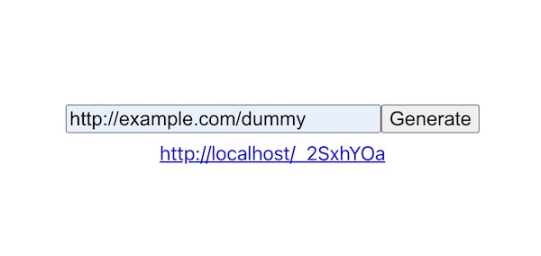
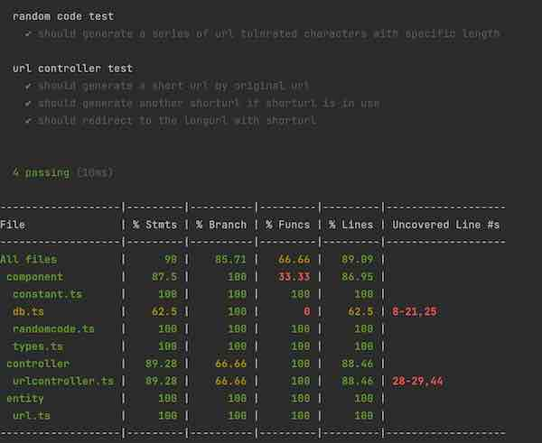
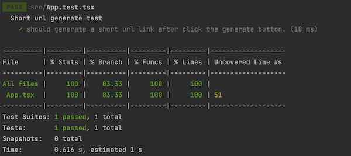
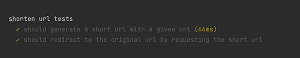

## UrlShortener

Url shortener demo application using PERN stack (PostgreSQL, Express, React, Nodejs).

### Run application
1. Run `docker-compose up -d --build`
2. Open http://localhost:8080 \
   
3. To stop the application, run `docker-compose down`

### Run unit tests
1. Server: `cd server && npm t`\
   
2. Web: `cd web && npm t`\
   

### Run api test
1. `docker-compose up -d --build`
2. `cd api-test && npm t`\
   
    
### Entity relation diagrams
View `architecture/entity.puml` for details

