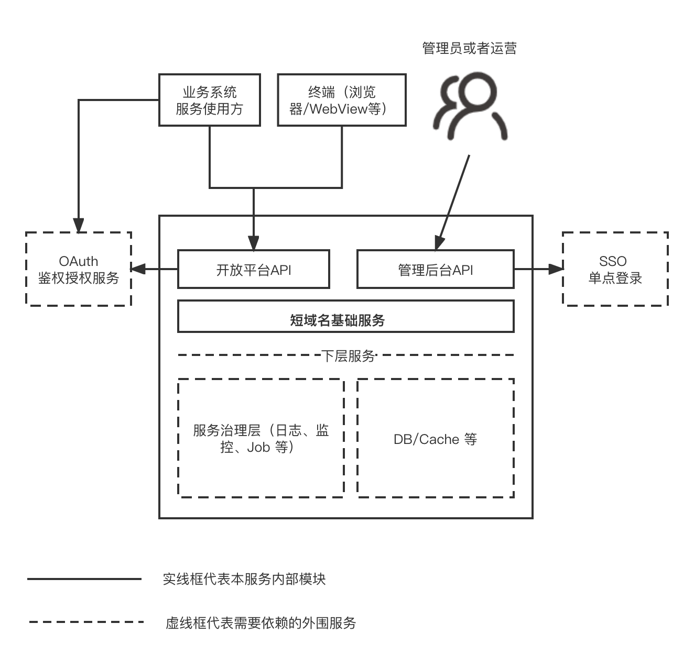
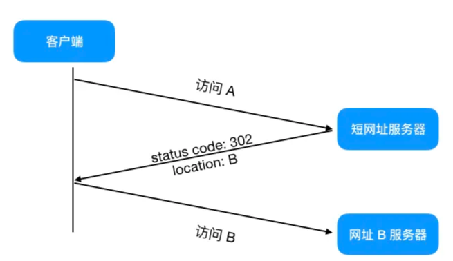

## 需求背景

实现短域名服务，更多请细节 [see](README.md)

需求：

- 短域名存储接口：接受长域名信息，返回短域名信息
- 短域名读取接口：接受短域名信息，返回长域名信息。

## 整体架构设计



业务流程：



### 开放平台

- 提供开放平台接口，例如：服务 Client 传入一个长域名，返回一个短域名
- 提供将短域名解析成对应的长域名，并重定向

### 管理后台

- 提供后台页面上域名置换操作
- 域名配置以及，域名的使用期限管理等
- BI 系统数据看板

### 鉴权

- 开放平台鉴权：业务系统（服务使用方）需要先在开放平台申请 appId 和 appSecret，底层依赖 OAuth 实现整体的鉴权。
- SSO 单点登录：管理后台统一接入 Cas 认证中心。

## 算法选型

假定短域名为 `https://t.com`，那么具有业务含义的短域名为 `https://t.com/s78shd7f`，格式为： `https://t.com/{shortCode}` (shortCode 长度为 8 位)。

那么我们来计算下 从 `a-z 0-9 A-Z` 里选出 8 个字符，一共能有：
62^8 = 218,340,105,584,896 ，218 万亿个 可看出来非常大，基本上能满足日常的需求了。

注：前期可以单库，不过中后期一旦量起来了需要考虑分库分表。

shortCode 生成选型：

| 算法          | 优点                                       | 缺点                                                       | 备注                         |
| ------------- | ------------------------------------------ | ---------------------------------------------------------- | ---------------------------- |
| 主键自增 id   | 利用主键唯一特性，天然保证唯一，并且索引快 | 适用单机版，后期分布式扩容困难; 安全性低，容易被暴力破解   |                              |
| 随机 8 位字符 | 安全性相对比较高，8 位随机码完全无规律     | 随机码到了后期容易重复，生成一个唯一随机码可能会循环很多次 |
| MurmurHash    | 比较适合哈希检索操作，性能比较高           | 可能会出现哈希碰撞，需要做防重处理                         | 需要进行一次转成 62 进制操作 |

总结：综上，MurmurHash 比较合适，只要我们处理好哈希碰撞即可。

## 短 id 组成

shortCode 码组成主要分为时间位和随机码位，如下：

```
|1 bit 符号位 | 25 bit 时间小时 | 6 bit 机器位 |  32 bit hash |
```

注：

- 25 bit 时间小时 理论上可以使用 2^31 / 60 / 24 / 365 = 63.8 年
- 机器位主要考虑到 分布式场景下，2^6 = 64 个数据集群
- 最后将 64 bit 转成 8 个字符（8bit * 8个字符 = 64 bit），具体实现在 `utils/id.ts里的 ShortId 类` 

问题：js 的 number 类型整型部分长度最大为 53 bit 位，所以按照 64 bit 来处理的话，极大可能会出现溢出，为此我们将 64 bit 拆成 两个 32 bit 来处理。

## 安全和性能

1. 可能泄露 appId appSecret 导致被循环生成短域名；也可能程序 bug 导致死循环生成短域名？

   > 解决方案：对每个 appId 进行限频，每个小时 最多 5W 个等。

2. 在秒杀场景下，短域名可能访问非常频繁，所有请求都打到数据库上，可能导致 DB 扛不住？

   > 解决方案：短域名场景比较单一，不需要考虑数据的一致性，非常适合 多级缓存，增加 redis 以及 本地缓存。

3. 有的黑客可能暴力组合访问访问短域名，来获得其他未知的域名？
   > 解决方案：第一点可以进行 恶意 IP 识别，拉入黑名单处理；第二点 使用 布隆过滤器 过滤掉一些恶意请求。

## 表结构设计

基于 MySQL 数据库来设计：

```sql
create table cloud_short_link
(
    `id`          bigint(20)              not null comment '员工ID' primary key,
    `lurl`        varchar(128) default '' not null comment '长域名',
    `short_id`    varchar(32) default '' not null comment '短id',
    `app_id`      varchar(32)  default '' not null comment '应用id',
    `expire_time` int(11)      default 0  not null comment '过期时间',
    `create_time` int(11)      default 0  not null comment '创建时间'
) ENGINE = InnoDB
  DEFAULT CHARSET = utf8mb4 COMMENT '短域名表';

alter table cloud_short_link
    add unique uk_short_id (short_id);

```

sqlite 对应 sql:

```sql
create table cloud_short_link
(
    id          INTEGER PRIMARY KEY,
    lurl        varchar(128) default '' not null,
    short_id    varchar(128) default '' not null unique,
    app_id      varchar(32)  default '' not null,
    expire_time int(11)      default 0 not null,
    create_time int(11)      default 0 not null
);
```

## 接口测试

- 生成短域名

```shell
curl -XPOST -v 'http://localhost:8000/slink' \
    --header 'Content-Type: application/json' \
    --data-raw '{"app_id": "123", "lurl": "https://www.baidu.com?search=Java2"}'

# 参数： app_id 应用id，随便填写一个字符短串，lurl 业务长域名地址

```
返回结果体：
```json
{"message":"success","code":0,"data":{"slink":"http://localhost:8000/j00ONlRz"}}
```

- 请求短域名重定向到长域名

```shell
curl -XGET -v 'http://localhost:8000/j00sNlRz'
```
返回结果头：
```
< HTTP/1.1 302 Found
< X-Powered-By: Express
< Access-Control-Allow-Origin: *
< Location: https://www.baidu.com?search=Java2
< Vary: Accept
< Content-Type: text/plain; charset=utf-8
< Content-Length: 56
< Date: Wed, 01 Jun 2022 06:24:24 GMT
< Connection: keep-alive
< Keep-Alive: timeout=5
```

## 用例测试

使用的是 jest 框架进行单元代码进行测试。

```shell
yarn test  
```