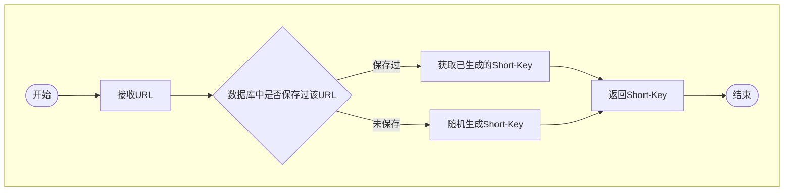
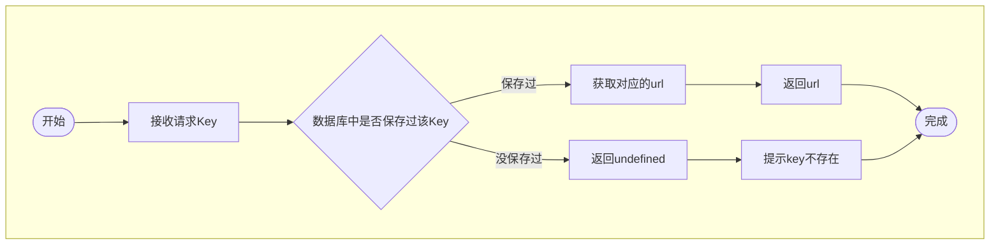

## /api/v1/storage 流程

```mermaid
flowchart TD
subgraph &nbsp;
    开始([开始])--> 接收URL -->
     Check{数据库中是否保存过该URL}

Check--保存过-->获取已生成的Short-Key -->返回Short-Key

Check--未保存-->随机生成Short-Key--> 返回Short-Key

--> 结束([结束])
end
```

## /api/v1/get 流程

```mermaid
flowchart TD
subgraph &nbsp;

开始([开始])--> 接收请求Key -->Check{数据库中是否保存过该Key}
Check--保存过-->获取对应的url -->返回url --> 完成([完成])
Check--没保存过-->返回undefined-->提示key不存在-->完成([完成])
end
```
