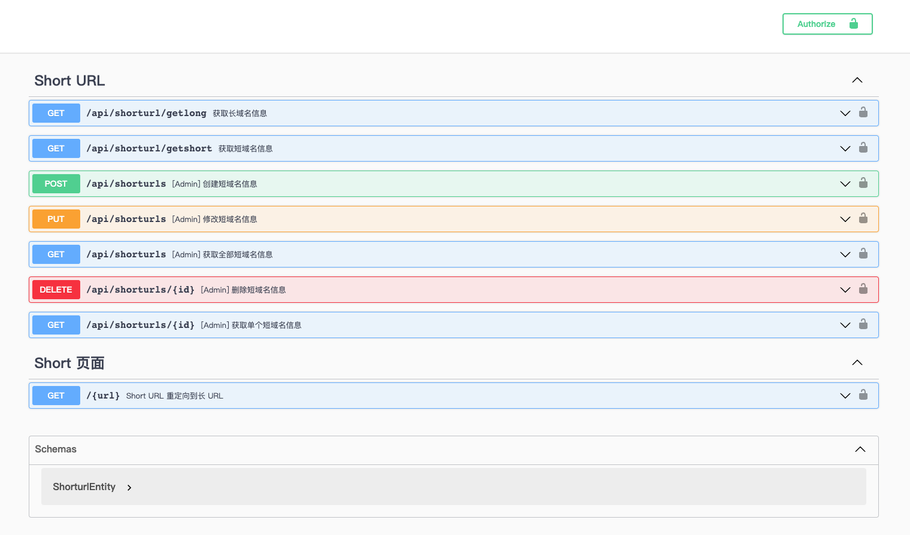
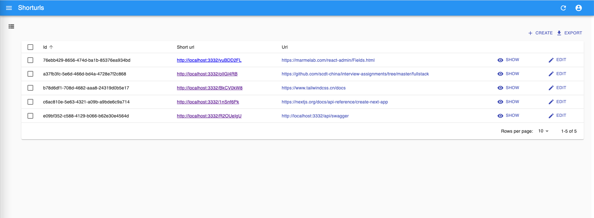
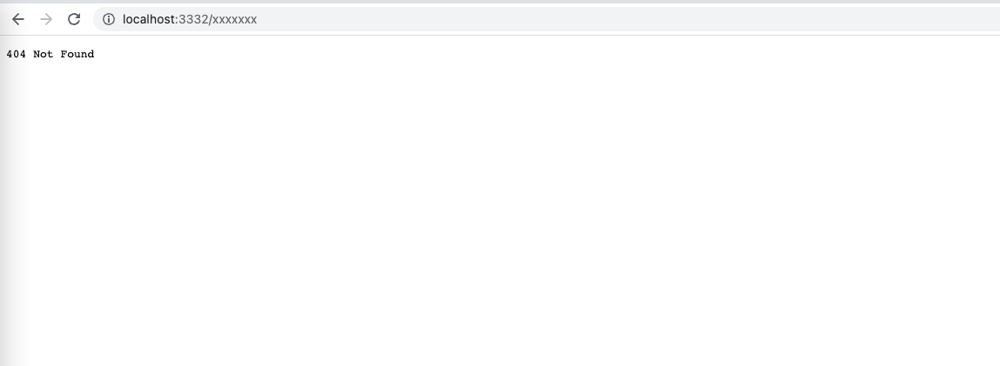

## 短域名服务设计方案

### [需求](./README.md)

### 需求分析

用户访问 shortURL `http://url.co/058CDDC6` 跳转到路径  longURL `http://localhost:3332/api/swagger/`

1. 数据对应并储存：

- 首先需要将 longURL 对应到短路径 shortURL 上，
```js
shortUrl = baseUrl + uuid(8)
```
- 将对应的数据储存起来，使用 Mysql储存；
- 为了提升效率, 将 Mysql 数据储存到 Redis；

2. 用户访问短域名
- 用户访问 shortURL , 
- 后台读取参数 如：`058CDDC6` 使用 `redis.get('058CDDC6')` 获取到 longURL;
- 如果 longURL 不存在，去 Mysql 数据库查找，
- 找到了 longURL ，返回 longURL ,并且储存到 Redis，
- 如果没有找到 longURL ，返回 404 Not Found。

#### 短域名长度最大为 8 个字符，涉及到的算法 `uuid(8)` ，可简写为
```js
const uuid = (len = 8, radix = 62) => {
  const chars = '0123456789ABCDEFGHIJKLMNOPQRSTUVWXYZabcdefghijklmnopqrstuvwxyz'.split('');
  const uuid = [];
  radix = radix || chars.length;
  for (let i = 0; i < len; i++) uuid[i] = chars[0 | Math.random() * radix];
  return uuid.join('')
}
```
### 需求实现

需要实现的两个接口为：
1. 短域名存储接口：接受长域名信息，返回短域名信息.
```
http://locahost:3332/api/shorturl/getlong?s_url=http://url.co/058CDDC6

如果不存在，返回:
```json
{
  "statusCode": 404,
  "message": "链接不存在"
}
```
存在则返回
```
{
  "statusCode": 200,
  "message": "获取成功",
  "data": "http://localhost:3332/api/swagger/"
}
```

2. 短域名读取接口：接受短域名信息，返回长域名信息。
`http://locahost:3332/api/shorturl/getshort?url=http://localhost:3332/api/swagger/`

如果不存在，创建并返回:
```json
{
  "statusCode": 200,
  "message": "获取成功",
  "data": "http://url.co/XX8CDDC6"
}
```

存在则返回
```json
{
  "statusCode": 200,
  "message": "获取成功",
  "data": "http://url.co/058CDDC6"
}
```


### 技术栈

前后端分离项目。

后端：
 - Node.js (Nestjs & Express)
 - 数据库
   持久化 Mysql
   缓存 Redis
 - 服务器 Nginx

前端：
  - React.js (Nextjs)
  - React-Admin

### 效果展示







### 后期功能
统计：点击量、访问的 ip 地域、用户使用的设备
管理后台：数据量
登录：权限管理
可设置密码：输入密码才可以继续访问
可设中间页面：增加确认点击
