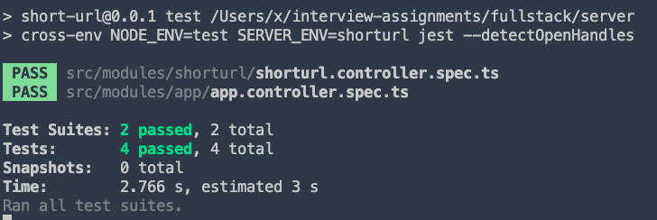

## 短域名服务设计方案

### 需求分析

用户访问 shortURL `http://locahost:3332/ZZZZZZZZ` 跳转到路径  longURL

1. 数据对应并储存：

- 首先需要将 longURL 对应到短路径 shortURL 上，

```js
shortUrl = baseUrl + string10to62(xx)
```

- 将对应的数据储存起来，使用 Mysql 持久化储存；
  为了提升数据库存储性能，我们直接使用自增 ID 存储模式，
  最大存储个数为 `string62to10('ZZZZZZZZ')`  `218340105584895`
- 为了提升查询效率, 将 Mysql 数据储存到 Redis 作为缓存；

2. 用户访问短域名

- 用户访问 shortURL ,
- 后台读取参数 如：`string62to10(058CDDC6)` 使用 `redis.get(string62to10('058CDDC6'))` 获取到 longURL;
- 如果 longURL 不存在，去 Mysql 数据库查找，
- 找到了 longURL ，返回 longURL ,并且储存到 Redis，
- 如果没有找到 longURL ，返回 404 Not Found。

#### 短域名长度最大为 8 个字符，涉及到的算法为

```ts
export const string10to62 = (num: number) => {
  var chars = '0123456789abcdefghigklmnopqrstuvwxyzABCDEFGHIGKLMNOPQRSTUVWXYZ'.split(''),
  radix = chars.length,
  qutient = +num,
  arr = [];
  do {
    let mod = qutient % radix;
    qutient = (qutient - mod) / radix;
    arr.unshift(chars[mod]);
  } while (qutient);
  return arr.join('');
}

export const string62to10 = (number_code: string) => {
  var chars = '0123456789abcdefghigklmnopqrstuvwxyzABCDEFGHIGKLMNOPQRSTUVWXYZ',
    radix = chars.length,
    number_code = String(number_code),
    len = number_code.length,
    i = 0,
    origin_number = 0;
  while (i < len) {
    origin_number += Math.pow(radix, i++) * chars.indexOf(number_code.charAt(len - i) || '0');
  }
  return origin_number;
}
```

### 需求实现

需要实现的两个接口为：

1. 短域名存储接口：接受长域名信息，返回短域名信息.

```
http://locahost:3332/api/shorturl/getlong?s_url=http://locahost:3332/058CDDC6

如果不存在，返回:
```json
{
  "statusCode": 404,
  "message": "链接不存在"
}
```

存在则返回

```
{
  "statusCode": 200,
  "message": "获取成功",
  "data": "http://localhost:3332/api/swagger/"
}
```

2. 短域名读取接口：接受短域名信息，返回长域名信息。
   `http://locahost:3332/api/shorturl/getshort?url=http://localhost:3332/api/swagger/`

如果不存在，创建并返回:

```json
{
  "statusCode": 200,
  "message": "获取成功",
  "data": "http://locahost:3332/XX8CDDC6"
}
```

存在则返回

```json
{
  "statusCode": 200,
  "message": "获取成功",
  "data": "http://locahost:3332/058CDDC6"
}
```

### 技术栈

前后端分离项目。


后端：

- 前端服务器 Nginx（Nextjs）
- Node.js 服务器 (Nestjs & Express)
- 数据库
  持久化 Mysql
  缓存 Redis

### 效果展示

[API 接口](http://localhost:3332/api/swagger/)


[404页面](http://localhost:3332/xxxxxxxx)


### 接口测试


