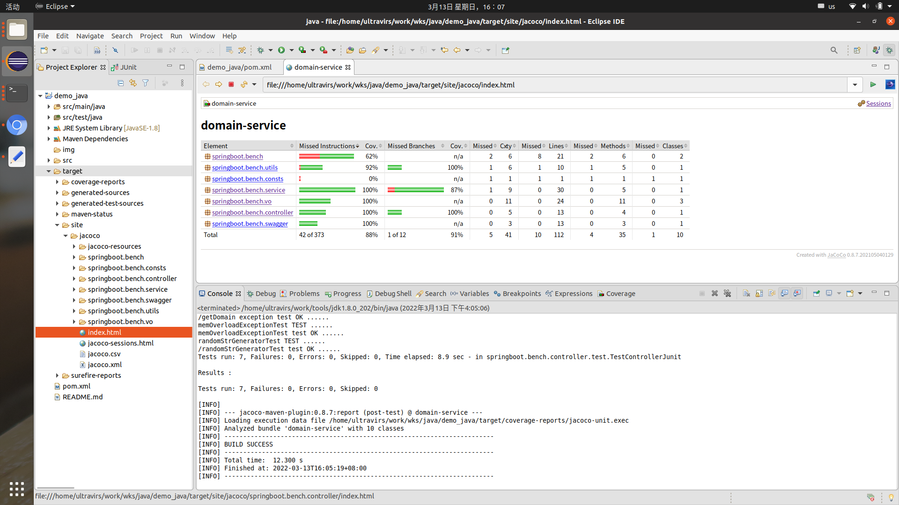
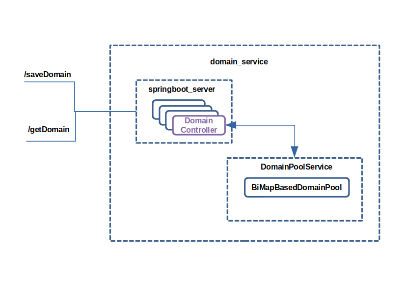

- [Jacoco单元测试](#Jacoco单元测试)
- [设计文档](#设计文档)
   - [整体设计思路](#整体设计思路)
   - [架构图](#架构图)
- [性能测试](#性能测试)
   - [性能测试方案](#性能测试方案)
   - [性能测试结果](#性能测试结果)

swage:
http://127.0.0.1:11000/v2/api-docs

## Jacoco单元测试

Jacoco单元测试代码覆盖率和分支覆盖率截图如下:

## 设计文档

1. **整体设计思路**  
按作业要求以springboot为服务底座，用undertow替换原生tomcat提供更高的并发
域名池需要同时支持按长域名存短域名和按短域名反查长域名，为了保证原子性，采用双向的BiMap数据结构来存储
域名池使用单例模式，实例加一把锁用于控制计数累加和BiMap写入的原子性; 计数用于内存保护，超过最大MAX_CAPACITY后抛出ERR_DOMAIN_POOL_FULL异常
controller层直接访问数据服务层提供的域名池进行save和get操作

2. **架构图**  

## 性能测试

1. **性能测试方案**  
使用wrk测试springboot框架性能(不带任何逻辑)，得到基线数据
注意丢弃第一组数据(程序预热)

2. **性能测试结果**  
硬件: CPU 4核 2.30GHz, 内存 16G/2666Mhz

wrk压力端和测试服务在同一台主机，不走网络

springboot undertow网络框架性能测试数据:
临界界定：当rate sampling interval开始 > 10ms，说明服务开始过载

10个压测线程，10000并发速率，持续30s
ultravirs@paas:bin$ wrk -c 100 -t 10 -d 30 -R 10000 http://127.0.0.1:11000/ping
  10 threads and 100 connections
  Thread calibration: mean lat.: 1.201ms, rate sampling interval: 10ms
  Thread calibration: mean lat.: 1.364ms, rate sampling interval: 10ms
  Thread calibration: mean lat.: 1.288ms, rate sampling interval: 10ms
  Thread calibration: mean lat.: 1.453ms, rate sampling interval: 10ms
  Thread calibration: mean lat.: 1.490ms, rate sampling interval: 10ms
  Thread calibration: mean lat.: 1.444ms, rate sampling interval: 10ms
  Thread calibration: mean lat.: 1.474ms, rate sampling interval: 10ms
  Thread calibration: mean lat.: 1.482ms, rate sampling interval: 10ms
  Thread calibration: mean lat.: 1.462ms, rate sampling interval: 10ms
  Thread calibration: mean lat.: 1.514ms, rate sampling interval: 10ms
  Thread Stats   Avg      Stdev     Max   +/- Stdev
    Latency     1.47ms    1.42ms  33.54ms   94.25%
    Req/Sec     1.05k   155.85     2.50k    79.81%
  299800 requests in 30.00s, 42.31MB read
Requests/sec:   9993.14
Transfer/sec:      1.41MB

10个压测线程，18000并发速率，持续30s
ultravirs@paas:bin$ wrk -c 100 -t 10 -d 30 -R 18000 http://127.0.0.1:11000/ping
  10 threads and 100 connections
  Thread calibration: mean lat.: 1.144ms, rate sampling interval: 10ms
  Thread calibration: mean lat.: 1.090ms, rate sampling interval: 10ms
  Thread calibration: mean lat.: 1.110ms, rate sampling interval: 10ms
  Thread calibration: mean lat.: 1.073ms, rate sampling interval: 10ms
  Thread calibration: mean lat.: 1.054ms, rate sampling interval: 10ms
  Thread calibration: mean lat.: 1.101ms, rate sampling interval: 10ms
  Thread calibration: mean lat.: 1.083ms, rate sampling interval: 10ms
  Thread calibration: mean lat.: 1.054ms, rate sampling interval: 10ms
  Thread calibration: mean lat.: 1.126ms, rate sampling interval: 10ms
  Thread calibration: mean lat.: 1.079ms, rate sampling interval: 10ms
  Thread Stats   Avg      Stdev     Max   +/- Stdev
    Latency     1.21ms    1.98ms  46.66ms   96.28%
    Req/Sec     1.91k   210.30     4.11k    87.14%
  539542 requests in 30.00s, 76.15MB read
Requests/sec:  17986.80
Transfer/sec:      2.54MB

10个压测线程，20000并发速率，持续30s
ultravirs@paas:bin$ wrk -c 100 -t 10 -d 30 -R 20000 http://127.0.0.1:11000/ping
Running 30s test @ http://127.0.0.1:11000/ping
  10 threads and 100 connections
  Thread calibration: mean lat.: 1.609ms, rate sampling interval: 10ms
  Thread calibration: mean lat.: 1.774ms, rate sampling interval: 10ms
  Thread calibration: mean lat.: 1.538ms, rate sampling interval: 10ms
  Thread calibration: mean lat.: 1.722ms, rate sampling interval: 10ms
  Thread calibration: mean lat.: 1.822ms, rate sampling interval: 10ms
  Thread calibration: mean lat.: 1.745ms, rate sampling interval: 10ms
  Thread calibration: mean lat.: 1.668ms, rate sampling interval: 10ms
  Thread calibration: mean lat.: 1.820ms, rate sampling interval: 10ms
  Thread calibration: mean lat.: 1.799ms, rate sampling interval: 10ms
  Thread calibration: mean lat.: 1.698ms, rate sampling interval: 10ms
  Thread Stats   Avg      Stdev     Max   +/- Stdev
    Latency     1.65ms    2.24ms  60.26ms   94.55%
    Req/Sec     2.11k   321.78     4.67k    79.32%
  599553 requests in 30.00s, 84.62MB read
Requests/sec:  19984.80
Transfer/sec:      2.82MB

ultravirs@paas:bin$ wrk -c 100 -t 10 -d 30 -R 25000 http://127.0.0.1:11000/ping
Running 30s test @ http://127.0.0.1:11000/ping
  10 threads and 100 connections
  Thread calibration: mean lat.: 3.684ms, rate sampling interval: 16ms
  Thread calibration: mean lat.: 3.594ms, rate sampling interval: 15ms
  Thread calibration: mean lat.: 2.843ms, rate sampling interval: 11ms
  Thread calibration: mean lat.: 2.944ms, rate sampling interval: 12ms
  Thread calibration: mean lat.: 2.860ms, rate sampling interval: 12ms
  Thread calibration: mean lat.: 3.518ms, rate sampling interval: 15ms
  Thread calibration: mean lat.: 3.965ms, rate sampling interval: 15ms
  Thread calibration: mean lat.: 3.060ms, rate sampling interval: 13ms
  Thread calibration: mean lat.: 2.562ms, rate sampling interval: 10ms
  Thread calibration: mean lat.: 3.601ms, rate sampling interval: 15ms
  Thread Stats   Avg      Stdev     Max   +/- Stdev
    Latency     2.41ms    3.95ms  88.70ms   92.56%
    Req/Sec     2.61k   352.94     6.89k    79.76%
  749395 requests in 30.00s, 105.77MB read
Requests/sec:  24981.98
Transfer/sec:      3.53MB

ultravirs@paas:bin$ wrk -c 100 -t 10 -d 30 -R 30000 http://127.0.0.1:11000/ping
Running 30s test @ http://127.0.0.1:11000/ping
  10 threads and 100 connections
  Thread calibration: mean lat.: 2.822ms, rate sampling interval: 11ms
  Thread calibration: mean lat.: 3.623ms, rate sampling interval: 17ms
  Thread calibration: mean lat.: 2.815ms, rate sampling interval: 12ms
  Thread calibration: mean lat.: 3.043ms, rate sampling interval: 13ms
  Thread calibration: mean lat.: 3.820ms, rate sampling interval: 18ms
  Thread calibration: mean lat.: 3.124ms, rate sampling interval: 14ms
  Thread calibration: mean lat.: 3.187ms, rate sampling interval: 13ms
  Thread calibration: mean lat.: 3.067ms, rate sampling interval: 13ms
  Thread calibration: mean lat.: 3.310ms, rate sampling interval: 15ms
  Thread calibration: mean lat.: 2.976ms, rate sampling interval: 13ms
  Thread Stats   Avg      Stdev     Max   +/- Stdev
    Latency     3.36ms    6.73ms 118.02ms   93.07%
    Req/Sec     3.12k   441.08     7.80k    80.48%
  896350 requests in 30.00s, 126.51MB read
Requests/sec:  29879.29
Transfer/sec:      4.22MB

结论1：
springboot undertow 网络框架并发性能大致在20000 ～ 25000之间

save接口需要构造动态数据, 而且很容易打满JVM内存, 这里简单保存一条得到短域名，然后并发测试查询接口性能
ultravirs@paas:bin$ curl -H "Accept: application/json" -H "Content-type: application/json" -X POST -d '{"longDomain": "http://abc.com"}' http://127.0.0.1:11000/saveDomain
{"retCode":0,"retInfo":"http://H4LlvtL9"}

通过短域名查询长域名post json:
{"shortDomain": "http://H4LlvtL9"}

编写lua脚本(替换body部分)：lua.json
wrk.method = "POST"
wrk.body = {"shortDomain": "http://H4LlvtL9"}'
wrk.headers["Content-Type"] = "application/json"

response = function(status, headers, body)
--print(body)
end

echo "{\"shortDomain\": \"http://H4LlvtL9\"}" > 

wrk -s 指定 lua.json
wrk -c 100 -t 10 -d 30 -R 5000 -s lua.json http://127.0.0.1:11000/getDomain

10个压测线程，10000并发速率，持续30s
ultravirs@paas:bin$ wrk -c 100 -t 10 -d 30 -R 10000 -s lua.json http://127.0.0.1:11000/getDomain
Running 30s test @ http://127.0.0.1:11000/getDomain
  10 threads and 100 connections
  Thread calibration: mean lat.: 1.216ms, rate sampling interval: 10ms
  Thread calibration: mean lat.: 1.183ms, rate sampling interval: 10ms
  Thread calibration: mean lat.: 1.233ms, rate sampling interval: 10ms
  Thread calibration: mean lat.: 1.350ms, rate sampling interval: 10ms
  Thread calibration: mean lat.: 1.274ms, rate sampling interval: 10ms
  Thread calibration: mean lat.: 1.298ms, rate sampling interval: 10ms
  Thread calibration: mean lat.: 1.266ms, rate sampling interval: 10ms
  Thread calibration: mean lat.: 1.367ms, rate sampling interval: 10ms
  Thread calibration: mean lat.: 1.306ms, rate sampling interval: 10ms
  Thread calibration: mean lat.: 1.279ms, rate sampling interval: 10ms
  Thread Stats   Avg      Stdev     Max   +/- Stdev
    Latency     1.22ms    1.17ms  36.00ms   95.09%
    Req/Sec     1.05k   150.62     2.78k    80.72%
  299798 requests in 30.00s, 54.61MB read
Requests/sec:   9992.93
Transfer/sec:      1.82MB

ultravirs@paas:bin$ wrk -c 100 -t 10 -d 30 -R 15000 -s lua.json http://127.0.0.1:11000/getDomain
Running 30s test @ http://127.0.0.1:11000/getDomain
  10 threads and 100 connections
  Thread calibration: mean lat.: 1.793ms, rate sampling interval: 10ms
  Thread calibration: mean lat.: 1.885ms, rate sampling interval: 10ms
  Thread calibration: mean lat.: 1.791ms, rate sampling interval: 10ms
  Thread calibration: mean lat.: 2.012ms, rate sampling interval: 10ms
  Thread calibration: mean lat.: 1.954ms, rate sampling interval: 10ms
  Thread calibration: mean lat.: 1.778ms, rate sampling interval: 10ms
  Thread calibration: mean lat.: 1.842ms, rate sampling interval: 10ms
  Thread calibration: mean lat.: 1.777ms, rate sampling interval: 10ms
  Thread calibration: mean lat.: 2.010ms, rate sampling interval: 10ms
  Thread calibration: mean lat.: 1.967ms, rate sampling interval: 10ms
  Thread Stats   Avg      Stdev     Max   +/- Stdev
    Latency     1.76ms    2.81ms  91.97ms   94.36%
    Req/Sec     1.58k   245.07     3.33k    77.32%
  449633 requests in 30.00s, 81.90MB read
Requests/sec:  14987.87
Transfer/sec:      2.73MB

ultravirs@paas:bin$ wrk -c 100 -t 10 -d 30 -R 18000 -s lua.json http://127.0.0.1:11000/getDomain
Running 30s test @ http://127.0.0.1:11000/getDomain
  10 threads and 100 connections
  Thread calibration: mean lat.: 2.285ms, rate sampling interval: 10ms
  Thread calibration: mean lat.: 2.217ms, rate sampling interval: 10ms
  Thread calibration: mean lat.: 2.003ms, rate sampling interval: 10ms
  Thread calibration: mean lat.: 2.221ms, rate sampling interval: 10ms
  Thread calibration: mean lat.: 2.157ms, rate sampling interval: 10ms
  Thread calibration: mean lat.: 2.224ms, rate sampling interval: 10ms
  Thread calibration: mean lat.: 2.251ms, rate sampling interval: 10ms
  Thread calibration: mean lat.: 2.001ms, rate sampling interval: 10ms
  Thread calibration: mean lat.: 1.972ms, rate sampling interval: 10ms
  Thread calibration: mean lat.: 2.313ms, rate sampling interval: 10ms
  Thread Stats   Avg      Stdev     Max   +/- Stdev
    Latency     1.98ms    2.57ms  40.77ms   92.02%
    Req/Sec     1.90k   276.67     4.44k    77.23%
  539557 requests in 30.00s, 98.28MB read
Requests/sec:  17986.49
Transfer/sec:      3.28MB

ultravirs@paas:bin$ wrk -c 100 -t 10 -d 30 -R 20000 -s lua.json http://127.0.0.1:11000/getDomain
Running 30s test @ http://127.0.0.1:11000/getDomain
  10 threads and 100 connections
  Thread calibration: mean lat.: 3.169ms, rate sampling interval: 12ms
  Thread calibration: mean lat.: 3.288ms, rate sampling interval: 14ms
  Thread calibration: mean lat.: 2.973ms, rate sampling interval: 11ms
  Thread calibration: mean lat.: 2.911ms, rate sampling interval: 11ms
  Thread calibration: mean lat.: 3.059ms, rate sampling interval: 12ms
  Thread calibration: mean lat.: 2.770ms, rate sampling interval: 11ms
  Thread calibration: mean lat.: 3.359ms, rate sampling interval: 14ms
  Thread calibration: mean lat.: 3.230ms, rate sampling interval: 13ms
  Thread calibration: mean lat.: 2.922ms, rate sampling interval: 11ms
  Thread calibration: mean lat.: 3.050ms, rate sampling interval: 13ms
  Thread Stats   Avg      Stdev     Max   +/- Stdev
    Latency     2.32ms    3.29ms  53.76ms   92.36%
    Req/Sec     2.09k   349.35     4.30k    74.90%
  599531 requests in 30.00s, 109.21MB read
Requests/sec:  19984.71
Transfer/sec:      3.64MB

ultravirs@paas:bin$ wrk -c 100 -t 10 -d 30 -R 25000 -s lua.json http://127.0.0.1:11000/getDomain
Running 30s test @ http://127.0.0.1:11000/getDomain
  10 threads and 100 connections
  Thread calibration: mean lat.: 40.256ms, rate sampling interval: 212ms
  Thread calibration: mean lat.: 21.130ms, rate sampling interval: 101ms
  Thread calibration: mean lat.: 23.030ms, rate sampling interval: 122ms
  Thread calibration: mean lat.: 20.873ms, rate sampling interval: 112ms
  Thread calibration: mean lat.: 30.075ms, rate sampling interval: 157ms
  Thread calibration: mean lat.: 37.193ms, rate sampling interval: 210ms
  Thread calibration: mean lat.: 41.886ms, rate sampling interval: 243ms
  Thread calibration: mean lat.: 27.860ms, rate sampling interval: 146ms
  Thread calibration: mean lat.: 15.349ms, rate sampling interval: 78ms
  Thread calibration: mean lat.: 14.337ms, rate sampling interval: 73ms
  Thread Stats   Avg      Stdev     Max   +/- Stdev
    Latency    22.46ms   50.75ms 653.31ms   91.93%
    Req/Sec     2.51k   240.15     3.64k    76.10%
  749419 requests in 30.00s, 136.51MB read
Requests/sec:  24981.41
Transfer/sec:      4.55MB

结论2：
查询接口性能基本在18000 ~ 20000 之间

总结：
使用springboot undertow作为服务底座，并发查询的性能在当前压测环境大概为18000 ~ 20000间最优
继续增大并发会导致单条请求的平均请求耗时增加，且性能会出现抖动

