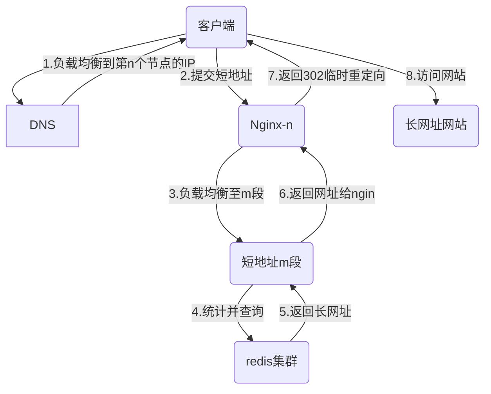
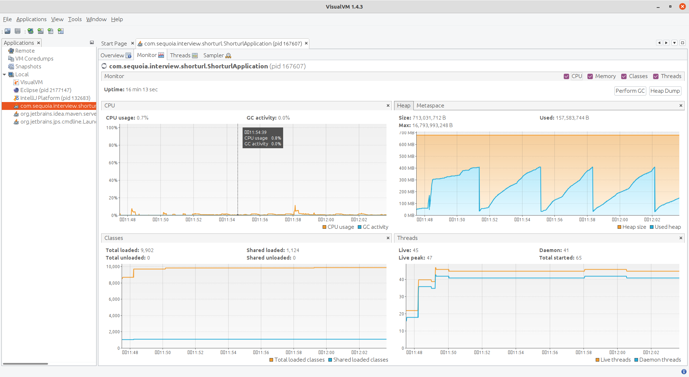

说明：请使用 [Typora](https://typora.io/#download) 编辑器打开浏览

# 短网址的实现

​        短网址本质上就是key-value，在系统范围内通过较短且唯一的短网址key快速查找出长网址value，进行302/301重定向返回给客户端浏览器。通过短地址访问的过程如下图所示：



​       短网址服务链接：https://www.urlc.cn/  。

​        技术上涉及2点： 

1. 短网址生成器--生成唯一值，短网址
2. key-value的建立、存储、快速查找

## 1. 短网址生成器

​       在固定长度下需要的短网址数量庞大，所以需要充分利用容量空间。以8位长度为例：2进制能够表示 $$ 2^8$$个短网址，8进制表示$$8^8$$个短网址, 16进制表示$$16^8$$个短网址。结合url的编码规则，禁止有/等特殊字符。那么我们使用0-9,A-Z,a-z 共62个字符构成62进制数字，则可以表达$$62^8$$个短网址。

​      在短网址的应用场景中，短网址生成的并发性并不会太高。所以，不用考虑太多分布式部署的事情。我们简单的做一下分段处理就好，需要可以分段多点部署。

### 1.1 短网址的分段处理

​      首先，8位短网址，我们假设使用最高位2位做为分段标志，这样最多可以分为$$62^2$$=3844段，每段可分配短网址为$$62^6$$=56800235584, 即568亿多短网址。在当前工程中，为防止内存溢出，使用最高6位作为分段标志，假设平均每一个URL为512字节，则3844×512=1922k字节。 在应用的配置文件中我们使用app.start和app.end表示分段的开始和结束。 当短网址当前值为app.end，再次分配时，则从app.start重新开始分配。

### 1.2 短网址的自增-plusOne函数

​     在短网址递增的方法上，使用了一些小技巧，避免了将62进制数转换为10进制进行加减后再转换的多次循环和对比操作。 0-9, A-Z, a-z, ASCII码分别为48-57,65-90,97-122 三段。 当前位递增加1时，9+1=A, Z+1=a,z+1=0时，使用if判断单独处理，其他+1情况直接：(char) ((int) curCh + 1) 即可。首先从最低位按照前面描述处理，当出现进位时，进行上一位的循环处理。这样最多循环（8-段位长度）次，即8-6=2次循环。具体实现方法见代码：ShortUrlServiceImpl.java中的plusOne方法。经测试，2亿次循环加1，耗时3.212秒，整体执行效率还是不错的。

```flow
title=>operation: plusOne处理流程
st=>start: 开始
cond=>condition: curValue是否为end？
yesop=>operation: 重新计数，返回start
noop=>operation: 从最低位开始(i=7;i>=SEG_LEN;i--), 取curCh=curValue[i]
condz=>condition: curCh=='z'?
eq0op=>operation: curValue[i]='0'
iOne=>operation: i--
condZ=>condition: curCh=='Z'?
eqaop=>operation: curValue[i]='a'
cond9=>condition: curCh=='9'?
eqAop=>operation: curValue[i]='A'
plusOne=>operation: curValue[i] = (char) ((int) curCh + 1)
return=>operation: 返回curValue
return2=>operation: 返回curValue
e=>end: 结束
st()->cond
cond(yes)->yesop->return->e
cond(no)->noop->condz
condz(yes,right)->eq0op(top)->noop
condz(no)->condZ
condZ(yes,right)->eqaop->return2(left)->e
condZ(no)->cond9
cond9(yes,right)->eqAop->return2(left)->e
cond9(no)->plusOne->return2(left)->e
```

​	可扩展点：上面的plusOne函数可以按照这个思路进行扩展实现高效的62进制加减算法．

## 2. 长网址和短网址的转换

​		给出长网址生成短网址前，首先通过长网址查找，判断是否生成过短网址？如果生成过，则直接返回已生成的短网址。如果没有生成过，则生成新的短网址。同时生成长网址 -> 短网址，短网址 -> 长网址的两种key-value关系。网上有很多成熟的key-value数据库，根据短网址的应用特点（一次写入，不再修改），redis是不错的选择，同时数据放到内存中也足够快。

## 2.1 短网址的生成过成-genShortUrl函数

具体流程如下：

```flow
st=>start: 开始
cond=>condition: 是否生成过对应的短网址？
yesop=>operation: 通过url查找shortUrl
lock=>operation: 加锁
noop=>operation: curValue+1生成新的短网址
saveop=>operation: 保存新的curValue,url-shortUrl,shortUrl-url关系
unlock=>operation: 解锁
returnop=>operation: 返回shortUrl
e=>end: 结束
st()->cond
cond(yes)->yesop->returnop->e
cond(no)->lock->noop->saveop->unlock(left)->returnop->e
```

​		可优化的点：就短网址的这个应用场景来说，对于短网址生成这个api来讲调用频率和并发都不会特别高，所以当前的简单实现就可以了．如果并发比较高的情况，可以考虑将保存curValue,url-shortUrl,shortUrl-url的三次网络IO操作改为一次网络IO保存在一个先进先出的消息队列系统中，然后在另一台服务上检查此队列并保存在redis中． 如果存在short-url关系异地多点部署的情况，此时也可以进行异地多点数据的同步操作.如果需要对url进行安全审查等操作的话，也可以在这个时间点来进行．

## 2.2 通过短网址查找长网址-getUrl函数

　　通过给出的shortUrl在redis中查找url. 这部分功能实现起来比较简单．

​		可能的扩展点：如果服务期望进行访问数据统计，跟访问人相关的安全策略，可以在此进行扩展．可以将相关代码写在这个类里．也可以以微服务的形式，将相关操作并行执行，需要等待的操作进行同步等待处理，记录型的操作不需要等待即可直接返回结果给用户．

## 3. 高可用

### 3.1 存储空间规划

1. 限制长网址的最大长度- 假设限制url最大长度为512字节，短地址固定长度为8字节

   首先限制长网址的最大长度，这样做有两个好处：

   a. 内存空间，存储空间可计算．假设短网址固定长度为8,前４位为分段标志．那么每段包含$$62^4=14776336$$个短网址，一对short-url需(512+8)*2个字节，则每段所需存储空间为：

   $$62^{8-4}*((512+8)*2)/(1024^3)\approx$$ 14.32 GB．
   
   b. 避免有人使用超长url垃圾数据进行恶意攻击．


2. 避免重复存储

   在生成新的短网址之前，首先检查是否已经建立过此长网址与短网址的对应关系，如果已经建立过了，则返回对应的短网址．如果系统引入了过期策略和用户登陆信息，那么检查时需要加上这些约束条件．当前实现仅是判断是否已经存在．

3. 设置过期时长，及时释放空间- 默认7天或者1个月，最长1年

   商业模式上可以按照用户类型，设置不同的过期时长，密码访问等．如免费用户默认７天，最长可以１个月．收费用户默认１个月，最长续费期间永久使用．同时，是否允许释放的短网址重新使用？就短网址这个应用场景来讲，个人不建议重新使用．设置短网址的人明确知道过期时间，但访问这个短网址的人不一定知道这个过期时间．多数人不会希望访问一个别人给的短网址时，不确定会弹出什么样的页面．然而技术上如果希望复用，可以监控redis的key过期事件，将过期的短网址ID进行回收再利用．

### 3.2 及时响应

1. 服务器配置：配置大内存服务器，将短网址 -> 长网址的映射关系尽可能的放在内存中。

2. 数据尽可能的靠近用户，建立短网址 -> 长网址服务的异地多节点部署。

3. 考虑新添映射关系在服务分发网络上的同步

   引入异地多节点部署后，就要考虑新建映射关系如何在异地多节点服务器上的同步问题．扩展点已经在[2.长网址和短网址的转换]　中进行了说明.

### 3.3 异常处理

1. 服务器正常退出重启后数据的恢复加载

   当前使用redis进行数据保存，重新启动后，服务需要从redis中取出curValue值，以便继续计数生成短网址．

2. 服务器异常退出，可容忍的数据丢失情况和数据不一致．

   当前使用redis进行数据存储，可以通过设置redis持久化策略参数，来减少异常退出时可能的数据丢失．
   
   应用程序中，只有在函数genShortUrl中存在数据不一致的情况．在执行plusOne获取新的shorUrl后，redis事务保存之前，存在shortUrlServiceImpl对象的curValue与redis中的curValue不一致的情况．但此时，curValue,url-shortUrl, shortUrl-url都没有保存，即shortUrl还没有被使用．异常退出重启后，shortUrlServiceImpl从redis中获取之前的curValue值,并不会有任何不良影响．
   
   

### 3.4 安全性

1. 避免恶意使用，大量无用数据 --添加身份认证

2. 避免非法使用 --长网址的自动化审核，限制长网址的最大长度．

   长网址的自动化审核，[2.长网址和短网址的转换]　中进行了说明

## 4.运行服务

### 4.1 ubuntu20.04 下

```Bash
#首先切换到工程目录下
docker pull redis
docker run -p 6379:6379 redis
mvn clean package -DskipTests 
nohup java -jar target/shorturl-0.0.1-SNAPSHOT.jar &
. src/test/bash/test.sh
time testGen 10
#显示：＂test genShortUrl -- status:200,sum:     10＂,则表示运行成功．
```

### 4.2 使用docker方式部署shortUrl服务和redis


## 5.系统性能测试

### 5.1 测试环境
#### 5.1.1 网络环境

​	百兆网络

#### 5.1.2 硬件环境

​	Intel® Core™ i7-2600K CPU @ 3.40GHz × 8 ，32G内存，4.3TB

#### 5.1.3 软件环境

​	Ubuntu 20.04.3 LTS

#### 5.1.4 启动服务


### 5.2 测试范围与主要内容
测试范围：响应时间的性能测试、CPU、Memory的性能测试、负载的性能测试（压力测试）、可靠性测试
主要检测内容：

1. 典型应用的反应时间 
2. 客户端、服务器的CPU、Memory使用情况
3. 服务器的响应速度 
4. 系统支持的最优负载数量   
5. 网络指标  
6. 系统可靠性测试

### 5.3 测试工具和测试方法
#### 5.3.1 ApacheBench(ab)
参数说明：
  -n 总请求次数
  -c 并发次数（并发请求不能大于总请求次数）

```
ab -n 1 -c 1 http://127.0.0.1/api/shorturl/gen?url=http://js.ixingk.org/1
```

#### 5.3.2 JMeter

#### 5.3.3 编写测试代码进行测试

测试 /api/shorturl/gen

```java
public void testRestfulGenNTimes(){
		initRedis();
		HashMap<String,String> params=new HashMap<>(1);
		long times=100000;
		MockHttpServletRequestBuilder request;
		long start = System.currentTimeMillis();
		for(int i=1;i<times;i++){
			try {
				request= get("/api/shorturl/gen")
						.param("url","http://js.ixingk.org/"+String.valueOf(i));
				mvc.perform(request).andExpect(status().isOk());
			} catch (Exception e) {
				e.printStackTrace();
			}
		}

		long end = System.currentTimeMillis();
		System.out.println("执行次数："+times+ ", 执行时间(ms): "+(end-start));

	}
```

测试/api/shorturl/geturl

```java
public void testRestfulGetUrlNTimes(){
		HashMap<String,String> params=new HashMap<>(1);
		long times=1000000;
		MockHttpServletRequestBuilder request;
		long start = System.currentTimeMillis();
		Set keys= redis.opsForHash().keys("shortUrl");
		int len = keys.size();//redis.opsForHash()..size("shortUrl");
		for (Iterator it = keys.iterator(); it.hasNext(); ) {
			String shortUrl = (String) it.next();
			try {
				//doGet("/api/shorturl/gen", params);
				request= get("/api/shorturl/geturl")
						.param("s",shortUrl);
				mvc.perform(request).andExpect(status().isOk());
			} catch (Exception e) {
				e.printStackTrace();
			}
		}
		long end = System.currentTimeMillis();
		System.out.println("执行次数："+times+ ", 执行时间(ms): "+(end-start)+ " 共查询："+len+ " 次");

	}
```

#### 5.3.4 curl+bash脚本进行测试

```bash
#!/bin/bash -x

host=127.0.0.1

function testGen() {
  sum=$1
  echo -e "test genShortUrl -- status:200,sum:\t\r\c"
  s200=0
  s400=0
  s500=0
  for ((i = 1; i <= ${sum}; i++)); do
    #echo "http://${host}:9000/api/shorturl/gen?url=http://js.ixingk.org/${i}"

    statuscode=$(curl -s -I -L http://${host}:9000/api/shorturl/gen?url=http://js.ixingk.org/${i}|/bin/grep 'HTTP'|awk '{print $2}')
    #echo -ne "\b\r"
    case $statuscode in
    200)
      s200=$(echo "${s200}+1" | bc -q)
      echo -e "\t\t\t\t\t\e[1;32m${s200}\e[0m\r\c"
      ;;
    400)
      s400=$(echo "${s400}+1" | bc -q)
      echo -e "\t\t\t\t\t\tstatus:400, sum: \e[1;32m${s400}\e[0m\r\c"
      ;;
    500)
      s500=$(echo "${s500}+1" | bc -q)
      echo -e "\t\t\t\t\t\t\t\t\t\tstatus:500, sum: \e[1;32m${s500}\e[0m\r\c"
      ;;
    default)
      ;;
    esac
  done
}

function testGet() {
  sum=$1
  s200=0
  s400=0
  s500=0
  nums="0123456789ABCDEFGHIJKLMNOPRSTUVWXYZabcdefghijklmnopqrstuvwxyz"

  echo -e "test getUrl ${sum}*62 times: stutus:200, sum: \t\r\c"
  for ((j = 1; j <=${sum}; j++)); do
    for i in ${nums}; do
      statuscode=$(curl -s -I -L http://${host}:9000/api/shorturl/geturl?s=AAAA000${i}|/bin/grep 'HTTP'|awk '{print $2}')
      #curl http://${host}:9000/api/shorturl/geturl?shorturl=AAAA000${i}
      case $statuscode in
    	200)
      		s200=$(echo "${s200}+1" | bc -q)
      		echo -e "\t\t\t\t\t\t\e[1;32m${s200}\e[0m\r\c"
      		;;
      400)
          s400=$(echo "${s400}+1" | bc -q)
          echo -e "\t\t\t\t\t\t\tstatus:400, sum: \e[1;32m${s400}\e[0m\r\c"
      		;;
      500)
          s500=$(echo "${s500}+1" | bc -q)
          echo -e "\t\t\t\t\t\t\t\t\t\t\tstatus:500, sum: \e[1;32m${s500}\e[0m\r\c"
      		;;
    	default)
      		;;
       esac
  	done
  done
}
# 在工程目录下执行下面代码进行测试
#. src/test/bash/test.sh
#time testGen 1000
#time testGet 1000
```


### 5.4 测试

#### 5.4.1 反应时间的性能测试

##### 5.4.1.1 方法一：使用junit+MockMvc构造循环多次调用计时，redis在本机，测试算法执行的大致时间．

| 处理点或事件      | 执行次数（万次） |　历时(ms)　| 时间平均值(ms) | 上次或上版本实际反映时间平均值（至少3次） |
| ----------------- | -------- | -------- | ---------- | ----------------------------------------- |
| /api/shorturl/gen | １00    | 845692   | 0.85           |  |
|             | 10 | 82073 |0.82 |                                           |
|             | 2 | 10697 | 0.53 |                                           |
| /api/shorturl/geturl | 100              | 341538   | 0.34           |                                           |
|                      | 10               | 33649    | 0.33           |                                           |
|  | 2                | 8086     | 0.41 |                                           |

测试结果分析：此时测试的相当于代码的执行效率，不涉及网络访问等．理论上讲会比真实访问快不少．好处是可以不受其他因素影响的情况下，大致评测实现算法本身的优劣．

​		/api/shorturl/gen调用平均耗时0.85毫秒左右;

​		 /api/shorturl/geturl调用平均耗时0.34毫秒左右．

测试方法二：使用linux脚本+curl构造循环多次调用计时．redis和restful服务都在本机．测试执行：在工程目录下执行

```bash
. src/test/bash/test.sh
time testGen 1000
time testGet 1000
```


| 处理点或事件         | 执行次数（万次） | 历时(ms) | 时间平均值(ms) | 上次或上版本实际反映时间平均值（至少3次） |
| -------------------- | ---------------- | -------- | -------------- | ----------------------------------------- |
| /api/shorturl/gen    | 10               | 82073    | 0.82           |                                           |
|                      | 1                | 92734    | 9.27           |                                           |
|                      | 0.1              | 8655     | 8.66           |                                           |
| /api/shorturl/geturl | 10               | 341538   | 0.34           |                                           |
|                      | 1                | 33649    | 0.33           |                                           |
|                      | 0.1              | 8655     | 0.41           |                                           |


测试结果分析：/api/shorturl/gen平均调用耗时0.85毫秒左右; /api/shorturl/geturl调用平均耗时0.34毫秒左右


#### 5.4.2 CPU、Memory的性能测试
使用工具：visualVM


测试环境：

1.　客户端情况
2.　应用服务器情况
3.　Redis服务器情况

测试结果分析：




#### 5.4.3 负载的性能测试（压力测试）

| 输入/动作       | 输出/响应 | 能否正常运行 |
| --------------- | --------- | ------------ |
| *10个用户操作*  |           |              |
| *20个用户操作*  |           |              |
| *30个用户操作*  |           |              |
| *50个用户操作*  |           |              |
| *100个用户操作* |           |              |
| *……*            |           |              |

测试结果分析：

#### 5.4.4 可靠性测试

| 任务描述                      |              |
| ----------------------------- | ------------ |
| 连续运行时间                  | *建议72小时* |
| 故障发生的时刻                | 故障描述     |
|                               |              |
|                               |              |
| ……                            |              |
| 统计分析                      |              |
| 任务A无故障运行的平均时间间隔 | （CPU小时）  |
| 任务A无故障运行的最小时间间隔 | （CPU小时）  |
| 任务A无故障运行的最大时间间隔 | （CPU小时）  |

测试结果分析：
