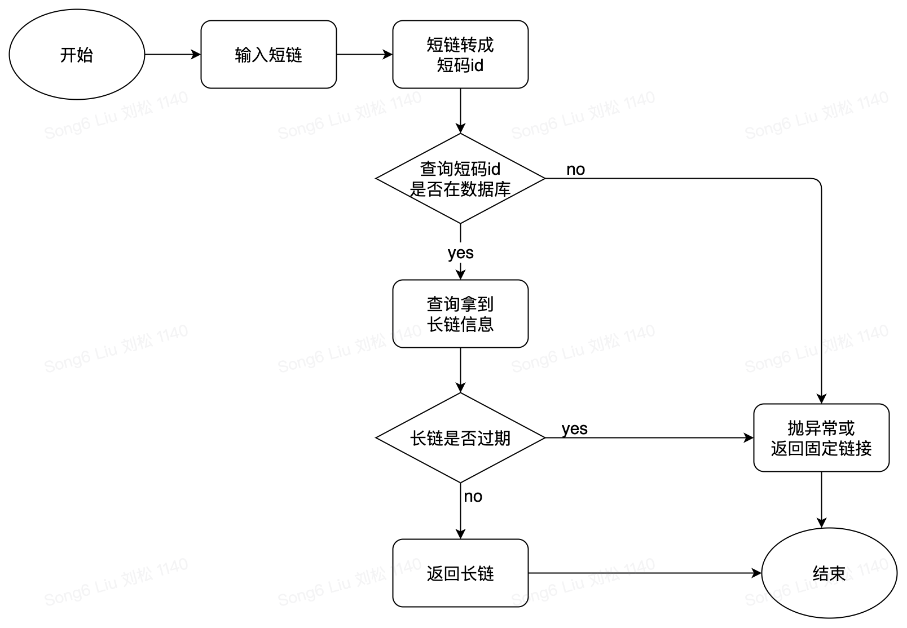

# 短域名服务Design View

## 背景
在现实生活中，对长 URL 的复制粘贴转发会比较麻烦，现需要提供一个短址服务，包含两个 API 接口:
- 短域名存储接口：接受长域名信息，返回短域名信息
- 短域名读取接口：接受短域名信息，返回长域名信息。

## 算法原理

### 自增序列算法
   
  我们可以维护一个id自增生成器，比如 1，2，3...n 这样的整数递增id，当收到一个长链转短链的请求时，生成器为其分配一个id，再将其转化为62进制，拼接到短链域名后面就得到了最终的短网址。只要拿到了id，就可以拿到短地址。重点在于这样的id自增生成器该如何设计，特别是高并发下，id自增生成器会成为系统瓶颈。
   
### id自增生成器的设计

| 方案名称  | 原理概述  | 优点 | 缺点 |
| :---- | :---- | :---- | :---- |
|  类uuid | 全局唯一标识符  | 生成简单  | id格式较长，且随机无序  |
|  mysql自增主键 | 使用mysql的自增主键  | 使用简单，方便扩展  | 高并发下写压力大  |
|  redis | redis自增id  | 高性能  | 需考虑持久化，高可用成本高  |
|  snowflake算法 | twitter全局自增id方案  | 高性能，高可用  | 依赖系统时钟，可能非全局递增  |

### 高并发下id自增生成器

当id自增生成器是单点时，很容易成为系统瓶颈。可以id生成器把做成分布式，自增步长使用机器个数，来降低id生成器的负载。

> 本系统采用的方案，为简化实现，暂不考虑id生成器分布式的情况，系统也未引入mysql和redis组件。本系统中**id自增生成器采用AtomicLong类**来保证并发安全性。

## 架构及实现

### 架构设计图

**架构设计图**
 

 

### 存储说明

按照要求，本系统未采用mysql和redis，仅使用JVM内存作为数据存储。
- 主数据存储，短链id到长链信息的map表映射。系统通过短链url请求时，能够查询到长链信息。
- cache数据，长链url到短链id的映射。cache数据能够保证同一长链在一段时间内的多次请求，得到相同的短链。

> 本系统映射数据采用了groovy提供的ConcurrentLinkedHashMap，它实现了LRU缓存，通过限制集合数量防止内存溢出。

### 系统流程图
**长链转短链流程图**
 

 

**短链转长链流程图**
 

 

## 系统测试

### 单元测试
**单元测试覆盖率截图**
 

 

### 性能测试

#### 性能测试方案
测试机器使用笔者的电脑，采用Jmeter作为性能测试工具，相关配置说明
- 机器配置，CPU i5-9500(6核6线程)，32GB内存。
- 短域名服务本地启动，服务启动参数：-Xms512m -Xmx512m -Xmn192m。
- Jmeter配置，同时启动5个线程(将核心数占满)请求本地服务，持续压测5分钟。
- Jmeter测试http接口2个，长链转短链post接口(长链采用随机数拼接生成)，短链转长链get接口(短链用随机生成的62进制短码)。

#### 性能测试结果
**服务启动参数：-Xms512m -Xmx512m -Xmn192m**
 

 

**服务启动参数：-Xms1024m -Xmx1024m -Xmn256m**
 

 

**性能测试结论**
- 因为数据存储在JVM内存，接口的90%分位，95%分位的延时极低。
- 单机TPS可达13000，因为机器配置原因，增加服务内存并不能提高TPS。
- 服务全部数据存储在JVM内存，实际中并不会这样，该测试数据仅参考。

## 链接

