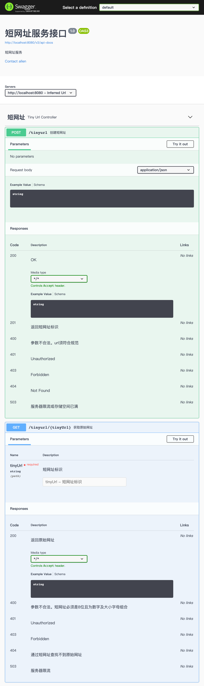
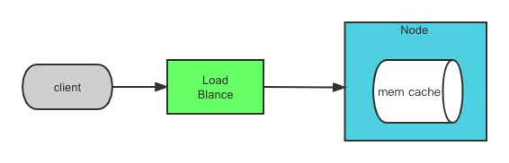
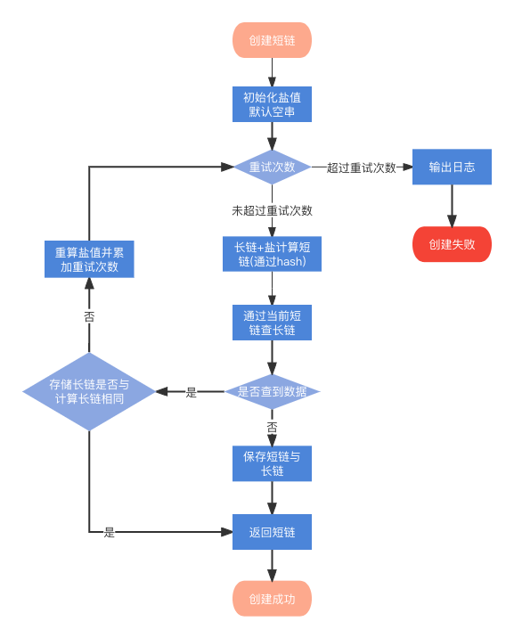
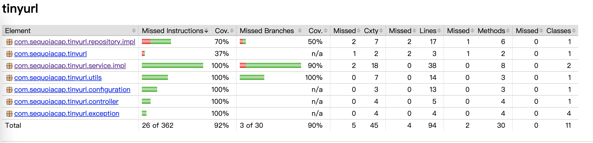
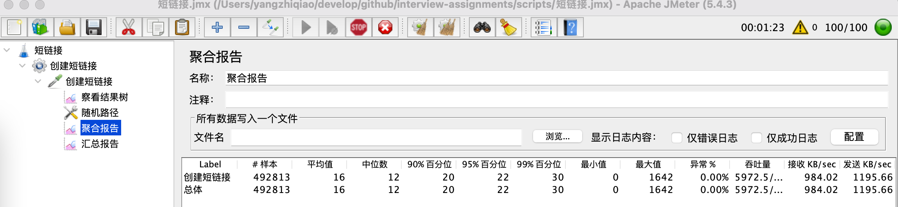
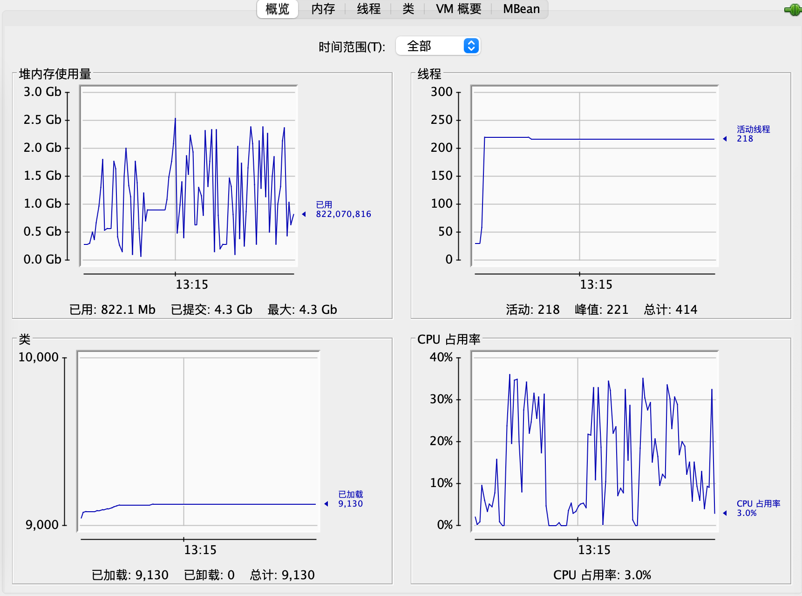
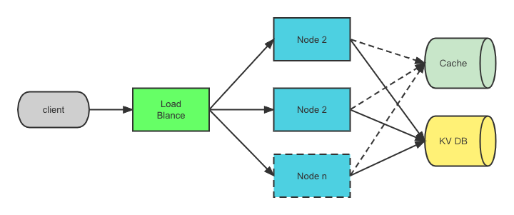

# 1. 需求
## 原始需求
实现短域名服务（细节可以百度/谷歌）

撰写两个 API 接口:
- 短域名存储接口：接受长域名信息，返回短域名信息
- 短域名读取接口：接受短域名信息，返回长域名信息。

限制：
- 短域名长度最大为 8 个字符
- 采用SpringBoot，集成Swagger API文档；
- JUnit编写单元测试, 使用Jacoco生成测试报告(测试报告提交截图)；
- 映射数据存储在JVM内存即可，防止内存溢出；

## 需求分析
### 背景
### 功能需求

- 接受长域名返回8位字符标识符
- 接受8位字符标识符返回其映射原始网址
### 非功能需求

- 高可用: 未来规划
- 可伸缩：未来规划
- 强一致性：未来规划
- 可持久性：数据保存在内存，可能丢失。且数据在过期后自动删除
- 低时延: 平均不高于30ms, 99%不高于50ms
- 读写比例 100:1

### 未明确需求与假设

- 相同的长域名是否需求生成相同的短域名？假设需要。但后续若考虑多租户，则同租户需要将相同域名映射到同一短域名
- 用户是谁？ 任何人
- 链接会过期？ 存储指定时间（默认配置10分钟）后删除
### 容量规划

- 并发请求：200
- 每秒写请求：峰值2000/s
- 每秒读请求：峰值20000/s
- 存储空间： 假设url平均长度500字符，存储时间10分钟。容量：2000*10*60*(500+8). 约600M
- 网络带宽：按查询计算。2w*500,约10M带宽

## API
  服务器限流当前未实现
 

# 2. 架构与关键设计
## 总体架构

当前部署架构见上图。数据缓存在本地。由于采用hash方式计算短链，在冲突时随机加盐重算，导致无法预测短链生成服务器，因此本设计采用单实例运行

### 关键技术方案选型
短链系统关键技术是短链生成
当前短链生成主要有三种方案，且都有厂商实际落地
 -  自增id生成
    
    使用中心化三方件（如数据库）自增id生成
    
    优势：简单。序号不浪费且不会重复
    
    劣势：中心化方案，高并发下三方件可能是瓶颈。序号易于预测
    
 -  Hash
 
    利用hash算法生成（当前我们使用了murmur3, 碰撞率较低）
    
    优势：不可预测
    
    劣势：存在碰撞可能。需要加盐重算解决问题
    
 -  分布式id生成(去中心化)
 
    利用分布式id算法生成id。如snowflake
    
    优势：去中心化
    
    劣势：仍存在一定可预测性；需要引入其它三方件(如zookeeper)设置机器及数据中心编号
    
综合考虑选择hash算法
## 短网址生成设计

当前方案仍存在无法创建情况。但考虑碰撞几率较低，加盐重试出现碰撞更低。因此多次重试后仍存在重试则输出日志

# 3. 测试
## 单元测试

## 性能测试
启动参数：java -Xmx4096m -Xms4096m -jar tinyurl-1.0.0.jar
性能测试脚本位于：scripts/短链接.jmx

# 4. 未来规划
## 整体架构

- 服务无状态，不保存数据。采用DB报错，对当前业务来说采用TiKV、LevelDB等kv存储比较合适。具体需后续分析
- id生成算法可换用分布式id生成方案，满足生成需求
- 相同url不可重复生成，可换用布隆过滤器解决提高效率。当前算法不能完全解决重复问题
- 高可用：db备份，故障管理，限流等