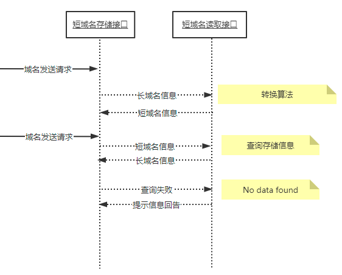

##需求说明：
 实现短域名服务：接受长域名信息，返回短域名信息；接受短域名信息，返回长域名信息。

##设计思路：
 根据审题，个人理解的实现步骤为：
  1. 页面接受输入长url地址，将其转换为8位数长度的短url地址，返回；
  2. 用两个Map，分别将长url地址、转换后的短url地址，存起来；
  3. 当输入短url地址，去查找步骤二中相应的Map，找出已经存在的长url地址，否则提示没找到。（可以视作：一一映射关系）
  
 思路：如何将长url地址转换为8位数的短url地址。这8位数无非出自 1-9/a-z/A-Z 中的任意排列组合。
   基于视作映射关系，或者后期集成相关业务场景或者系统交互性能，通过某种算法实现，某一个长url转换后，生成唯一的一个短url地址。
   举例：长域名 http://www.baidu.com  ——> 转换后的短域名：tt.cn/a/002ONyUC
   当访问【短域名读取接口】时，无论是输入上述的 tt.cn/a/002ONyUC 还是 002ONyUC （视作分布式ID 或者 redis里面的key），都将只返回 http://www.baidu.com 
   如果重启项目或者重新访问【短域名存储接口】，再次输入 长域名 http://www.baidu.com ，转换后的短域名依然是 tt.cn/a/002ONyUC。
   
 总结：代码实现的关键点是确定具体的转换算法。
 
      

##架构设计图/接口交互（时序图）
 

##开发说明：
 1. 没有数据库交互，或缓存机制，暂用Map来存储长url、短url；
 2. 采用的转换算法：google.guava的 Hashing.murmur3_32();

##关于测试
 1. 单元测试
    类：com.example.assignment.LinkConvertApplicationTest

 2. 覆盖率测试
    Jacoco 或者 Converage

 3. 系统性能测试
    Jmeter3.0。本作业仅接口交互，单机，无集群部署/分布式/无数据库交互，TPS/响应时间等性能参数仅是体现本人笔记本电脑，不具参考意义。
 