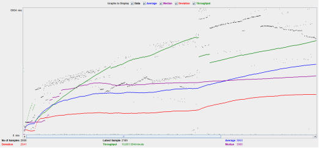

<div align='center' ><font size='42'> 短域名服务需求与程序说明文档 </font></div> 

[toc]

# 1 需求

## 1.1 需求描述
实现短域名服务，撰写两个 API 接口：
- 短域名存储接口：接受长域名信息，返回短域名信息
- 短域名读取接口：接受短域名信息，返回长域名信息

## 1.2 实现要求
要求与限制：
- 短域名长度最大为 8 个字符 ；
- 采用SpringBoot，集成Swagger API文档 ；
- JUnit编写单元测试, 使用Jacoco生成测试报告(测试报告提交截图) ；
- 映射数据存储在JVM内存即可，防止内存溢出 ；
- 源代码(按照生产级的要求编写整洁的代码，使用gitignore过滤掉非必要的提交文件，如class文件) ；
- Jacoco单元测试覆盖率截图(行覆盖率和分支覆盖率85%+) ；
- 文档：完整的设计思路、架构设计图以及所做的假设(Markdown格式) 。
- 最好有系统性能测试方案以及测试结果

## 1.3 需求分析

### 1.3.1 总体分析
根据上面的需求，可以理解为需要采用SpringBoot做一个后端的短链接服务，最主要的就是实现短链接生成
与读取短链接返回长链接的方式。给定长网址系统应将其转换为短链接，这个链接应该是唯一且不冲突的。
用户访问短链接的时候，应将其导向原始链接。短网址不应该被看出与原网址的关系（not guessable/predictable）。

### 1.3.2 短域名服务是什么
短域名服务，即短地址服务（也叫短网址：Short URL）让一个很长的网站链接缩短为一个短的链接，然后通过访问短链接重定向到原始的长链接，因为短信、微博等有字数限制，所以短地址就是为了这个而产生的。短地址网站基本都是通过后端服务转向来实现网址缩短。使用短链接的好处：短、字符少、美观、便于发布、传播。

举个例子，现有地址是这个：`https://www.abc.com/app/tb-source-app/aiguangjiepc/content/index.html?spm=a21bo&user_name=lucas` 
通过短链接服务可以将上面的地址转成 `https://sc.io/ra6vAv` 

### 1.3.3 实现算法对比
短地址服务的代码都是使用 [a-z,A-Z,0-9]总共 62 个字母数字的组合(**`62进制编码`**)来表示，6位的代码，就会有 `62^6 ~= 568亿种组合`。500多亿的组合基本上够用了，`所以我们在这个项目中使用6位短码`，如果需要扩展可以扩充到8位。
目前主要使用的算法有两种：1.自增序列算法、 2.摘要算法，对比情况如下。

| <div style="width:60px"> 算法 </div> | <div style="width:400px"> 说明 </div>                                                                | <div style="width:120px"> 优点 </div>                       | <div style="width:160px"> 缺点 </div>                                                                                  |
|:-----------------------------------|:---------------------------------------------------------------------------------------------------|:----------------------------------------------------------|:---------------------------------------------------------------------------------------------------------------------|
| 自增序列算法                             | 自增序列算法 也叫永不重复算法，它主要是设置 id 自增。一个 10 进制 id 对应一个 62进制的数值，1对1，也就不会出现重复的情况。这个利用的就是低进制转化为高进制时，字符数会减少的特性。 | 1.实现相对容易; <br> 2.id自增永不重复                                 | 1.短码的长度不固定，随着 id 变大从一位长度开始递增; <br> 2.相同的链接生成不同的id，如果访问量大增会生成大量id，导致id耗尽; <br> 3.需要有统一的id记录和同步记录; <br> 4.短码是有序的，安全性不高 |
| 摘要算法                               | 将长网址先用md5生成32位签名串,分为四段循环处理,取每端里面的任意一个就可作为这个长url的短代码地址。                                             | 1.短码长度固定; <br> 2.同样的长链接有相同的短码，可充分利用短码不容易耗尽; <br> 3.编码安全性高 | 1.需要算法实现，相对复杂; <br> 2.存在碰撞(重复)的可能性，虽然几率很小(判断并处理重复即可)                                                                 |
> 经过上表的对比，我们看到各种算法都有优缺点，并且以上算法都有公司在应用。这次我们更看重安全性、固定长度，并且并结合需求实现的要求存储在JVM中，ID无法长久存储，所以我们选择 **`摘要算法`** 这种方式，使用6位的代码有568亿种组合会更合适。

# 2 设计方案
## 2.1 概要设计
根据以上需求与算法分析，我们将采用Java8与SpringBoot实现短域名服务，有存储、读取两个API接口，由于数据存储在JVM内存并防止内存溢出，我们将使用Caffeine将数据存储到jvm，利用Caffeine的W-TinyLFU算法防止内存溢出。并集成Swagger，使用JUnit编写单元测试, 使用Jacoco生成测试报告, 按照生产级的要求编写整洁的代码。
这个项目可以先不用考虑安全认证、国际化、分布式应用、多环境部署等内容。

| <div style="width:150px"> 需求 </div>                  | <div style="width:180px"> 应对方案 </div>                                                                    | <div style="width:30px"> 预计满足 </div> |
|------------------------------------------------------|----------------------------------------------------------------------------------------------------------|--------------------------------------|
| 短域名长度最大为 8 个字符                                       | 使用摘要算法生成6位短码(可以选择6-8位)，符合需求                                                                              | √                                    |
| 采用 SpringBoot，集成Swagger API文档                        | 使用 SpringBoot，并集成 Swagger                                                                                | √                                    |     
| JUnit编写单元测试, 使用Jacoco生成测试报告(测试报告提交截图)                | 集成JUnit，Jacoco 添加单元测试并生成测试报告                                                                             | √                                    |   
| 映射数据存储在JVM内存即可，防止内存溢出                                | 使用Caffeine 将数据存储在JVM内存中，设置存储时间与数量利用Caffeine的W-TinyLFU算法防止内存溢出                                            | √                                    |   
| 源代码(按照生产级的要求编写整洁的代码，使用gitignore过滤掉非必要的提交文件，如class文件) | 按照生产级的规范编写代码与单元测试，并使用Analysis code，Alibaba java coding guidelines 等插件工具对工程代码进行检验，并使用gitignore过滤掉非必要的提交文件 | √                                    |  
| Jacoco单元测试覆盖率截图(行覆盖率和分支覆盖率85%+)                      | 集成Jacoco对单元测试覆盖率进行分析并生成报告                                                                                | √                                    |  
| 文档：完整的设计思路、架构设计图以及所做的假设(Markdown格式)                  | 编写项目的 README.md 文档说明完整的设计思路、程序设计图以及所做的假设                                                                 | √                                    |  
| 有系统性能测试方案以及测试结果                                      | 使用Jmeter、VisualVM等对程序的性能进行测试并输出结果                                                                        | √                                    |

## 2.2 整体技术选型
| <div style="width:120px"> 名称 </div> | <div style="width:100px"> 版本 </div> | <div style="width:400px"> 描述 </div>                                                                                                  |
|:------------------------------------|:------------------------------------|:-------------------------------------------------------------------------------------------------------------------------------------|
| Java                                | 1.8                                 | Java基础版本，选用1.8                                                                                                                       |
| SpringBoot                          | 2.6.4                               | 帮助开发者快速搭建Spring框架和一个Web容器；包含logback等，使用UTF-8编码                                                                                       |
| Spring-boot-starter-web             | 与SpringBoot版本保持一致                   | 使用Spring MVC的RestController实现API                                                                                                     |
| Spring-boot-starter-validation      | 与SpringBoot版本保持一致                   | 使用Validation 检验输入参数的正确性                                                                                                              |
| Spring-boot-starter-test            | 与SpringBoot版本保持一致                   | 单元测试(Junit5)验证各项功能                                                                                                                   |
| Caffeine                            | 2.9.3                               | 使用Caffeine 缓存来实现数据存储，利用Caffeine的W-TinyLFU算法防止内存溢出。设置最后一次写入或访问后经过固定时间过期30 天。为防止JVM内存溢出设置最大存储6十万数据，按每个链接对象500字节算，需要300M的JVM存储空间(可按需设置) |
| Swagger                             | 3.0.0                               | Swagger 生成API文档                                                                                                                      |
| Lombok                              | 1.18.22                             | Lombok 简化java源码                                                                                                                      |
| Jacoco                              | 0.8.7                               | Jacoco 测试覆盖率工具                                                                                                                       |

## 2.3 架构流程设计
### 2.3.1 创建短链接-架构流程设计
整体的流程保障创建的短码不重复，并且不发送缓存雪崩等情况，使用POST方法访问。
 

### 2.3.2 短链接查询长链接-架构流程设计
整体的流程保障大批量的并发访问，保障执行效率，使用GET方法访问（方法按read-only进行设计）。
 

## 2.4 工程包结构设计
整个工程使用SpringBoot服务端的分层架构，主要为Controller 表现控制层 ，Service 服务层 ，Dao 数据交互层，Entities 实体类等层级，工程结构如下：
````
cn.sequoiacap.links
├── base          -- 项目整体的基础设置
│   └──base          -- 项目整体的基础设置
│      └──config        -- 项目整体的配置
│      └──utils         -- 项目整体的工具
├── dao           -- 数据层
│   └──impl          -- 数据层实现包
├── entities      -- 实体层
│   └──groups        -- 实体验证分组包
├── service       -- 服务层
│   └──impl          -- 服务层实现包
├── web           -- web层
│   └──config        -- web配置
│   └──controller    -- web控制层
│   └──exception     -- web的异常处理
│   └──vo            -- web的view object层
````

## 2.5 接口设计
整个系统主要有2个API：1生成短链接，2.查询短域名返回长域名信息。以上接口使用RESTful API接口标准来实现，接口安全验证暂时不考虑。短链接我们使用 `https://sc.io/` 这个域名，短码使用6位短码。

### 2.5.1 生成短链接API设计
1. 生成短链接API，使用POST方法，参数为json格式传输长链接，返回json格式的状态与link对象(长链接，短链接，短码):
```
POST /link 
```
requestBody:
```json
{
   "longLink": "https://www.abc.com/app/tb-source-app/aiguangjiepc/content/index.html?spm=a21bo&user_name=lucas"
}
```
responseBody:
```json
{
   "code": 200,
   "message": "成功",
   "data": {
      "longLink": "https://www.abc.com/app/tb-source-app/aiguangjiepc/content/index.html?spm=a21bo&user_name=lucas",
      "shortCode": "ra6vAv",
      "shortLink": "https://sc.io/ra6vAv"
   }
}
```

### 2.5.2 通过短链接返回长链接API设计
2. 获取原始链接API，使用GET方法，直接在url设置短码参数，返回json格式的状态与link对象(长链接，短链接，短码):
```
GET /link/{shortCode} 
```
responseBdoy:
```json
{
   "code": 200,
   "message": "成功",
   "data": {
      "longLink": "https://www.abc.com/app/tb-source-app/aiguangjiepc/content/index.html?spm=a21bo&user_name=lucas",
      "shortCode": "ra6vAv",
      "shortLink": "https://sc.io/ra6vAv"
   }
}
```
### 2.5.3 错误码（code）设计说明

| code | 说明     |
|------|--------|
| 200  | 成功     |
| 201  | 创建成功   |
| 400  | 请求失败   |
| 401  | 认证失败   |
| 404  | 接口不存在  |
| 405  | 方法不被允许 |
| 406  | 没有找到数据 |
| 500  | 系统繁忙   |
| 1001 | 参数无效   |
| 1002 | 参数为空   |

# 3 打包与运行

## 3.1 打包
直接使用 maven 打包即可，输入命令：`mvn clean install`  或者  `mvn clean package`
运行以上命令后，项目中将生成 `target` 目录，`target`目录中将会生成 `links-0.1.0.jar`，`jacoco.exec`，`site`等文件和目录。
`links-0.1.0.jar`：是SpringBoot的运行jar，`jacoco.exec`：是jacoco的执行文件，`site`：这个目录是jacoco的覆盖率报告。

## 3.2 运行
可以直接用IDE运行 `LinksApplication` 类，或者使用如下命令运行 `links-0.1.0.jar` 
```
java -Xmx2G -Xms2G -Xmn1G -jar links-0.1.0.jar
```
> 运行后用端口为80，postman访问 http://localhost/link 即可，打开Swagger 在浏览器输入 http://localhost/swagger-ui/index.html

# 4 运行结果截图
## 4.1 Swagger文档截图
Swagger的文档2个API：1生成短链接(post)，2.查询短域名返回长域名信息(get)
 

## 4.2 Jacoco覆盖率截图
Missed Instructions 覆盖率：98%， Missed Branches 覆盖率：95%
 

# 5 性能测试方案及结果

## 5.1 性能测试方案
+ 使用 Jmeter 来进行测试, 使用 JConsole 观察 CPU 和 内存使用情况来确定系统最高能支撑的 TPS 和 QPS
+ 机器配置: cpu:2C 内存:8G

## 5.2 性能测试结果

### 5.2.1 场景一：100用户并发访问

#### 5.2.1.1 Jmeter设置
 

#### 5.2.1.2 Jmeter测试结果
 
 

#### 5.2.1.3 Java VisualVM测试结果
 

### 5.2.2 场景二：500用户并发访问

#### 5.2.2.1 Jmeter设置
 

#### 5.2.2.2 Jmeter测试结果
 
 

#### 5.2.2.3 Java VisualVM测试结果
 

### 5.2.3 场景三：1000用户并发访问

#### 5.2.3.1 Jmeter设置
 

#### 5.2.3.2 Jmeter测试结果
 
 

#### 5.2.3.3 Java VisualVM测试结果
 

# 6 假设与改进

## 6.1 读写预估
> 此服务应该是频繁读操作。相比起加入新的URL而言，访问已有URL的短链接将会频繁很多。 我们可以假设读写操作的数量比为100:1。
> 预计每月生成500M个新的短URL，每秒~200，读写操作数量比100:1，每月重定向（读）为500Mx100=50B， 每秒~20K

## 6.2 存储、内存、带宽预估
> 存储：假设每个短URL以及原始链接会被保存5年，5年内生成的短URL总量为500Mx5x12=30B，假设每个URL需要500B，总共需要的存储空间为500Bx30B=15TB

> 内存：对一些高访问的热门URL做cache操作，这些URL会存在于内存里面，而不是硬盘上，便于快速访问。 假设URL也遵从80-20 Rule，
> 那么20%的URL产生了80%的流量，我们将对top20%的URL做cache。 每个月生成的新URL为500M，top20%~100M， 
> 总共需要100Mx500B=500MB。 如果我们想cache更长时段的URL，则需要更大的空间。

> 带宽：每秒会有~200写操作（新URL），所以总共上传数据带宽为100KB/s ，对于读操作，~20K/s，下载带宽为~10MB/s

## 6.3 生产环境预估
> 本次设计主要是基于单机模式并且存储到jvm，欠缺生产环境的高并发、高性能、高可用、安全认证等方面的考虑。 <br>
> 1.如果作为企业级短域名服务，需要考虑微服务的分布式部署适应不同地区的存储与访问，实现服务的高可用(允许某些服务挂机和动态的线性扩展)。 <br>
> 2.作为企业级短域名服务，需要通过关系数据库(Mysql等)、NoSql数据库(Redis、Mongodb等)、本地缓存(Caffeine等)的多级存储与分布式缓存联动实现存储(主备)与快速访问。 <br>
> 3.作为企业级短域名服务，需要分环境部署和设置(开发、测试、生产等)，对于信息存储、信息读取都需要安全认证进行验证来确保访问的安全与数据安全。 <br>
> 4.作为企业级短域名服务，需要对用户的各种行为与操作进行记录与分析。 <br>
> 5.作为企业级短域名服务，需要多种监控系统对系统的日志、性能、安全等进行监控与分析。 <br>
> 6.完成开发后需经过多轮测试与自动化docker或k8s灰度上线运行。