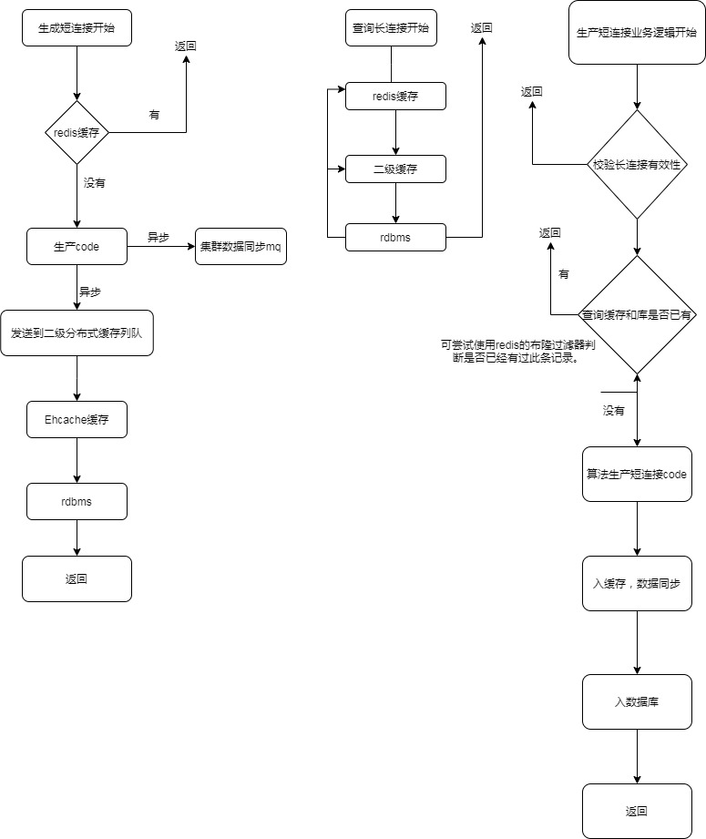
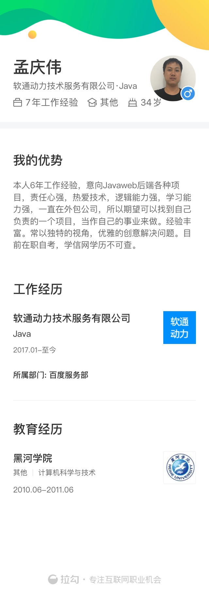

# Java Assignment

***要考虑参加面试，您需要完成下面的“作业”部分。***

### Assignment

**设计编写一个短域名服务（*参考www.sina.lt*），它包括提供服务的Web应用，后端Restfull API，您需要思考如何使服务高可用、在并发访问时系统的性能表现，服务在不同地理区域的访问延迟。使用Markdown描述您的系统设计、技术选型。**

这是开放性等作业，我们希望您递交的作业内容包括：

1. 系统设计文档(Markdown)
./desigin/系统设计文档.md

2. 源代码
../homework/Qingwei/pom.xml

3. 单元测试代码及单元测试覆盖率 
[单元测试覆盖率](./test/index.html)

4. API集成测试案例以及测试结果
    [ API集成测试案例](./jmeter/*)

| Label        | Samples | Average | Median | 90%LIne | 95%Line | 99%Line | Min  | Maximum | Error% | Throughput        | Received KB/sec   | Sent KB/sec       |
| ------------ | ------- | ------- | ------ | ------- | ------- | ------- | ---- | ------- | ------ | ----------------- | ----------------- | ----------------- |
| HTTP Request | 10000   | 101     | 34     | 216     | 415     | 1245    | 1    | 1990    | 0.0    | 871.1560240439062 | 141.8265827816012 | 179.5057822981096 |
| TOTAL        | 10000   | 101     | 34     | 216     | 415     | 1245    | 1    | 1990    | 0.0    | 871.1560240439062 | 141.8265827816012 | 179.5057822981096 |

5. 简单的架构设计图，以及所做的假设 
    
    

6. 涉及的SQL或者NoSQL的Schema(注意标注出 Primary key 和 Index 如果有)
    [sql](./schema.sql)

简历。

## Job Description

### 岗位指责

1. 能够独立的按产品需求进行技术方案设计和编码实现，确保安全、可扩展性、质量和性能;
2. 在负责的业务上有独立的见解和思考，对业务产品具有独立沟通、完善业务需求和识别方案风险的能力;
3. 具有持续优化、追求卓越的激情和能力，能持续关注和学习相关领域的知识，并能使用到工作当中;
4. 具备和第三方供应商进行沟通，对设计方案进行审核的能力;

### 要求

1. 5年软件研发/解决方案设计工作经验(金融领域经验加分)；
2. Java基础扎实，熟悉高级特性和类库、多线程编程以及常见框架(SpringBoot等)；
3. 具备基本系统架构能力，熟悉缓存、高可用等主流技术；
5. 持续保持技术激情，善于快速学习，注重代码质量，有良好的软件工程知识和编码规范意识；

