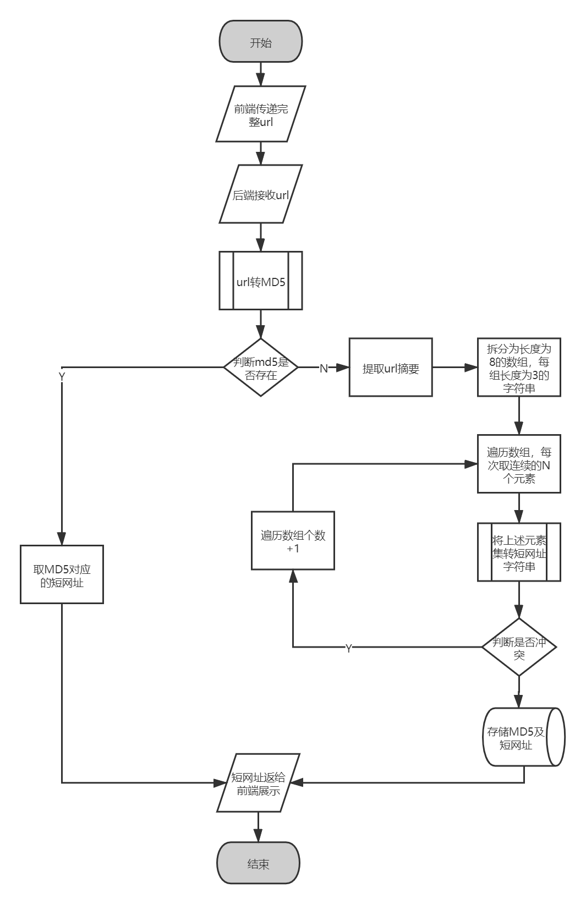
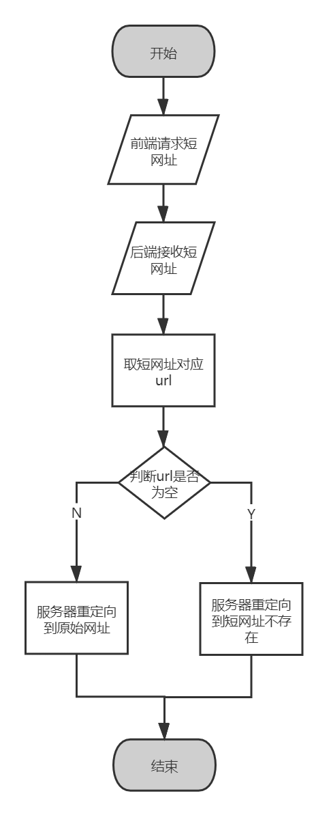
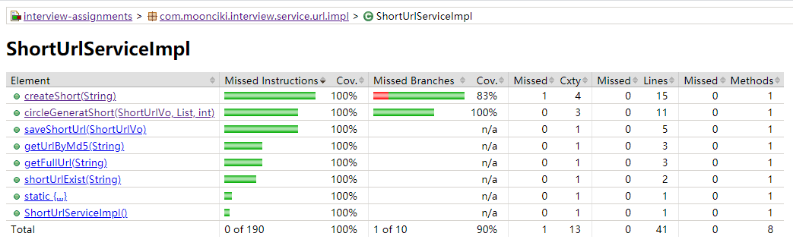
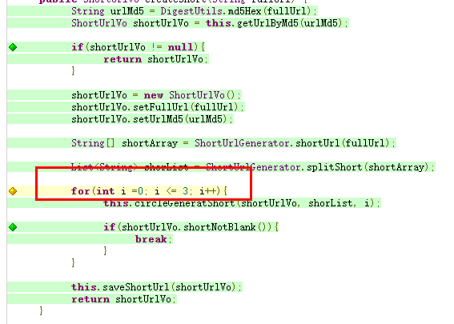

## 任务要求

* 互联网中的地址有的时候会很长，不利于记录、发布和传播。

* 为了方便记录、发布或者传播互联网的地址，我们需要实现：输入一个完整的url，通过该系统，生成一个尽可能短的地址，并且能够通过访问该短地址，自动跳转到原始地址的目的。

## 市面上成熟的短网址

*  常见短网址服务器 [https://www.sina.lt/index.html]()

### 方案选择

#### 1. 爬虫式：通过 http 方式请求上述地址接口，并返回短网址结果。
    优点：不用重复造轮子，且没有超短域名的要求。
    缺点：不受控制，不可监控，不可定制化。

#### 2. 自己实现
    优点： 完全可控，并且可以做相关监控统计，支持定制化。
	缺点： 地址长度受域名影响

##### 这里我们采用自己实现方式。

### 主流实现方法
#### 1. 自增序列算法
    通过自增序列，如mysql 自增主键，redis incr 自增命令，可以生成不重复的自增的10进制数，然后将改10进制抓换成 [a-z, A-Z, 0-9] 62 个字母表示的数，保存该数字与 url 的对应关系，然后通过重定向即可实现。
    如果长度是6位的话，总共会有 62^6 ~= 568亿种组合，基本上够用了。

##### 优缺点对比

    优点：实现简单，无重复。
    缺点：地址不定长，需要维护自增序列，随着数据增多url长度会增加，并且该方法生成的地址有规律可循，可能容易给人脱库。

#### 2. 摘要算法
    将长网址md5生成32位签名串,分为4段, 每段8个字节；
    对这四段循环处理, 取8个字节, 将他看成16进制串与0x3fffffff(30位1)与操作, 即超过30位的忽略处理；
    这30位分成6段, 每5位的数字作为字母表的索引取得特定字符, 依次进行获得6位字符串；
    最终可以获得4个6位串；取里面的任意一个就可作为这个长url的短url地址；
    如果发生hash冲突，进行冲突处理。

##### 优缺点对比

    优点：地址无规律，不容易被脱库。不需要维护自增序列。
    缺点：可能会发生重复，发生重复时，解决起来比较麻烦

### 最终实现方案
##### 鉴于安全性最重要，因此我们选择使用摘要算法作为实现。
考虑到上面摘要算法长度为6位，其实算比较长的，因此我们再此算法基础上在做优化，将上述的4个6位字符串拆分成8个3位，然后再加上冲突解决策略。
由于时间原因，我们持久层省略掉数据库存储，直接使用redis 做缓存及持久化。

### 流程
    1. 用户通过http 将完整 url 传到后台
	2. 后端接收到url后，先将url生成md5，由于md5的重复可能性要小于短网址，因此通过判断该md5是否存在redis中，判断之前是否生成过该url的短网址。
    3. 如果历史存在该url的短网址，直接将短网址返回至前端展示
    4. 如果历史不存在该md5，则通过摘要算法，生成对应的摘要数组，该数组长度为4，且每一个字符串元素的长度为6
    5. 通常做法，使用上述字符串数组中的任意元素即可作为该url的短网址。但由于6位长度有点长，并且期间会出现重复，因此我们对此方法做优化调整。
    6. 将上述的字符串数组拆分，变成长度为8，且每个元素长度为三的字符串数组。
    7. 顺序遍历每个数组，直到其中三位字符串不重复，如果全都重复，则每次遍历两个元素，组成6位字符，直到不重复，然后以此类推。
    8. 最后会得到 3、6、9 位长度的字符串以保证不重复，如果url有超时时间，那么基本最多6位就能满足不重复的要求。
    9. 上述的短网址返回前端。
    10. 前端通过访问上述短网址，服务器接收到对应的短链地址，通过redis，查询该地址是否存在，存在就重定向到原始url,如果不存在，则跳转“该短网址不存在或已超时”地址，重定向采用服务端 302 跳转，（301是永久重定向，为了保证可控性，或者实现统计，短链失效的问题，这里采用302重定向）。
    11. 至此目的实现。

#### 创建短网址流程图

#### 访问短网址流程图

### 单元测试结果

#### 该分支只有再数据量特别庞大的时候，才会出现9位的短网址的情况，如果将该数值减小就可以完全覆盖，但是如此一来就没办法解决大数据量冲突的一个问题。

### 效果图

### 演示地址

http://114.67.231.40:8000/page/url/shortUrl.html

# 参考资料

* https://www.sina.lt/index.html
* https://segmentfault.com/a/1190000012088345
