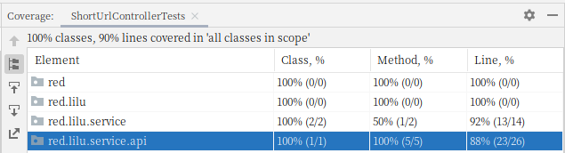
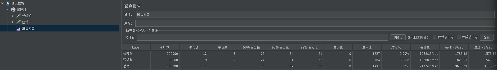

# Java 李克明 作业

## 设计思路

已经近6年没有摸过Spring，这次对着文档学习了SpringBoot.

设计时两个核心点需要注意:
1. 计算短码得高效
2. 存取速度得快

拿到题目之后第一时间寻找编码算法，最终选择MurmurHash。由于使用内存存储，需要注意并发下不争用，最终选择ConcurrentHashMap。

## Coverage报告

## 架构图

基于SpringBoot的简单REST接口，没有什么架构图可画。

## 性能测试

手上只有一台台式机，i5的CPU, 16GB内存。服务和测试都在这台电脑上，所以实际性能会打折扣。

自己写测试程序可能因写法导致测试结果存在异议, 故选择Apache Jmeter。开10000个线程循环10次，先调用长转短，拿到返回的短域名后，再调用短转长。流程详见工程文件 [性能测试工程.jmx](性能测试工程.jmx) 。

