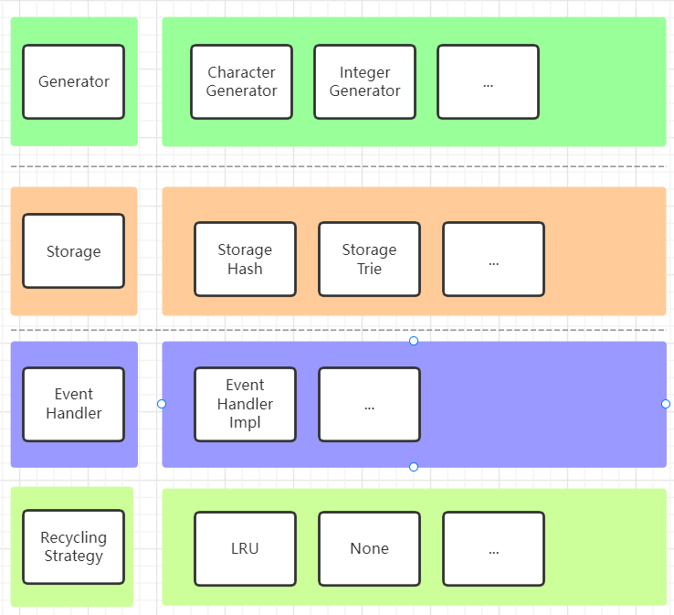
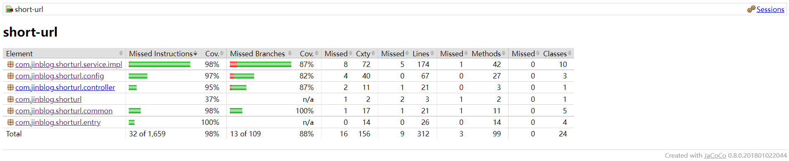

# 短域名服务

## 系统主要模块图

## 模块说明
系统主要分四个模块，Generator，Storage，EventHandler，RecyclingStrategy。
为了便于后序扩展，每个模块都抽象出了最上层的接口。
然后基于不同的数据结构，回收算法，进行了不同的实现。支持在配置文件中直接指定组件的类型，以适应不同的场景。具体如下：

- Generator：用来生成短链接。
- Storage：用来存储短链接与长链接的映射关系。
- RecyclingStrategy：用于内存不足时，回收内存。
- EventHandler：用于将系统事件与回收策略联系起来。异步的，避免影响接口性能。

### 模块详细说明
#### Generator模块
用来生成短链接，实现方式有两种：IntegerGenerator，CharacterGenerator。
- IntegerGenerator：使用AtomicInteger自增实现。
  - 优点：无锁，多线程性能更高。
  - 缺点：无法扩展，最多生成36的8次方个短链接。
- CharacterGenerator：使用自定义的字符，模拟数字进位实现。
  - 优点：支持扩展，可生成更多的短链接。最多生成62的8次方个短链接。
  - 缺点：有锁。多线程场景下长转短性能相对较差。

#### Storage模块
用于存储长链接与短链接之间的映射关系。实现方式有两种：StorageHash，StorageTrie。
- StorageHash：基于ConcurrentHashMap实现。
  - 优点：锁的粒度更小，多线程时性能更强。 
  - 缺点：极端情况下（hash冲突较多），查询复杂度变为O(n)或O(log n)，n为hash槽内元素的数量。
- StorageTrie：基于trie结构实现。
  - 优点：查找性能稳定。
  - 缺点：锁的粒度较大，多线程时性能较差。

#### EventHandler模块
用来异步处理系统事件，以将系统事件与回收策略联结起来。实现方式有：EventHandlerImpl。

#### RecyclingStrategy模块
内存不足时，执行回收策略。实现方式有：RecyclingStrategyLRUImpl，RecyclingStrategyNoneImpl。
- RecyclingStrategyLRUImpl：以LRU方式回收内存中的数据。即回收最久未使用对象。
- RecyclingStrategyNoneImpl：不进行回收。

## 测试覆盖率

## 性能测试方案
### 测试目的
测试短链接系统在不同的配置下的性能基准

### 测试范围
并发测试系统主要接口：生成短链接接口，获取长链接接口。

### 环境
#### 硬件配置
|应用服务器|硬件配置|
|:---:|:---:|
|短链接服务|2×2.60 GHZ，2G内存|

#### 软件配置
|软件|版本|
|:---:|:---:|
|操作系统|CentOS Linux release 7.9.2009 (Core)|
|JVM|1.8.0_202|
|Spring boot|2.4.2|
|undertow|2.2.3 Final|

#### 测试工具
|软件|版本|
|:---:|:---:|
|ApacheBench|2.3|

### 测试内容
测试不同组件配置下，系统的性能。测试前先使用1000个请求激活JIT。

|接口|并发数|总请求数量|
|:---:|:---:|:---:|
|长链接转短链接接口|5|1000|
|短链接转长链接接口|5|1000|

### 测试结果
|接口|Generator|Storage|RecyclingStrategy|Requests per second|Time per request(ms)|
|:---:|:---:|:---:|:---:|:---:|:---:|
|长链接转短链接|character|hash|lru|741.23|1.349|
|短链接转长链接|character|hash|lru|1066.32|0.938|
|长链接转短链接|character|tire|lru|753.07|1.328|
|短链接转长链接|character|tire|lru|1182.02|0.846|
|长链接转短链接|integer|hash|lru|816.00|1.225|
|短链接转长链接|integer|hash|lru|1099.34|0.910|
|长链接转短链接|integer|trie|lru|805.72|1.241|
|短链接转长链接|integer|trie|lru|1023.83|0.977|