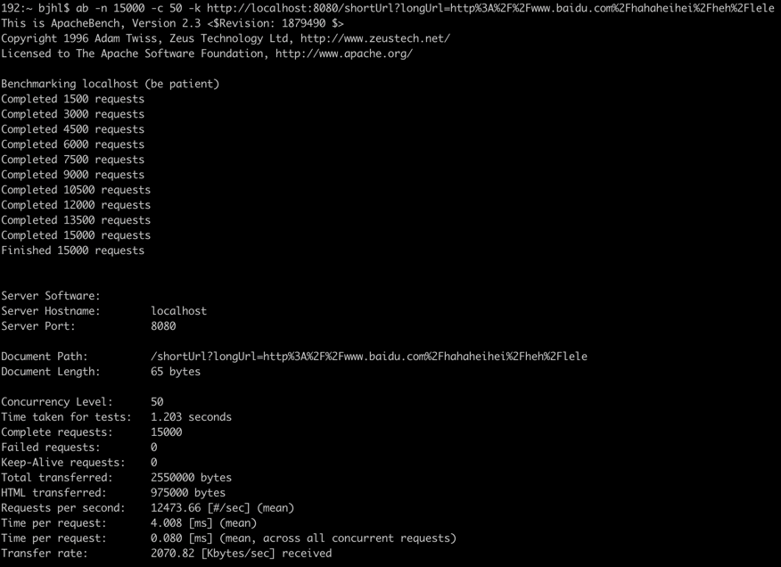

# assignments

## 介绍
长短域名服务接口说明
## 软件架构
JDK1.8
基于MD5实现，长URL经过MD5后，得到32位字符串

将32位字符串分成4组，每组8位，生成2位字符串，最后得到2*4=8位的短URL

考虑并发情况下的安全问题，将短链存入currenthashmap

map数据最多占用90%，预留10%内存,map装载因子0.75，内存占按75%处理

## swagger

## Jacoco结果

## 压测方案
url参数动态变化

并发请求500、800、1000、1500、2000...

找到发生故障的极限，在给定时间内能够持续处理的最大负载，看是否满足业务预期

疲劳强度测试，在一定饱和状态下cup、内存情况，是否出现error

jmeter压测结果：

