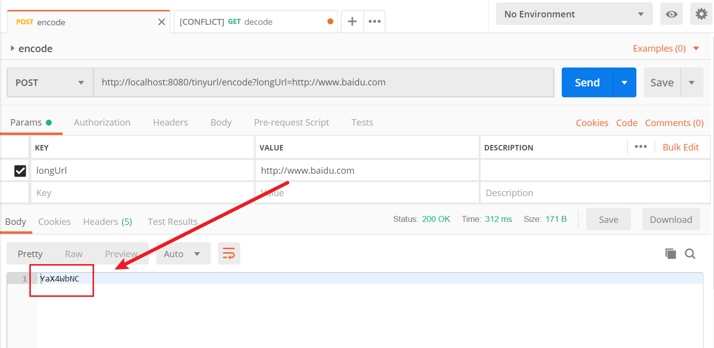
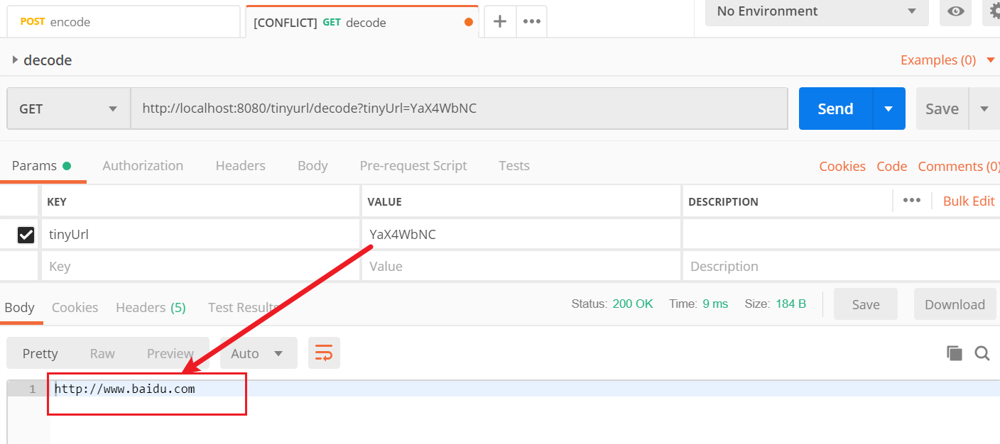
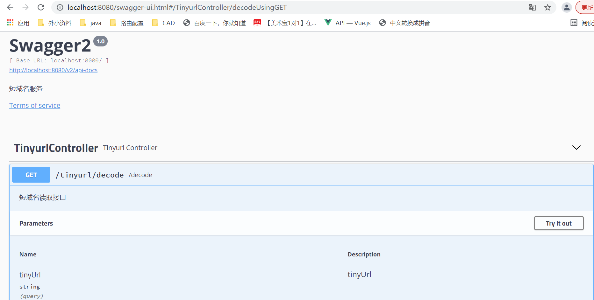
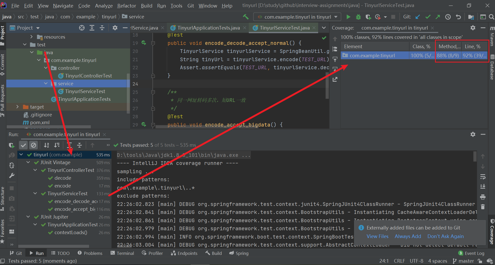

# 短域名服务

## 1.功能实现
### 1.1短域名存储接口

### 1.2短域名读取接口

## 2.功能限制
### 2.1短域名长度最大为 8 个字符
使用8位62进制数字，最多可以存储62^8个网址，满足要求
### 2.2采用SpringBoot，集成Swagger API文档

### 2.3JUnit编写单元测试, 使用Jacoco生成测试报告(行覆盖率和分支覆盖率85%+)

### 2.4映射数据存储在JVM内存即可，防止内存溢出
使用Map缓存URL和tinyURL的映射关系，满足要求

## 3.设计思路
1.使用Map缓存URL和tinyURL的映射关系;  
2.为了避免缓存大量相同的URL，使用双map做校验;  
3.使用8位62进制数字表达tinyURL，后续如果容量不够，可以扩展到更大的进制数;    
4.安全考虑，避免从外部猜测URL缓存数量，tinyURL不适合使用自增数，改成使用随机数;   
5.为什么不直接取URL的hash值？因为hash值不未知，不可靠;  
6.双map缓存了2份数据，内存开销有点大，暂时没想到更好的办法。  