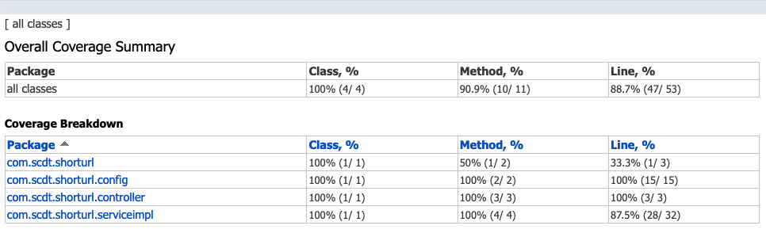

# 设计文档
## 需求分析
- 短域名需求主要是需要能通过原始较长域名生成一个唯一的短域名
- 不需要保证相同原始域名生成相同短域名
- 可以使用雪花算法生成趋势递增的long id然后转换成短字符串来实现短域名

## 假设
- 相同url生成的短url不需要相同
- 生成的短url未被访问后会失效
- 考虑到实际可能并发，把Snowflake算法中的sequence bit调整为1位，worker bit调整
为3位。既单worker每毫秒可以生成2个短域名，最多可以支持8个worker

## 系统架构
### 工程结构
~~~shell
.
├── HELP.md
├── README.md
├── build.gradle
├── gradle
│   └── wrapper
│       ├── gradle-wrapper.jar
│       └── gradle-wrapper.properties
├── gradlew
├── gradlew.bat
├── jacoco.gradle #jacoco的单独配置文件，其中主要把集成测试的单元测试的结果组合做成report
├── lombok.config 
├── settings.gradle
├── src
│   ├── isolationTest #集成测试，主要测试api的返回是否符合期望
│   │   └── java
│   │       └── io
│   │           └── nigelwy
│   │               └── javaassignments
│   │                   └── controller
│   │                       └── ShortUrlControllerTest.java
│   ├── main
│   │   ├── java
│   │   │   └── io
│   │   │       └── nigelwy
│   │   │           └── javaassignments
│   │   │               ├── JavaAssignmentsApplication.java
│   │   │               ├── ShortUrlProperties.java #配置一定得是类而不是用@Vaule注入
│   │   │               ├── api
│   │   │               │   ├── ShortUrlApi.java
│   │   │               │   └── response
│   │   │               │       └── GenerateShorturlResponse.java
│   │   │               ├── config
│   │   │               │   ├── ApplicationConfiguration.java
│   │   │               │   └── OpenApiConfig.java
│   │   │               ├── controller
│   │   │               │   └── ShortUrlController.java
│   │   │               ├── repository
│   │   │               │   ├── InMemoryUrlRepository.java
│   │   │               │   └── UrlRepository.java
│   │   │               ├── service
│   │   │               │   ├── ShortUrlService.java
│   │   │               │   ├── SnowflakeUrlGenerator.java
│   │   │               │   └── UrlGenerator.java
│   │   │               └── util
│   │   │                   └── Snowflake.java
│   │   └── resources
│   │       └── application.yaml
│   └── test #单元测试，测试方法的分支，逻辑
│       └── java
│           └── io
│               └── nigelwy
│                   └── javaassignments
│                       ├── Constants.java
│                       ├── repository
│                       │   └── InMemoryUrlRepositoryTest.java
│                       └── service
│                           ├── ShortUrlServiceTest.java
│                           └── SnowflakeUrlGeneratorTest.java
└── test_report.png
~~~

### 设计思路
- 需要一个接口生成短url，一个接口返回长url
  - 生成短url的接口采用POST方法，返回Json格式的长短url对象
  - 返回短url的接口采用GET方法，找到结果是返回302浏览器直接重定向，找不到结果则返回404
  - 为了使得整体的url更短, 直接在跟路径上实现了接口
  - ShortUrlApi定义接口契约，添加swagger注解，做到实现和文档分离
- 生成短Url的接口需要做两件事，生成短url和存储映射关系。
生成短Url和的实现方式（算法），映射存储的方式（内存/分布式高速缓存，过期策略等等）都会随着产品演进发生变化，
因此抽象出UrlGenerator和UrlRepository这两个接口来定义契约，ShortUrlService作为调度器来串联处理逻辑。
- SnowflakeUrlGenerator采用雪花算法生成62进制短url，只有一个异常分支是生成的域名长度超过设定的限度8。
同时权衡了可能的并发量，对sequence和worker的bit做了调整。因为雪花算法是外部提供的算法，秉承不对依赖进行
测试的原则，把Snowflake这个类加了jacoco exclude。
- InMemoryUrlRepository使用了Google的Inmemory cache实现，简单加了一个1天的过期时间和最大key数量上限
来避免OOM。这些配置可以参数化，也可以有更高级的过期策略，这些都是后续的优化空间。

## 测试报告

## 性能测试
性能测试使用的工具位[hey](https://github.com/rakyll/hey)
性能测试结果符合预期, 约2000每秒
~~~shell
at 18:47:38 ❯ hey -z 20s -m POST http://localhost:8080/\?originUrl\=https://www.baidu.com

Summary:
  Total:	20.0256 secs
  Slowest:	0.1345 secs
  Fastest:	0.0004 secs
  Average:	0.0252 secs
  Requests/sec:	1985.3630

Response time histogram:
  0.000 [1]	|
  0.014 [10062]	|■■■■■■■■■■■■■■■■■■■■■■■■■■■■■■■■■■■
  0.027 [11475]	|■■■■■■■■■■■■■■■■■■■■■■■■■■■■■■■■■■■■■■■■
  0.041 [11401]	|■■■■■■■■■■■■■■■■■■■■■■■■■■■■■■■■■■■■■■■■
  0.054 [6707]	|■■■■■■■■■■■■■■■■■■■■■■■
  0.067 [36]	|
  0.081 [16]	|
  0.094 [10]	|
  0.108 [0]	|
  0.121 [0]	|
  0.135 [50]	|

Latency distribution:
  10% in 0.0060 secs
  25% in 0.0122 secs
  50% in 0.0250 secs
  75% in 0.0379 secs
  90% in 0.0440 secs
  95% in 0.0461 secs
  99% in 0.0481 secs

Details (average, fastest, slowest):
  DNS+dialup:	0.0000 secs, 0.0004 secs, 0.1345 secs
  DNS-lookup:	0.0000 secs, 0.0000 secs, 0.0032 secs
  req write:	0.0000 secs, 0.0000 secs, 0.0016 secs
  resp wait:	0.0251 secs, 0.0002 secs, 0.1296 secs
  resp read:	0.0000 secs, 0.0000 secs, 0.0116 secs

Status code distribution:
  [201]	39758 responses
~~~

## 后续优化
- 在分布式环境通过环境变量传入雪花算法的worker id
- 在分布式环境使用类似redis的缓存代替jvm存储
- 短时间的热点url生成可以通过一定策略做到生成相同的短url
- 公共的错误返回结构，ControllerAdvice