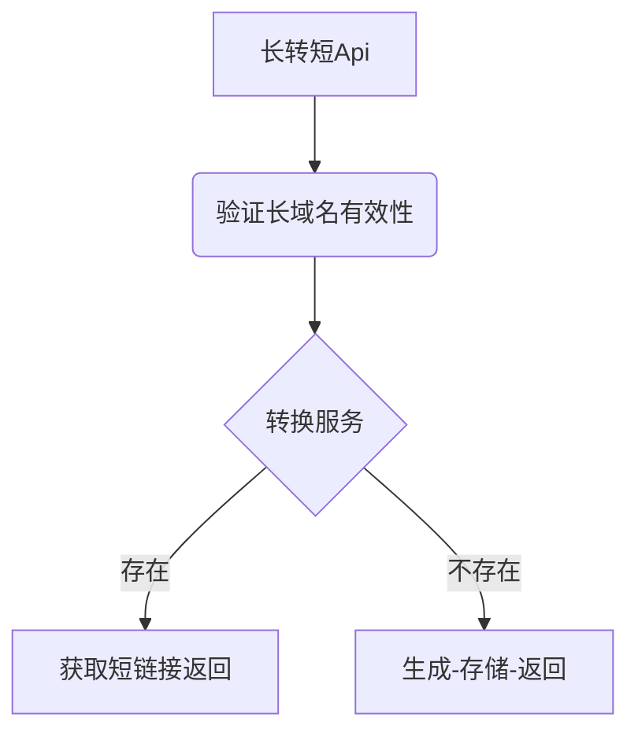
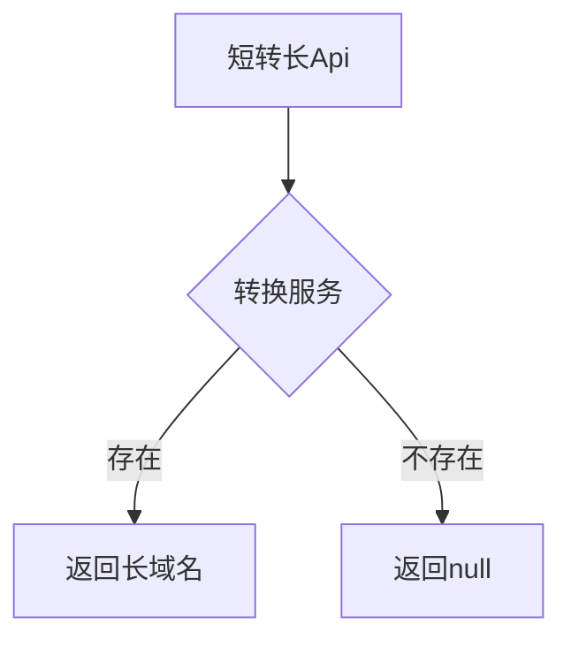

### 短域名服务设计思路
** 长域名转换短域名 **
```
       通过接口以post方式接收长域名信息，对其进行md5处理，到内存对象查询是否存在，如果存在直接返回短域名信息。如果不存在则生成短域名信息并将生的短域名及长域名分别存入内存对象中。
```

** 短域名查找长域名 **
```
       通过接口以get方式接收短域名信息，到内存对象中查找，存在则返回长域名信息，不存在则返回null。
```

### 架构图
** 长转短 **

** 短转长 **


