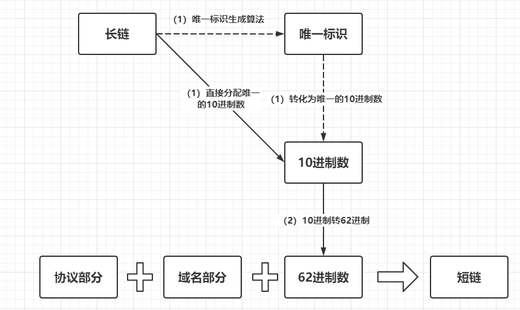
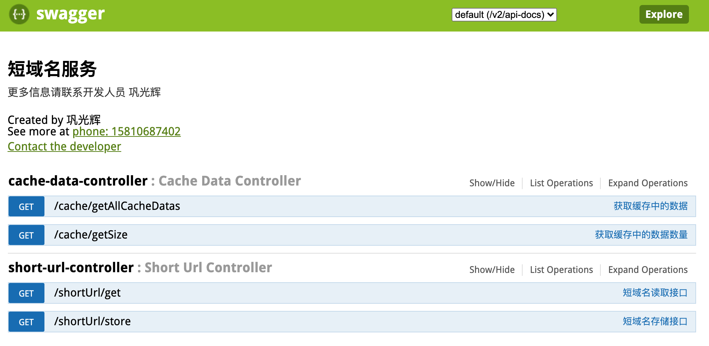
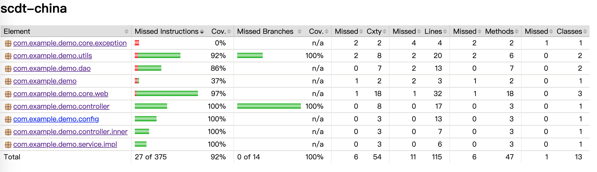
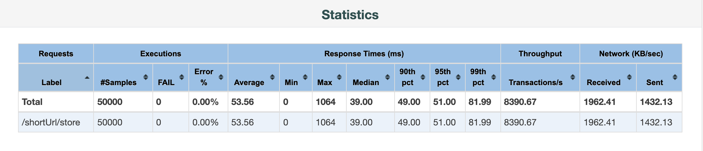
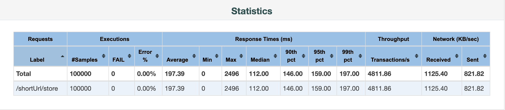
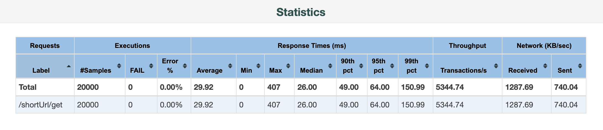
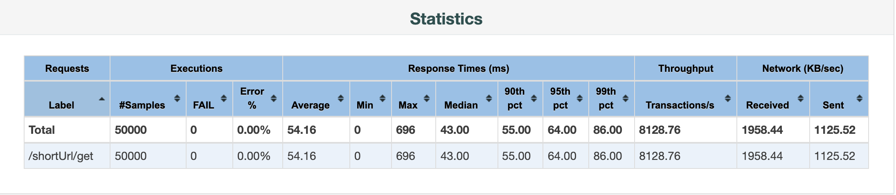
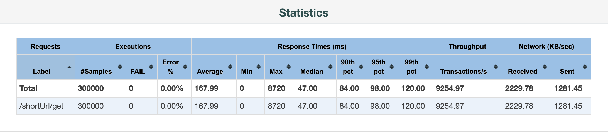
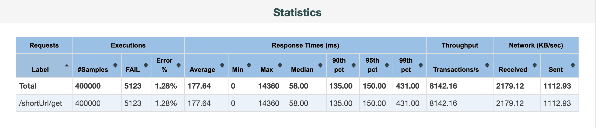

#短链接服务设计
+ 应聘者：巩光辉-JAVA    
+ 手机：15810687402 
+ 邮箱：ggh666@163.com
+ 如本题面试通过，请邮件联系索取个人简历，谢谢~

##设计方案
* 设计思路

* 唯一标识生成算法（MurmurHash）
 + MurmurHash 是一种非加密型哈希函数，适用于一般的哈希检索操作。与其它流行的哈希函数相比，对于规律性较强的 key，MurmurHash 的随机分布特征表现更良好
 + MurmurHash 提供了两种长度的哈希值，32 bit，128 bit，为了让网址尽可通地短，我们选择 32 bit 的哈希值，32 bit 能表示的最大值近 43 亿 
 + 我们使用的是26个字母的大小写，加上10个数字，那么对于N位压缩码可以表示的最大组合数量为，最后选择 N=6 组合生成62进制数
 + N = 4，组合数为62 ^ 4 = 14_776_336，接近148万
 + N = 5，组合数为62 ^ 5 = 916_132_832，9.16亿左右
 + N = 6，组合数为62 ^ 6 = 56_800_235_584，568亿左右
  
* 内存存储(Guava Cache)
 + Google开源的本地缓存工具库，它的设计灵感来源于ConcurrentHashMap，使用多个segments方式的细粒度锁，在保证线程安全的同时，支持高并发场景需求，同时支持多种类型的缓存清理策略，包括基于容量的清理、基于时间的清理、基于引用的清理等
 + 本设计将缓存数量设置为1千万，超过1千万后，新增的数据会覆盖前面的缓存数据，也可以基于空间大小来设置，防止内存溢出
  		+ .maximumSize(10000000)//设置缓存数量上限
 		+ .maximumWeight(1024 * 1024 * 1024 * 100)//100M空间大小

* 正则表达式验证url合法性
* 举例，根据输入长域名，返回一个6位62进制数
	+ 	https://www.baidu.com/index.html  -->  EQSjdj
	

## 遗留问题
暂未解决短域名冲突场景，目前在压测过程中，暂未出现冲突场景。

## Swagger-UI
访问地址：http://localhost:8080/swagger-ui.html

+ CacheDataController 部分为获取缓存中的数据，验证数据使用
 
## 单元测试覆盖率
使用jacoco做覆盖率测试，如下图：
 
 
## 性能测试
* 测试目的
	+ 发现系统中可能隐藏的并发访问时的问题
	+ 关注系统可能存在的并发问题，例如系统中的内存泄漏、线程锁和资源争用方面的问题
	+ 测试系统在一定饱和状态下，例如cpu、内存在饱和使用情况下，系统能够处理的会话能力，以及系统是否会出现错误
	+ 在开发的各个阶段使用需要相关的测试工具的配合和支持

* 测试环境

	|名称|说明|
	|---|---|
	|硬件|Mac笔记本 4核16G|
	|软件|Springboot 应用 JVM分配4G内存，ParallelGC回收器|
	|压测工具|Jmeter|
	|监控工具| iStatistica (CPU,内存,网络)|

* 压测数据
	
	|名称|说明|
	|---|---|
	|存储短链接|/shortUrl/store|
	|第一组数据|200线程 每个循环100次|
	|第二组数据|500线程 每个循环100次|
	|第三组数据|1000线程 每个循环100次|
	|||
	|获取长链接|/shortUrl/get|
	|第一组数据|200线程  每个循环100次|
	|第二组数据|500线程 每个循100次|
	|第三组数据|1000线程 每个循环100次|
	|第四组数据|2000线程 每个循环100次|
	|第五组数据|3000线程 每个循环100次|
	|第六组数据|4000线程 每个循环100次|

* 压测结果 

	* /shortUrl/store
	
		+ 第一组压测结果(200线程 每个循环100次) 
		
		+ 第二组压测结果(500线程 每个循环100次)
		
		+ 第三组压测结果(1000线程 每个循环100次)
		

	* /shortUrl/get
		* 先将测试数据提前存储起来，压测时直接通过接口来获取
   		+ 第一组压测结果(200线程 每个循环100次) 
		
		+ 第二组压测结果(500线程 每个循环100次)
		
		+ 第三组压测结果(1000线程 每个循环100次)
		
		+ 第四组压测结果(2000线程 每个循环100次)
		
		+ 第五组压测结果(3000线程 每个循环100次)
		
		+ 第六组压测结果(4000线程 每个循环100次)
		
	
	结论
	
	+ 本次使用JVM缓存，并且还做了容量限制，所以在压测过程中，只有CPU资源的变化
	+ 短域名存储接口根据压测结果看，在500并发左右线性能表现最好
	+ 短域名获取接口根据压测结果，在1000并发左右性能表现最好，随着并发数量增加，接口耗时与吞吐量会有所下降