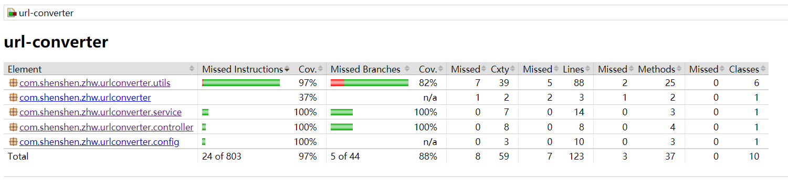

# 说明

## 总体设计思路
* 当调用存储接口的时候，根据算法生成一个8个字符的字符串(生成方法和域名无关)
* 把生成的字符串当做key，长域名当做value，保存到map中
* 当调用查询接口时，从map中查找对应value值返回，如果没有返回null
* 为了防止内存溢出，map限制了大小，同时也设置过期时间，当超过map大小时，移除最老的元素(不管是否过期)
* 还有个定时器，定时清除map中到期的元素

## key字符串生成思路
* 使用雪花算法生成一个唯一长整形数，每秒4096*32*32个
* 把长整形转化为62进制字符串（0-9，a-z，A-Z共62个字符）
* 由于要求转化的字符不能超过8个，62进制中8位数最高218340105584896，所以需要把雪花算法生成的长整形变小
* 因为时间搓的高位基本不变，所以从高位截取17位二进制，变成一个47位的二进制数
* 在把生成的47位二进制数转为62进制的字符串
* **因为位数比较小，一年多就会重复，如果并发量不是太大可以通过减小机器位或者数据中心位增加重复周期**

## 缓存设计思路
* 使用ConcurrentHashMap作为存储载体，为了预防内存溢出增加一个int计数器，当增加到给定数值则等待空位出现
* 使用定时任务队列ScheduledThreadPoolExecutor，来删除过期的对象
* 由于ConcurrentHashMap线程安全，所以只在put时给计数器上锁
#### 缓存设计的改进思路
* 自己封装，性能没有开源控件好，如redis，Ehcache等
* 相同url每次都会生成一个新的标识，浪费资源

# 关于缓存性能
* 因为ConcurrentHashMap线程安全，查询和删除使用内部同步机制，所以
* 当过期时间无限大，缓存大小趋近于Integer.MAX_VALUE时，该性能无限趋近于ConcurrentHashMap的性能
* 当缓存大小一定时，如果生成的速度小于过期的速度，则性能取决于生产的速度
* 当缓存大小一定时，如果生成的速度大于过期的速度，则性能取决于过期的数据

# 单元测试覆盖

张伟 15801587075
419349990@qq.com