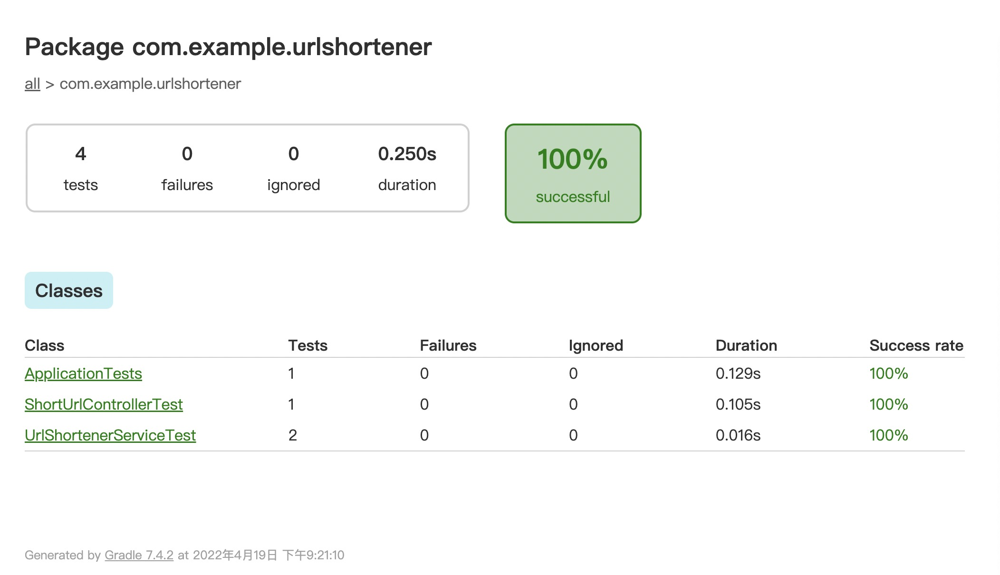
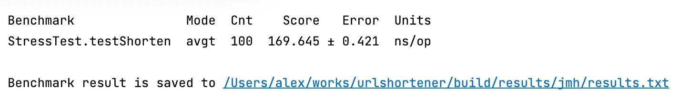

# Url Shorten Service

A url shorten web service developed in kotlin.

This springboot project consists of 5 components:

## Architecture and Design
* The "Application" class is the webapp's entrypoint.
* The "Controller" Classes that exposes the main API "endpoints".
* The "Service" Classes are responsible for encapsulating and implementing the business logic.
* The "Repository" Class that is responsible for accessing the database.
* The "Model" class that functions as "Data Transfer Object".

## Compile and run the App
Compile the application and download its dependencies with the following command.
```
gradle bootRun
```
## To unittest the project, run
```
gradle test
```

## To see the api docs, go to
```
http://localhost:8080/swagger-ui/index.html
```

## Api endpoints
```
POST /api/v1/shorten with body as long_url_string - For creating the short url from long url
GET /api/v1/query/{id} - For retrieving the long URL from short id(url) 
```

## Unittest with coverage


## Performance test
We believe that A performance bottleneck probably occurs in the `shortenUrl` method in class com.example.urlshortener.ShortUrlService.
Thus, we have only tested this function.

