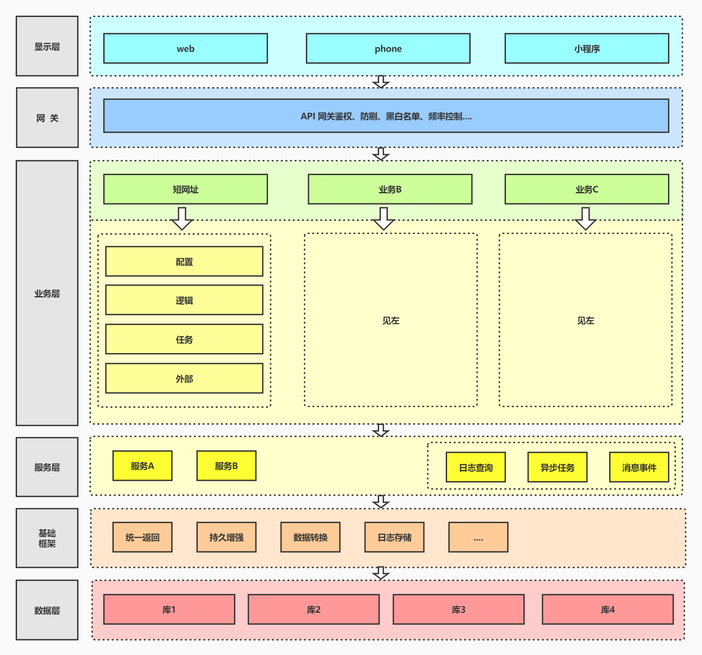
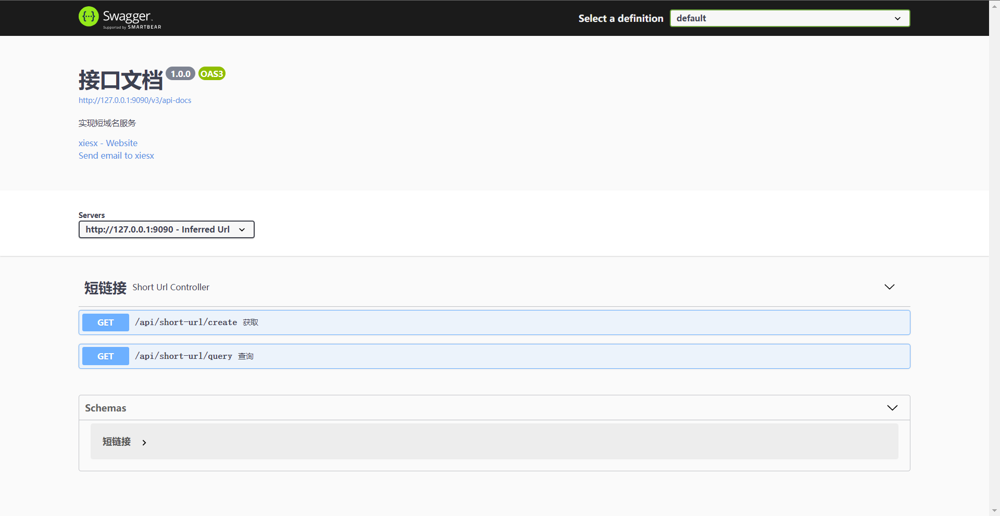
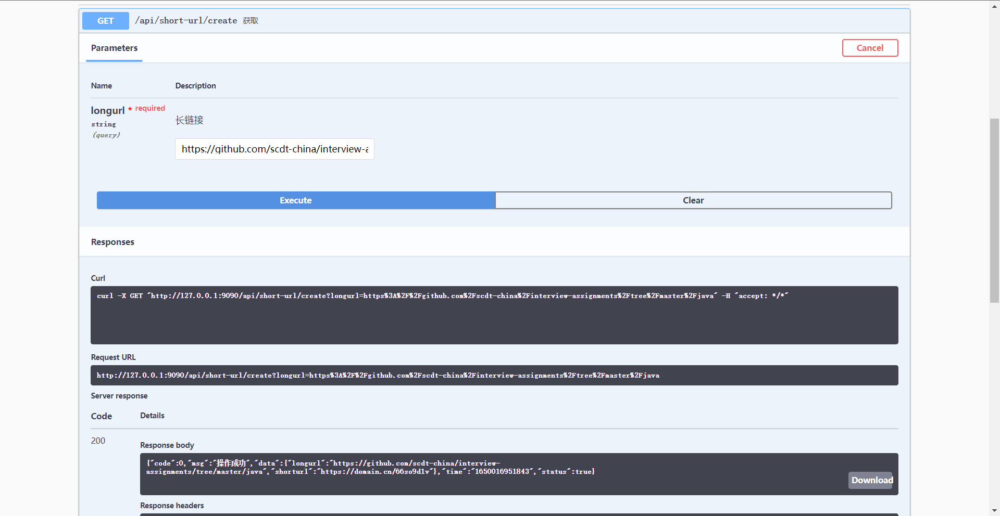
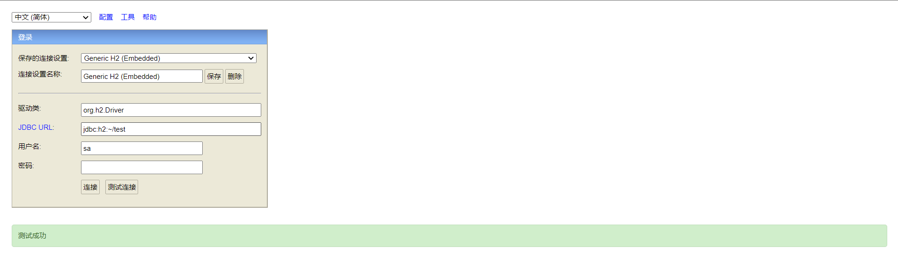
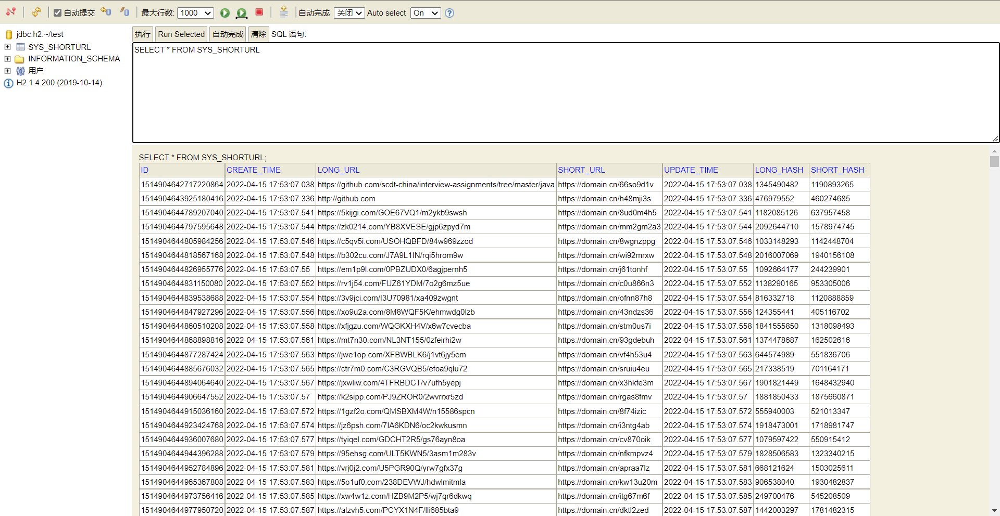
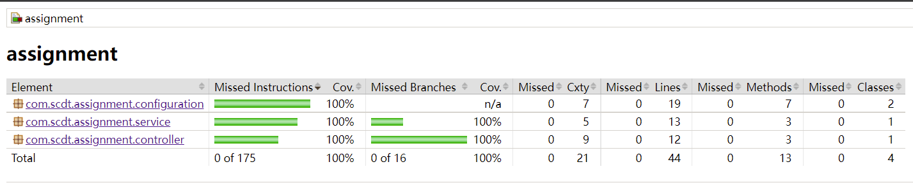
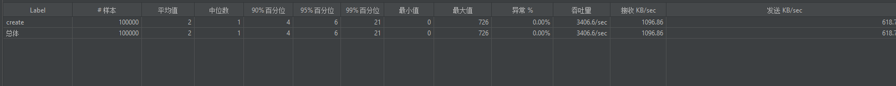
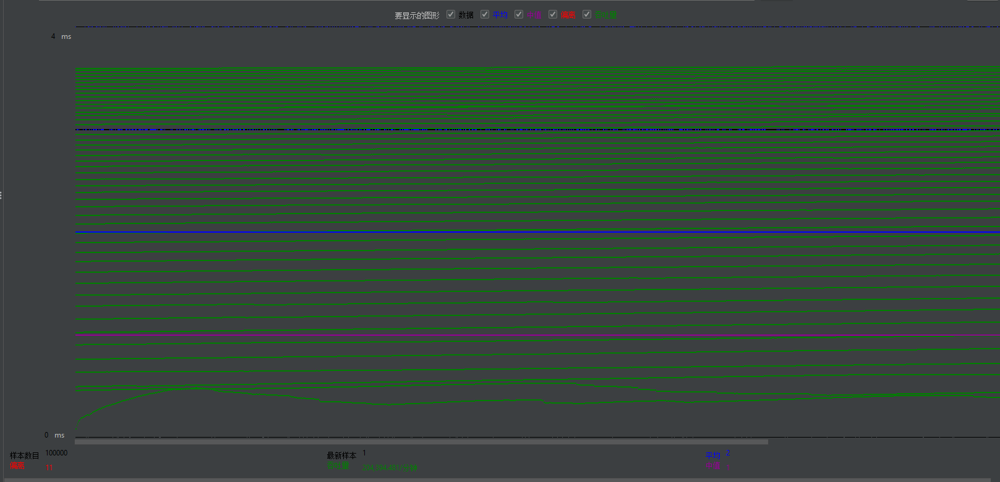
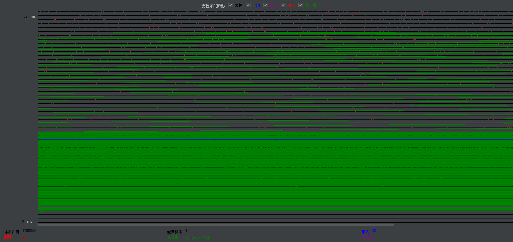

# 作业

> 实现短域名服务

<br/>

### 架构设计

> 在业务服 **短网址** 中设计思路，主要解决如下2个问题：

1. 长链接转短链接存储
   > 通过使用 字符串哈希 **BKDR算法** ，快速高效的将任意长度的字符串数据映射为一定长度的整数。当请求量大了后，可以在Hash值上边做文章，如数据缓存，数字后缀，分布式存储等等....避免直接操冗长的链接地址
2. 短链接的解析、转换、跳转
   > 用户请求指定根域名项目，
   > 
   > 1、解析：当我们得到一个请求短链接拿到固定长度的后缀，可以通过自定义过滤器filter实现，也可通过nginx做过滤转发
   > 
   > 2、转换：通过Query接口查询结果返回网关层
   > 
   > 3、跳转：网关层拿到返回数据得到完整的长链接地址从而进行转发
   
   <br/>



<br/>

### 启动项目

```
    ______           __  ____              __ 
   / ____/___ ______/ /_/ __ )____  ____  / /_
  / /_  / __ `/ ___/ __/ __  / __ \/ __ \/ __/
 / __/ / /_/ (__  ) /_/ /_/ / /_/ / /_/ / /_  
/_/    \__,_/____/\__/_____/\____/\____/\__/  Power By SpringBoot (v2.6.6) 


[scdt][ INFO][04-15 17:56:41][main][logStarting(StartupInfoLogger.java:55)] | - Starting AppApplication using Java 1.8.0_292 on DELL-XPS with PID 11260 (D:\Projects\test\scdt\target\classes started by XIE in D:\Projects\test\scdt)
[scdt][ INFO][04-15 17:56:41][main][logStartupProfileInfo(SpringApplication.java:646)] | - The following 1 profile is active: "dev"
[scdt][ INFO][04-15 17:56:43][main][log(DirectJDKLog.java:173)] | - Initializing ProtocolHandler ["http-nio-9090"]
[scdt][ INFO][04-15 17:56:43][main][log(DirectJDKLog.java:173)] | - Starting service [Tomcat]
[scdt][ INFO][04-15 17:56:43][main][log(DirectJDKLog.java:173)] | - Starting Servlet engine: [Apache Tomcat/9.0.60]
[scdt][ INFO][04-15 17:56:43][main][log(DirectJDKLog.java:173)] | - Initializing Spring embedded WebApplicationContext
[scdt][ INFO][04-15 17:56:47][main][setApplicationContext(SpringContext.java:45)] | - Spring ApplicationContext completed.
[scdt][ INFO][04-15 17:56:47][main][instantiate(StdSchedulerFactory.java:1220)] | - Using default implementation for ThreadExecutor
[scdt][ INFO][04-15 17:56:47][main][<init>(SchedulerSignalerImpl.java:61)] | - Initialized Scheduler Signaller of type: class org.quartz.core.SchedulerSignalerImpl
[scdt][ INFO][04-15 17:56:47][main][<init>(QuartzScheduler.java:229)] | - Quartz Scheduler v.2.3.2 created.
[scdt][ INFO][04-15 17:56:47][main][initialize(RAMJobStore.java:155)] | - RAMJobStore initialized.
[scdt][ INFO][04-15 17:56:47][main][initialize(QuartzScheduler.java:294)] | - Scheduler meta-data: Quartz Scheduler (v2.3.2) 'quartzScheduler' with instanceId 'NON_CLUSTERED'
  Scheduler class: 'org.quartz.core.QuartzScheduler' - running locally.
  NOT STARTED.
  Currently in standby mode.
  Number of jobs executed: 0
  Using thread pool 'org.quartz.simpl.SimpleThreadPool' - with 10 threads.
  Using job-store 'org.quartz.simpl.RAMJobStore' - which does not support persistence. and is not clustered.

[scdt][ INFO][04-15 17:56:47][main][instantiate(StdSchedulerFactory.java:1374)] | - Quartz scheduler 'quartzScheduler' initialized from an externally provided properties instance.
[scdt][ INFO][04-15 17:56:47][main][instantiate(StdSchedulerFactory.java:1378)] | - Quartz scheduler version: 2.3.2
[scdt][ INFO][04-15 17:56:47][main][setJobFactory(QuartzScheduler.java:2293)] | - JobFactory set to: org.springframework.scheduling.quartz.SpringBeanJobFactory@a4f504a8
[scdt][ INFO][04-15 17:56:47][main][log(DirectJDKLog.java:173)] | - Starting ProtocolHandler ["http-nio-9090"]
[scdt][ WARN][04-15 17:56:47][main][modelSpecification(OperationImplicitParameterReader.java:170)] | - Unable to interpret the implicit parameter configuration with dataType: String, dataTypeClass: class java.lang.Void
[scdt][ WARN][04-15 17:56:47][main][modelSpecification(OperationImplicitParameterReader.java:170)] | - Unable to interpret the implicit parameter configuration with dataType: String, dataTypeClass: class java.lang.Void
[scdt][ INFO][04-15 17:56:47][main][start(QuartzScheduler.java:547)] | - Scheduler quartzScheduler_$_NON_CLUSTERED started.
[scdt][ INFO][04-15 17:56:47][main][onApplicationEvent(SpringContext.java:54)] | - Startup Server name: scdt, path: D:\Projects\test\scdt
[scdt][ INFO][04-15 17:56:47][main][onApplicationEvent(SpringContext.java:59)] | - Startup Scheduler 0 Job Completed.
[scdt][ INFO][04-15 17:56:47][main][logStarted(StartupInfoLogger.java:61)] | - Started AppApplication in 7.172 seconds (JVM running for 8.157)
[scdt][ INFO][04-15 17:56:47][main][main(AppApplication.java:33)] | - Started Application success
```

### [接口文档](http://127.0.0.1:9090/swagger-ui/index.html)

> 整体流程：通过Maven引入Springfox依赖，使用最新的Swagger3.0版本，通过简单的注解，生成接口文档，在线调试。

```
<dependency>
    <groupId>io.springfox</groupId>
    <artifactId>springfox-boot-starter</artifactId>
    <version>3.0.0</version>
</dependency>
```





### [嵌入式数据库](http://127.0.0.1:9090/h2)

> 整体流程：使用了H2嵌入式数据库，集成Spring Data Jpa对数据进行映射存储，首次运行自动生成表结构，开箱即用。

> 帐号/密码：sa/sa





### 测试报告

> 整体流程：通过Maven引入Jacoco插件，再编写Junit5单元测试，最后通过mvn clean test命令生成报告。

```
<plugin>
    <groupId>org.jacoco</groupId>
    <artifactId>jacoco-maven-plugin</artifactId>
    <version>0.8.8</version>
</plugin>
```



### 压力测试

> 整体流程：使用Jmeter通过内置Random插件，自定义参数变量来模拟长链接，达到测试接口目地。

#### 测试条件

> 定义模板地址：**https://${random6}.com/${random8}/${random10}**
定义随机变量：如下

```
${random6}  = ${__RandomString(6,abcdefghijklmnopqrstuvwxyz,)}
${random8}  = ${__RandomString(8,abcdefghijklmnopqrstuvwxyz,)}
${random10} = ${__RandomString(10,abcdefghijklmnopqrstuvwxyz,)}
```

> 填充模板示例：**https://ugkzgb.com/yuhxgygb/zjuidrhytj**
> 
> 测试硬件环境：处理器  Intel(R) Core(TM) i5-10210U CPU @ 1.60GHz，2112 Mhz，4 个内核，8 个逻辑处理器
> 
> 测试软件环境：Win11，OpenJdk8、SpringBoot2.6.6、JMeter5.4.1

<br/>

#### 测试结果

这里以 **Create创建短链接** 接口为例

> 测试模拟条件1：线程数10、循环10000次，共计10w次请求





> 测试模拟条件2：线程数100、循环10000次，共计100w次请求




> [`技术博客`](http://go168.xyz/)
