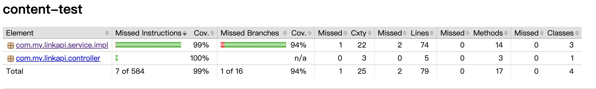

# 李奇 Java Assignment

## 需求

撰写两个 API 接口:
- 短域名存储接口：接受长域名信息，返回短域名信息
- 短域名读取接口：接受短域名信息，返回长域名信息。

限制：
- 短域名长度最大为 8 个字符
- 采用SpringBoot，集成Swagger API文档；
- JUnit编写单元测试, 使用Jacoco生成测试报告(测试报告提交截图)；
- 映射数据存储在JVM内存即可，防止内存溢出；

递交作业内容

- 源代码(按照生产级的要求编写整洁的代码，使用gitignore过滤掉非必要的提交文件，如class文件)
- Jacoco单元测试覆盖率截图(行覆盖率和分支覆盖率85%+)
- 文档：完整的设计思路、架构设计图以及所做的假设(Markdown格式)

## 实现

设计思路
- 链接加密计算成唯一6位短链接 :md5加密，把加密字符按照 8 位一组 16 进制与 0x3FFFFFFF 进行位与运算 把得到的值与 0x0000003D 进行位与运算，取得字符数组 chars 索引
- 验证已保存Map集合是否包含不同链接但是md5值一致情况
- 放置短域名于长域名的映射关系至Map集合，添加追踪数据至追踪数组
- 
- 添加守护线程
- 从头部验证追踪数组是否包含过期短域名，包含过期内存清除
- 防止长期无用的短链接占用内存

jacoco 结果
- 

